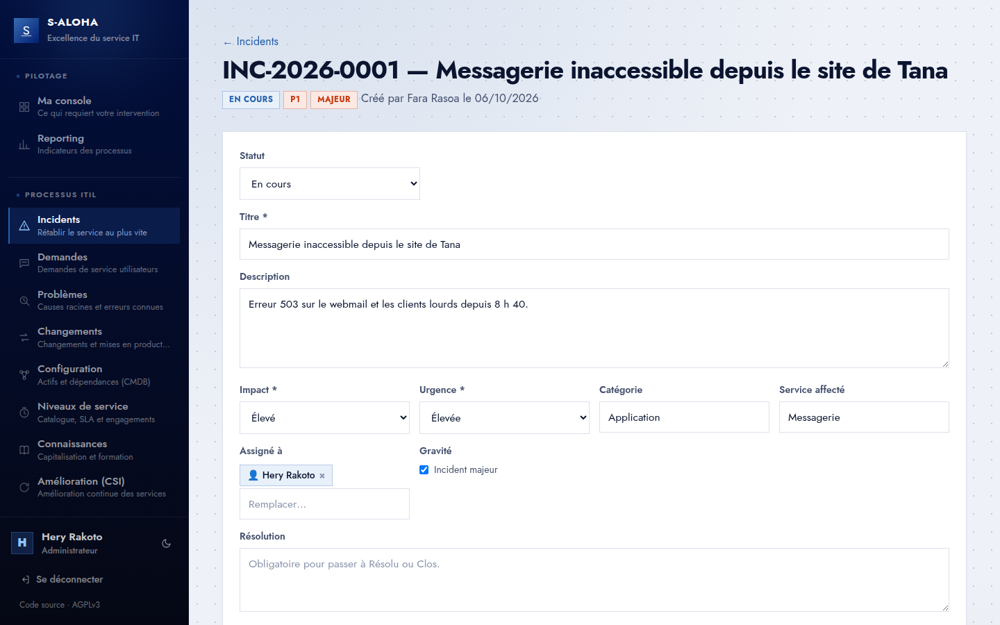
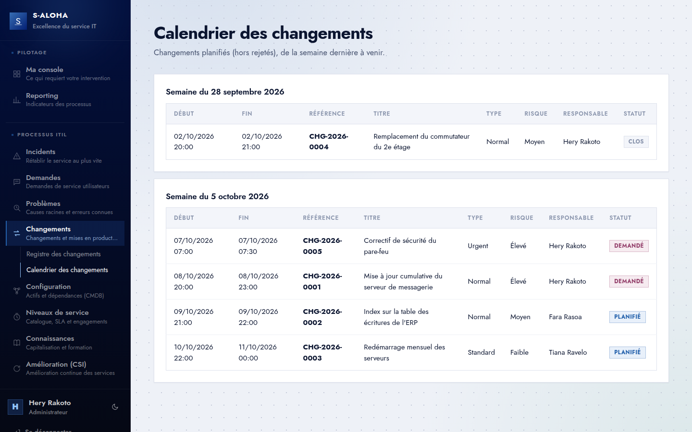
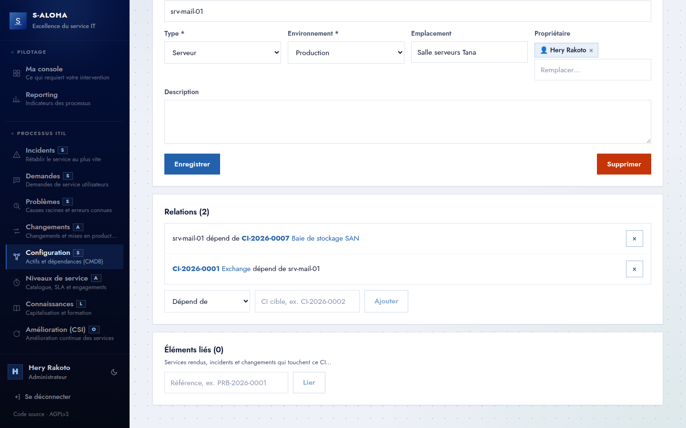
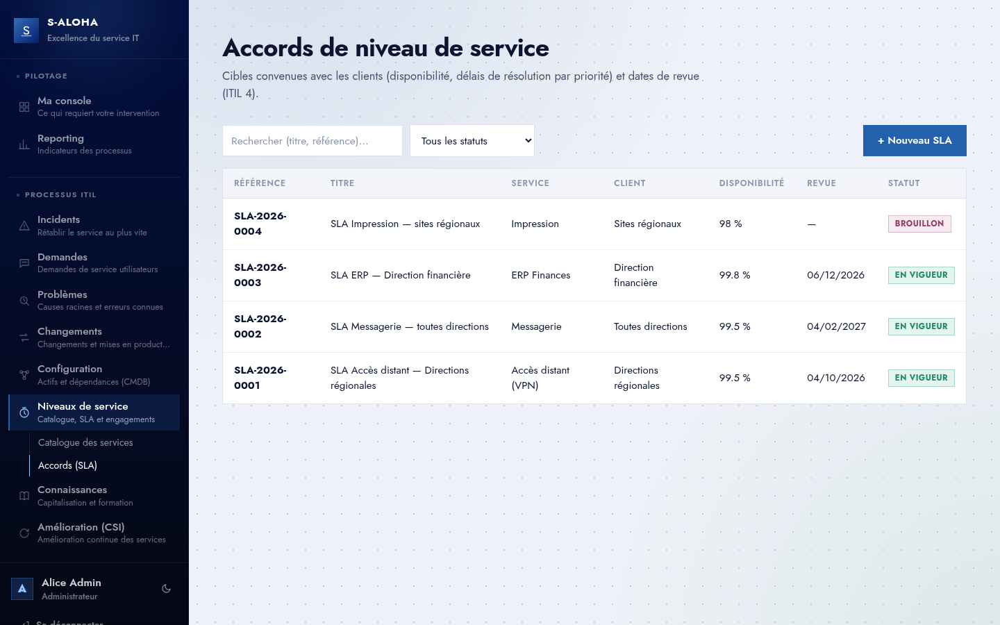
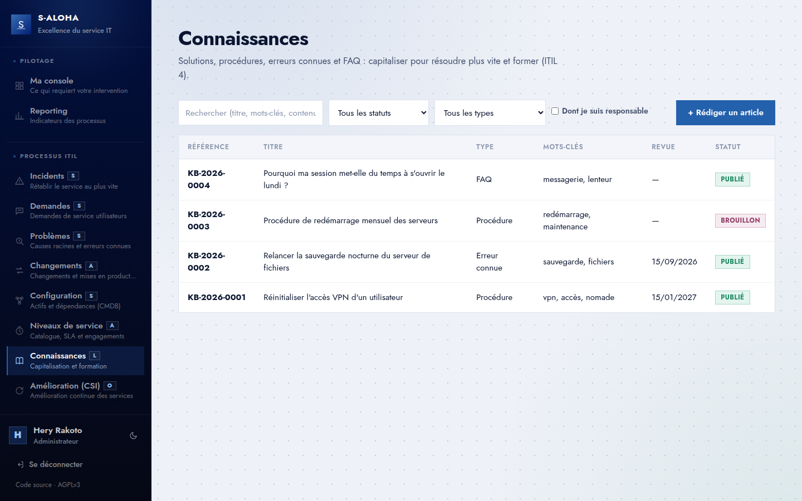
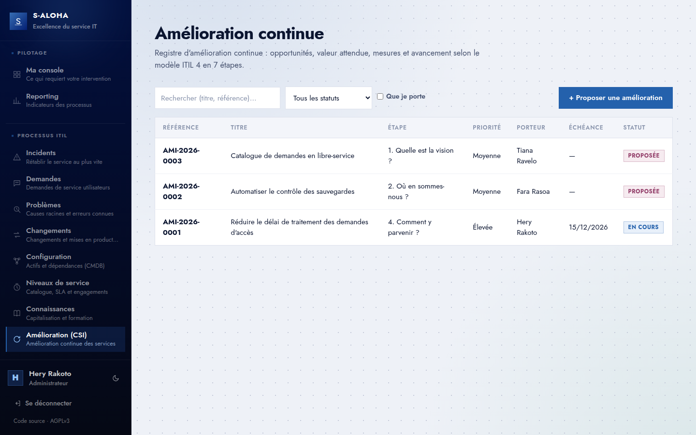

<div align="center">


# S-Aloha

### L'excellence du service IT au cœur de votre performance.

La plateforme ITIL qui se branche sur votre Active Directory<br/>
et montre à chacun **ce qui requiert son intervention, maintenant**.

[](https://github.com/christian-raj/S-Aloha/actions/workflows/ci.yml)


[](LICENSE)

[Fonctionnalités](#pourquoi-s-aloha) · [Aperçu](#aperçu) · [Essayer](#essayer-en-5-minutes) · [Contribuer](#contribuer-et-soutenir) · [Documentation](#documentation) · [English](#english)

<br/>


</div>

---

## Pourquoi S-Aloha

**🔐 Branché sur votre annuaire, dès le premier jour**
Vos utilisateurs se connectent avec leur compte Windows. Les droits suivent vos groupes
Active Directory : aucun compte à créer, aucun mot de passe stocké.

**🎯 Une console qui dit quoi faire**
Chaque utilisateur arrive sur ce qui l'attend, classé par criticité : actions en retard,
incidents majeurs, changements à autoriser, demandes à approuver, problèmes à qualifier,
revues échues. L'informatif passe après.

**🔍 L'analyse de cause racine, outillée**
Trois méthodes intégrées : **5 Pourquoi**, **Ishikawa 6M** et **arbre des défaillances**
avec portes ET/OU. Plusieurs analyses par problème, la conclusion alimente la cause racine.

**✅ Des actions qui aboutissent**
Chaque action corrective porte une échéance et une matrice **RACI** affectée à des
personnes ou des groupes de l'annuaire. Les retards remontent tout seuls.

**📊 Le pilotage sans export Excel**
MTTR des problèmes et des incidents, taux de changements réussis, répartitions, actions
en retard avec leurs responsables, volumétrie de chaque processus : tout est dans le Reporting.

**🏠 Chez vous, en une commande, et libre**
On-prem, trois containers, vos données restent dans votre SI. Logiciel libre sous
AGPLv3 : pas de licence par utilisateur, pas de dépendance à un éditeur.

## Une plateforme, tous vos processus ITIL

| Processus | |
|---|---|
| **Gestion des problèmes** — cause racine, erreurs connues, actions correctives | ✅ Disponible |
| **Incidents** — priorité P1–P4, incidents majeurs, ouverture d'un problème lié | ✅ Disponible (MVP) |
| **Demandes** — objet demandé, bénéficiaire, approbation avant traitement | ✅ Disponible (MVP) |
| **Changements** — standard pré-autorisé, autorisation, retour arrière, calendrier | ✅ Disponible (MVP) |
| **Configuration (CMDB)** — éléments de configuration et leurs relations | ✅ Disponible (MVP) |
| **Niveaux de service** — catalogue des services, SLA et dates de revue | ✅ Disponible (MVP) |
| **Connaissances** — solutions, procédures, erreurs connues, publication validée | ✅ Disponible (MVP) |
| **Amélioration continue** — registre et modèle ITIL 4 en 7 étapes | ✅ Disponible (MVP) |

Chaque processus est un module, aligné sur la pratique **ITIL 4** correspondante, sur un
socle commun : même connexion, même console, même reporting. Les enregistrements se
relient entre eux par leur référence : un incident ouvre un problème, un problème appelle
un changement, un changement touche des CI.

## Aperçu

<table>
  <tr>
    <td width="50%"><br/><b>Connexion</b> — avec le compte Active Directory</td>
    <td width="50%"><br/><b>Registre des problèmes</b> — statut, priorité P1–P4 calculée</td>
  </tr>
  <tr>
    <td><br/><b>Fiche problème</b> — impact × urgence, contournement, cause racine</td>
    <td><br/><b>Analyse de cause racine</b> — 5 Pourquoi, Ishikawa, FTA</td>
  </tr>
  <tr>
    <td><br/><b>Actions correctives</b> — échéance et matrice RACI</td>
    <td><br/><b>Reporting</b> — MTTR, taux de changements réussis, volumétrie</td>
  </tr>
  <tr>
    <td><br/><b>Incidents</b> — priorité P1–P4, incident majeur, problème lié</td>
    <td><br/><b>Changements</b> — autorisation et calendrier des mises en production</td>
  </tr>
  <tr>
    <td><br/><b>Configuration</b> — éléments de configuration et leurs dépendances</td>
    <td><br/><b>Niveaux de service</b> — SLA par service, cibles et revues</td>
  </tr>
  <tr>
    <td><br/><b>Connaissances</b> — solutions, procédures, erreurs connues</td>
    <td><br/><b>Amélioration continue</b> — registre et modèle ITIL 4 en 7 étapes</td>
  </tr>
</table>

## Essayer en 5 minutes

Pas besoin d'Active Directory : le **mode démonstration** démarre son propre annuaire et
charge des données d'exemple fictives. Seul Docker est requis.

```bash
git clone https://github.com/christian-raj/S-Aloha.git && cd S-Aloha
docker compose -f docker-compose.yml -f docker-compose.demo.yml up -d --build
```

Ouvrez **http://localhost** et connectez-vous avec l'un des comptes de démonstration :

| Compte | Mot de passe | Rôle |
|---|---|---|
| `demo.admin` | `Demo-Admin-2026` | Administrateur |
| `demo.manager` | `Demo-Manager-2026` | Gestionnaire |
| `demo.user` | `Demo-User-2026` | Utilisateur |

**Avec votre Active Directory** : renseignez-le dans `docker-compose.yml` (variables
`Ldap__*` du service `api`), puis `docker compose up -d --build`. Les utilisateurs doivent
appartenir à l'un des groupes `GRP-SALOHA-ADMINS`, `GRP-SALOHA-MANAGERS` ou
`GRP-SALOHA-USERS` (noms configurables). Détails : [guide d'exploitation](docs/reference/exploitation.md).

> [!IMPORTANT]
> Mode démonstration et configuration fournie servent à l'évaluation : mots de passe
> publics, ni LDAPS ni HTTPS. Avant une mise en production, suivez
> [la liste de durcissement](docs/reference/securite.md#points-de-durcissement-avant-production).

## Sous le capot

| | |
|---|---|
| **Frontend** | React 18 + Vite, CSS natif à jetons, servi par nginx |
| **API** | ASP.NET Core 8 + Entity Framework Core, Swagger sur `/swagger` |
| **Données** | PostgreSQL 16 |
| **Identité** | Active Directory (LDAP) → JWT, rôles Admin / Manager / User |
| **Tests** | xUnit + Testcontainers (API), Vitest + Testing Library (frontend) |

Socle commun dans `backend/Core` et `frontend/src/core`, un module par processus dans
`Modules/` et `modules/`. Détail : [architecture](docs/reference/architecture.md).

```bash
TESTCONTAINERS_RYUK_DISABLED=true dotnet test tests/SAloha.Api.Tests   # API, Docker requis
cd frontend && npm test                                                # interface
```

## Contribuer et soutenir

S-Aloha est un projet ouvert : toutes les contributions sont bienvenues, du code à la
documentation en passant par les retours d'usage.

- 🧩 **Première contribution ?** Les issues
  [`good first issue`](https://github.com/christian-raj/S-Aloha/issues?q=is%3Aissue+is%3Aopen+label%3A%22good+first+issue%22)
  sont prêtes à prendre : contexte, fichiers concernés, critère de fin.
- 🛠️ **Envie d'un chantier plus large ?** Voir
  [`help wanted`](https://github.com/christian-raj/S-Aloha/issues?q=is%3Aissue+is%3Aopen+label%3A%22help+wanted%22)
  et le [plan d'action](docs/plan-action.md).
- 📝 Le [guide de contribution](CONTRIBUTING.md) explique comment proposer une
  modification. Chaque commit est signé (`git commit -s`, *Developer Certificate of Origin*).
- 💛 **Votre organisation utilise S-Aloha ?** Le soutien financier permet d'aller plus
  vite sur la feuille de route : voir la [stratégie communauté et financement](docs/strategie-communaute.md#axe-4--financer-le-projet).

## Documentation

| | |
|---|---|
| 🧭 [Produit](docs/reference/produit.md) | Vision, processus ITIL couverts, feuille de route |
| 📐 [Règles métier](docs/reference/regles-metier.md) | Rôles, console, cycle de vie, priorité, RACI |
| 🏗️ [Architecture](docs/reference/architecture.md) | Containers, socle et modules, API, tests |
| ⚙️ [Exploitation](docs/reference/exploitation.md) | Installation, Active Directory, mise à jour |
| 🛡️ [Sécurité](docs/reference/securite.md) | Modèle d'autorisation, durcissement |
| 🤝 [Contribuer](CONTRIBUTING.md) | Issues, pull requests, contrôles avant envoi |
| 🚨 [Signaler une faille](SECURITY.md) | En privé, jamais dans une issue publique |
| 📚 [Tout le reste](docs/readme.md) | Base de données, frontend, décisions, plan d'action |

## English

**S-Aloha** is a free (AGPLv3), self-hosted **ITIL 4 service-management platform** for
IT departments that run **Active Directory**. Users sign in with their Windows account;
roles follow AD groups. Each user lands on an action-oriented console showing what needs
their attention, ranked by severity.

- **Processes**: problem management with root-cause analysis (5 Whys, Ishikawa, fault
  tree), RACI-based corrective actions, plus MVP modules for incidents, service requests,
  change enablement (with schedule), configuration items (CMDB), service levels,
  knowledge and continual improvement — all linked to each other.
- **Stack**: ASP.NET Core 8, EF Core, PostgreSQL 16, React 18 + Vite, Docker Compose.
- **Try it**: `docker compose -f docker-compose.yml -f docker-compose.demo.yml up -d --build`,
  then sign in at http://localhost as `demo.admin` / `Demo-Admin-2026` (a demo directory
  is started for you).
- **Contribute**: documentation is in French, code in English; issues and pull requests
  are welcome in **English or French**. Start with a
  [`good first issue`](https://github.com/christian-raj/S-Aloha/issues?q=is%3Aissue+is%3Aopen+label%3A%22good+first+issue%22)
  and read [CONTRIBUTING.md](CONTRIBUTING.md). Commits are signed off (DCO).

## Licence

S-Aloha est un logiciel libre, distribué sous
[GNU Affero General Public License v3](LICENSE) ou toute version ultérieure.

Vous pouvez l'utiliser, le modifier et le redistribuer librement. Si vous mettez une
**version modifiée** à disposition d'utilisateurs à travers le réseau, vous devez leur
donner accès à son code source : l'interface affiche pour cela un lien « Code source »,
configurable ([détails](docs/reference/exploitation.md#licence-et-code-source)).

Copyright © 2026 Christian Rajaonary.

<div align="center">
<br/>
<sub><i>Service alohan'ny zavatra rehetra</i> — le service avant toute chose.</sub>
</div>
