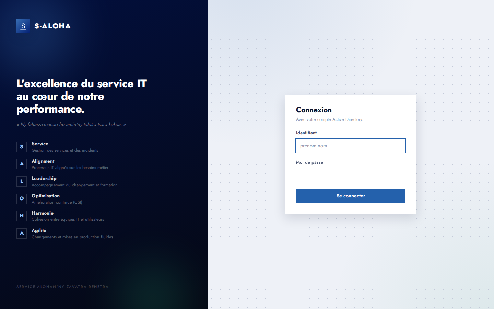
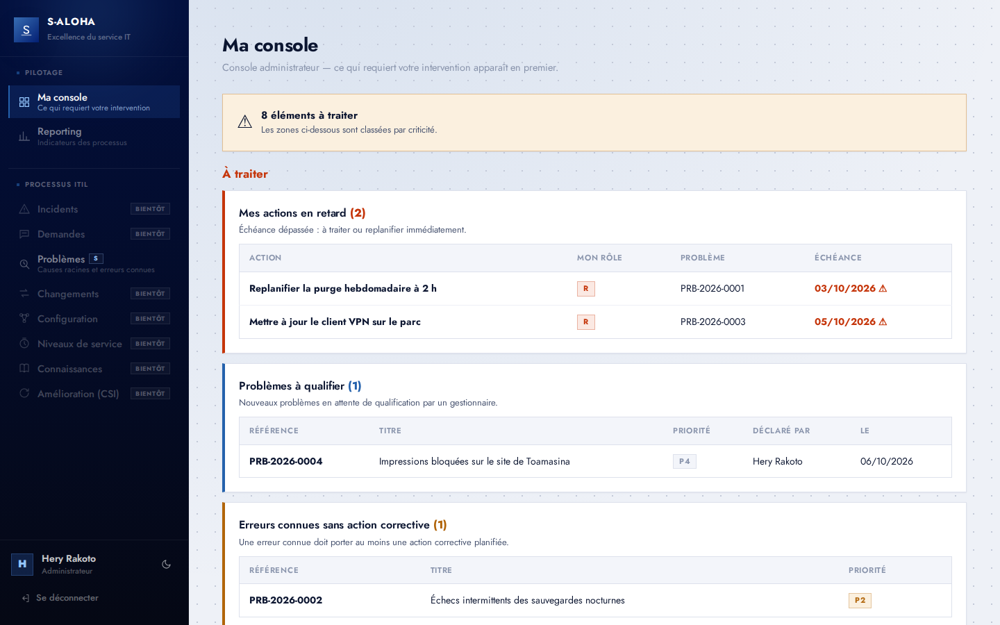
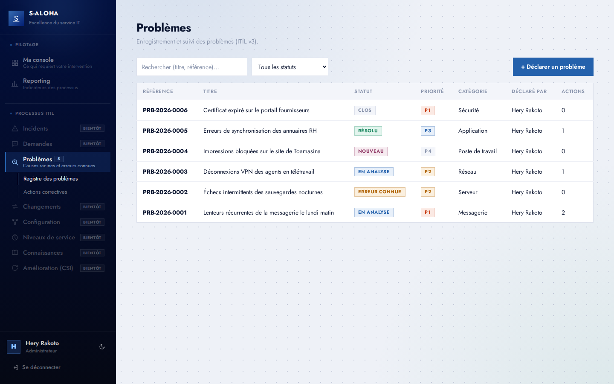
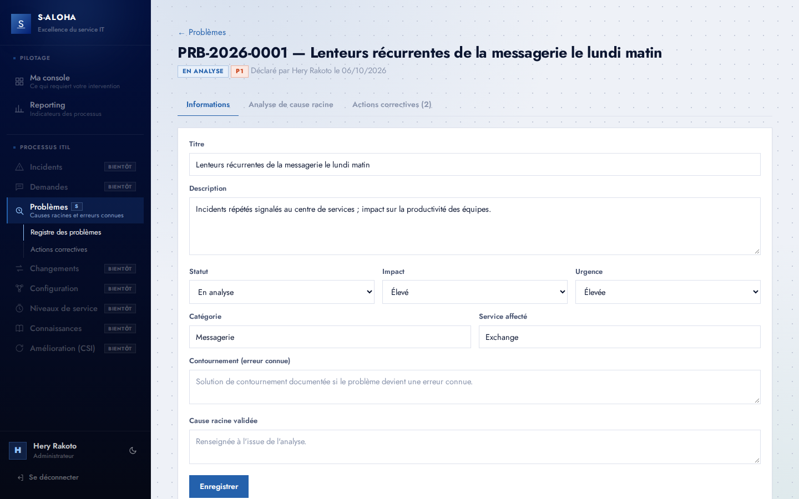
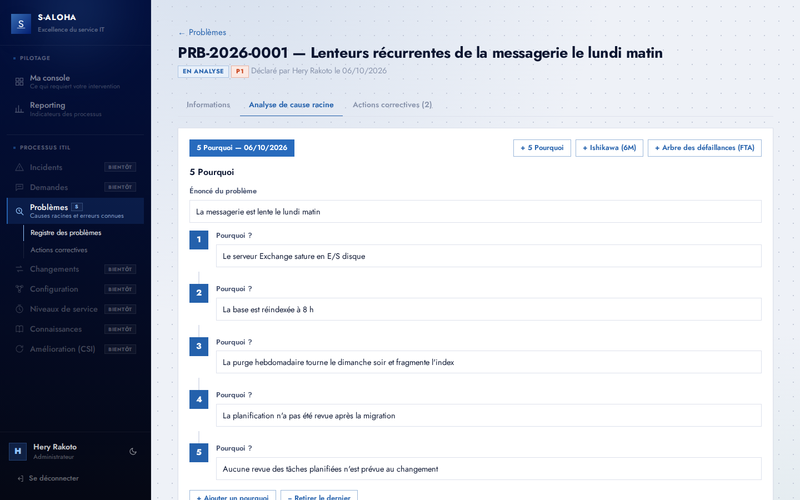
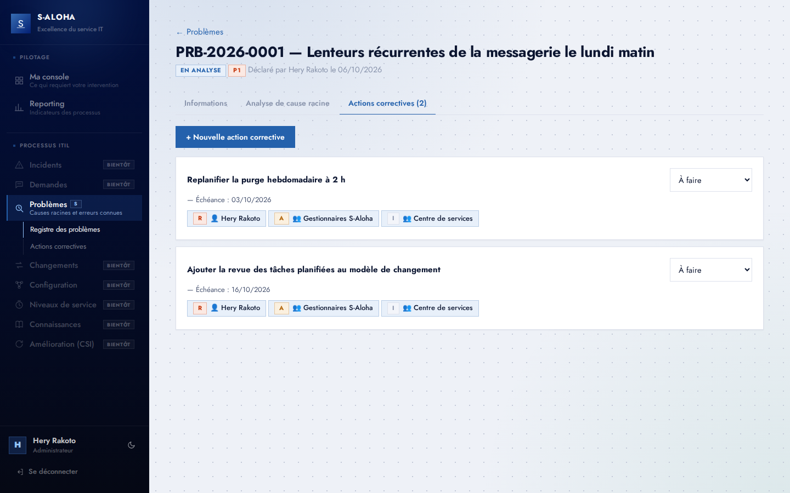
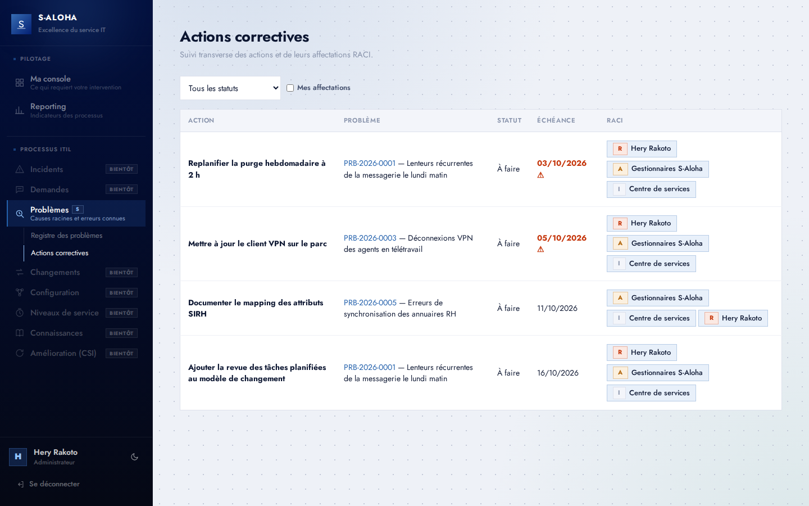
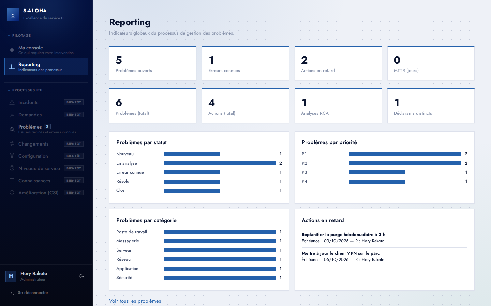

# S-Aloha

**Intégration des processus ITIL** — *l'excellence du service IT au cœur de notre performance.*

S-Aloha est une plateforme web de gestion des processus ITIL pour une DSI d'entreprise,
adossée à l'**Active Directory** on-prem. Elle s'organise en un socle commun (identité,
annuaire, console par rôle, reporting) et un module par processus.

| Processus | État |
|---|---|
| **Problèmes** — analyse de cause racine (5 Pourquoi, Ishikawa 6M, arbre des défaillances), erreurs connues, actions correctives RACI | ✅ disponible |
| Incidents · Demandes · Changements · Configuration · Niveaux de service · Connaissances · Amélioration (CSI) | 🔜 bientôt |

Vision, piliers S-A-L-O-H-A et cartographie : [`docs/reference/produit.md`](docs/reference/produit.md).

## Stack

| Couche | Technologie |
|---|---|
| Frontend | React 18 + Vite, CSS natif à jetons (thèmes clair/sombre), servi par nginx |
| Backend | ASP.NET Core 8 Web API + Entity Framework Core |
| Base | PostgreSQL 16 |
| Auth | Active Directory on-prem (LDAP) → JWT |
| Déploiement | Docker Compose (db, api, web) |

## Démarrage rapide

```bash
# 1. Adapter la configuration AD dans docker-compose.yml (service api)
# 2. Lancer
docker compose up -d --build
# 3. Ouvrir http://localhost  (API + Swagger : http://localhost:8080/swagger)
```

Les utilisateurs doivent appartenir à l'un des groupes AD `GRP-SALOHA-ADMINS`,
`GRP-SALOHA-MANAGERS` ou `GRP-SALOHA-USERS` (configurables). Configuration complète et
mise à jour d'une installation antérieure : [`docs/reference/exploitation.md`](docs/reference/exploitation.md).

> ⚠️ La configuration fournie contient des secrets d'exemple et n'active ni LDAPS ni
> HTTPS. Avant toute mise en production : [`docs/reference/securite.md`](docs/reference/securite.md#points-de-durcissement-avant-production).

## Structure

```
├── docker-compose.yml
├── backend/                     # ASP.NET Core 8 — projet SAloha.Api
│   ├── Core/                    # socle : Auth, Directory, Data, Pilotage
│   └── Modules/
│       └── ProblemManagement/   # Controllers, Models
├── frontend/                    # React + Vite
│   └── src/
│       ├── core/                # Layout, Login, Console, Reporting
│       └── modules/
│           ├── registry.js      # registre des processus ITIL (navigation)
│           └── problem-management/
├── docs/                        # documentation — point d'entrée : docs/readme.md
└── scripts/check-docs.py        # contrôle des liens de la documentation
```

## Aperçu

Captures réalisées avec des données de démonstration.

### Connexion (Active Directory)
Authentification avec le compte AD ; l'accès est réservé aux membres des groupes paramétrés.



### Ma console — par rôle, orientée action
Page d'accueil composée côté serveur selon le rôle : zone **À traiter** classée par
criticité (actions en retard, problèmes à qualifier, erreurs connues sans action…), zone
**À suivre** pour l'informatif. Ici la vue **Admin**.



### Registre des problèmes
Liste filtrable (statut, recherche) avec badges de statut et priorité P1–P4 calculée.



### Fiche problème — qualification
Impact × urgence, catégorie, contournement (erreur connue) et cause racine validée.



### Analyse de cause racine
**5 Pourquoi** (ci-dessous), **Ishikawa 6M** ou **arbre des défaillances** avec portes
ET/OU ; plusieurs analyses possibles par problème.



### Actions correctives — matrice RACI
Échéance et affectations RACI vers des utilisateurs ou groupes AD (au moins un R,
exactement un A).



### Suivi transverse des actions
Vue globale filtrable par statut ou « Mes affectations », avec signalement des retards.



### Reporting
Volumétrie, répartitions par statut / priorité / catégorie, actions en retard, MTTR.



## Documentation

Point d'entrée : [`docs/readme.md`](docs/readme.md).

| | |
|---|---|
| [Produit](docs/reference/produit.md) | Vision, piliers, processus ITIL et leur état |
| [Règles métier](docs/reference/regles-metier.md) | Rôles et droits, consoles, cycle de vie, priorité, RACI |
| [Architecture](docs/reference/architecture.md) | Containers, socle et modules, authentification, API |
| [Base de données](docs/reference/base-de-donnees.md) | Entités et formats des analyses |
| [Frontend](docs/reference/frontend.md) | Structure, registre des modules, design |
| [Exploitation](docs/reference/exploitation.md) | Configuration, AD, déploiement |
| [Sécurité](docs/reference/securite.md) | Modèle d'autorisation, durcissement |
| [Décisions (ADR)](docs/decisions/readme.md) | Choix structurants et leurs raisons |
| [Plan d'action](docs/plan-action.md) | Chantiers ouverts |
