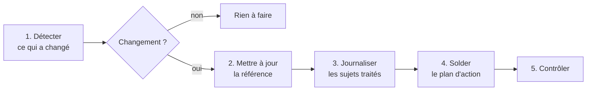

# 🔄 Protocole de mise à jour documentaire

<sub>[← Documentation](readme.md)</sub>

> La routine qui garde la documentation alignée sur le code et archive les sujets traités.
> Elle s'exécute à intervalle régulier pendant le travail, et au plus tard avant chaque
> commit ([ADR-0002](decisions/adr-0002-documentation-dans-le-depot.md)).

## En bref



## 1. Détecter

Point de comparaison : le dernier passage de la routine (commit et état de l'arbre de
travail). Sources :

- `git log` depuis le dernier passage, `git status`, `git diff HEAD` ;
- les décisions prises en séance (validées par le décideur) ;
- les défauts ouverts ou fermés dans [GitHub Issues](https://github.com/christian-raj/S-Aloha/issues).

Si rien n'a changé, la routine s'arrête là.

## 2. Mettre à jour la référence

Chaque changement est replié dans le document de [`reference/`](reference/) concerné,
**sur place**. Correspondance :

| Ce qui a changé | Document à mettre à jour |
|---|---|
| `backend/Modules/*/Controllers`, routes, policies | [architecture](reference/architecture.md) § API, [règles métier](reference/regles-metier.md) |
| Règle de gestion (statuts, priorité, RACI, console) | [règles métier](reference/regles-metier.md) |
| `Models/Entities.cs`, `AppDbContext` | [base de données](reference/base-de-donnees.md) |
| `backend/Core/Auth`, `Program.cs` (auth, CORS, JWT) | [architecture](reference/architecture.md), [sécurité](reference/securite.md) |
| `appsettings.json`, `docker-compose.yml`, Dockerfiles | [exploitation](reference/exploitation.md) |
| `frontend/src/modules/registry.js` | [produit](reference/produit.md) (cartographie), [frontend](reference/frontend.md) |
| `App.jsx`, `core/`, `modules/*/pages` | [frontend](reference/frontend.md) § Routes et Structure |
| `styles.css`, thème, composants visuels | [frontend](reference/frontend.md) § Design ; captures d'écran |
| Nouveau terme métier ou technique | [glossaire](reference/glossaire.md) |
| Fonctionnalité visible par l'utilisateur | [README](../README.md) |
| Décision structurante actée | nouvel ADR dans [`decisions/`](decisions/readme.md) |

Une interface modifiée rend les **captures d'écran** obsolètes : les régénérer
(`docs/screenshots/`, mêmes noms de fichiers).

## 3. Journaliser les sujets traités

Les sujets traités du jour sont consignés dans **`archives/journal-AAAA-MM-JJ.md`**. Le
journal du jour est complété au fil des passages ; il est **figé le lendemain**, comme
toute archive.

Une entrée par sujet :

```markdown
## Titre du sujet

- **Quoi** : ce qui a été fait, en une ou deux phrases
- **Pourquoi** : le besoin, le défaut ou la décision d'origine
- **Fichiers** : les principaux fichiers touchés
- **Documentation** : les documents mis à jour, ADR créé le cas échéant
- **Commit** : le hash, ou « non commité » si le travail est en cours
```

Un journal n'est pas un changelog de fichiers : il raconte des **sujets** (une
fonctionnalité, un correctif, une décision), pour retrouver plus tard ce qui a été fait,
quand et pourquoi.

## 4. Solder le plan d'action

Un chantier terminé **quitte** [`plan-action.md`](plan-action.md) et rejoint l'entrée du
journal du jour (« Soldé du plan d'action : … »). Le plan ne garde que ce qui reste à
faire. Un chantier nouveau, découvert en cours de route, y entre.

## 5. Contrôler

```bash
python3 scripts/check-docs.py     # liens, ancres et chemins cités
```

Puis vérifier qu'aucun document ne cite de projet tiers privé, de secret réel ou d'outil
d'assistance, le dépôt étant public.

La routine **ne committe pas** : le commit reste une décision du mainteneur, qui y joint
la documentation mise à jour.
