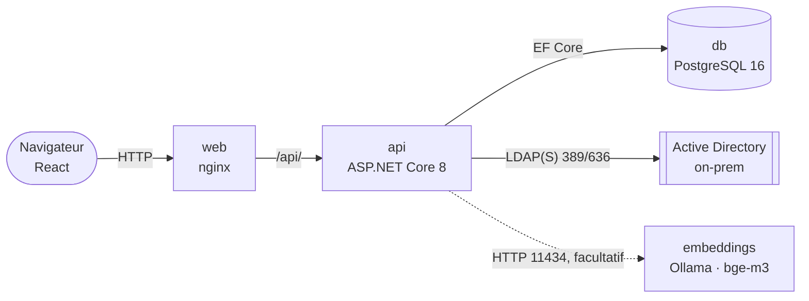
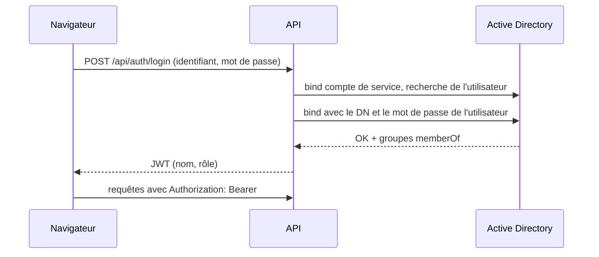

# 🏗️ Architecture

> Comment S-Aloha est construit : containers, socle et modules, authentification, API.

<sub>[← Documentation](../readme.md) · [Produit](produit.md) · [Règles métier](regles-metier.md) · [Architecture](architecture.md) · [Base de données](base-de-donnees.md) · [Frontend](frontend.md) · [Exploitation](exploitation.md) · [Sécurité](securite.md) · [Glossaire](glossaire.md)</sub>

## 1. Vue d'ensemble



Quatre containers orchestrés par `docker-compose.yml` : **web** (nginx sert le build React et proxifie `/api/` vers l'API), **api** (ASP.NET Core 8), **db** (PostgreSQL 16, volume persistant `pgdata`) et **embeddings** (Ollama, modèle `bge-m3`, réseau interne seulement), facultatif : sans lui, la recherche reste lexicale ([recherche](recherche.md), [ADR-0013](../decisions/adr-0013-recherche-hybride-service-embeddings-separe.md)).

## 2. Stack

| Couche | Choix | Notes |
|---|---|---|
| Frontend | React 18 + Vite, react-router | Build statique servi par nginx ; aucune dépendance UI lourde (CSS natif à jetons, voir [frontend.md](frontend.md)) |
| Backend | ASP.NET Core 8 Web API | Controllers REST, Swagger exposé sur `/swagger` |
| ORM | Entity Framework Core 8 (8.0.31) | Provider Npgsql ; schéma par migrations EF, appliquées au démarrage ([ADR-0008](../decisions/adr-0008-migrations-ef.md)) |
| Base | PostgreSQL 16 (provider Npgsql EF 8.0.11) | Remplaçable par SQL Server (provider EF + image du compose) |
| Annuaire | Novell.Directory.Ldap.NETStandard | Bind de service pour la recherche, bind utilisateur pour l'authentification |
| Auth API | JWT Bearer (HS256, JwtBearer 8.0.31) | Claims : name, displayName, role ; expiration paramétrable |

## 3. Organisation du code : socle et modules

S-Aloha est une **plateforme modulaire** : un **socle** (*Core*) transverse à tous les processus ITIL, et un **module** par processus. Les huit processus du registre sont implémentés ; tous sauf *Gestion des problèmes* en MVP, sur un socle commun d'enregistrement (voir [produit.md](produit.md) et [ADR-0007](../decisions/adr-0007-pratiques-itil4-et-socle-commun-des-processus.md)).

```
backend/                              # projet SAloha.Api (namespace SAloha.Api.*)
├── Program.cs                        # DI, JWT, policies, CORS, migrations au démarrage
├── Core/                             # socle — ne dépend d'aucun module
│   ├── Audit/                        # AuditEntry, AuditInterceptor (journal SOC-20), AuditController, ForcedTransition
│   ├── Auth/                         # AuthController, LdapService, TokenService, AuthDtos
│   ├── Data/                         # AppDbContext, References (XXX-AAAA-NNNN), DatabaseSchema + Migrations/
│   ├── Directory/                    # DirectoryController, DirectoryEntry (recherche AD)
│   ├── Itil/                         # Priority (matrice impact × urgence → P1–P4)
│   ├── Links/                        # ItemLink, registre ItemLinks, LinksController (liens inter-processus)
│   ├── Pilotage/                     # ConsoleController, ReportsController (vues transverses)
│   └── Records/                      # Record (entité de base), RecordController<T,TDto>, Allowed, Dates
└── Modules/
    ├── ProblemManagement/            # Gestion des problèmes : Problems, Analyses, Actions
    ├── IncidentManagement/           # Gestion des incidents : Incidents
    ├── ServiceRequestManagement/     # Gestion des demandes de service : ServiceRequests
    ├── ChangeEnablement/             # Habilitation des changements : Changes (+ calendrier)
    ├── ServiceConfigurationManagement/ # Configuration des services : ConfigurationItems (+ relations)
    ├── ServiceLevelManagement/       # Niveaux de service : Services, Agreements
    ├── KnowledgeManagement/          # Connaissances : Knowledge
    └── ContinualImprovement/         # Amélioration continue : Improvements
        # chaque module : Controllers/ et Models/ (Entities.cs : entités et DTO)
```

### Socle commun des processus (`Core/Records`)

Les processus autres que les problèmes héritent d'un même socle :

- **`Record`** — classe de base non mappée (une table par processus) : `Id`, `Reference`,
  `Title`, `Description`, `Status`, responsable AD (`OwnerType`, `OwnerId`,
  `OwnerDisplayName`), traçabilité (`CreatedBy`, `CreatedAt`, `UpdatedAt`).
- **`RecordController<T, TDto>`** — API CRUD commune : liste (`status`, `q`, `owner=me`),
  détail, création avec référence (`References.CreateAsync`), modification avec contrôle
  du statut, suppression (Admin, liens compris). Un module ne déclare que son préfixe,
  ses statuts et ses règles : `Transitions` (graphe des transitions permises, SOC-05,
  servi par `GET …/transitions` ; refus 400 « Transition de A vers B non permise » avec les
  statuts accessibles), `Apply` (champs et valeurs fermées), `RequiresManager`
  (statuts réservés), `CheckStatus` (conditions du statut, vérifiées à chaque
  enregistrement), `OnStatusChanged` (horodatages), `StatusAfterEdit` (statut auquel
  la modification d'un non-gestionnaire ramène l'enregistrement), `InitialStatus`, `ManagerOnly`
  (référentiels), `Filter`/`Search`/`WithDetails`, `ListItems` (colonnes du registre).
  Les longueurs `[MaxLength]` sont contrôlées avant l'enregistrement (`Lengths`).
- **`References.CreateAsync`** — référence annuelle `XXX-AAAA-NNNN` (plus grand numéro + 1,
  nouvelle tentative sur collision de l'index unique) ; utilisée aussi par les problèmes.

Règles de dépendance :
- un **module** peut utiliser le socle (auth, annuaire, `AppDbContext`) ;
- le **socle** n'importe pas le code d'un module, à l'exception de `Core/Pilotage`, `Core/Data` et `Core/Links` qui agrègent les données des modules (console, reporting, `DbSet`, registre des types reliables) ;
- un module n'appelle pas un autre module directement : les liens entre processus passent par `Core/Links` (table `ItemLinks`).

Ajouter un module : créer `Modules/<Processus>/{Controllers,Models}` — entité dérivée de `Record`, DTO implémentant `IRecordDto`, contrôleur dérivé de `RecordController` —, déclarer ses `DbSet` et l'index unique de sa référence dans `AppDbContext`, l'inscrire dans `ItemLinks.Kinds` s'il est reliable, puis son interface côté frontend (voir [frontend.md](frontend.md) § Ajouter un module).

## 4. Authentification et autorisation



1. `POST /api/auth/login` : l'API se connecte à l'AD avec le **compte de service** (`Ldap:BindUser`), recherche l'utilisateur (`Ldap:UserFilter`), puis valide le mot de passe par un **bind avec le DN de l'utilisateur**.
2. Les groupes `memberOf` sont comparés au mapping `Ldap:Groups` (Admin > Manager > User). Aucun groupe correspondant ⇒ connexion refusée.
3. Un **JWT** est émis avec le rôle en claim ; il porte le `sAMAccountName` renvoyé par l'annuaire, non l'identifiant tel que tapé (de même que `LoginResponse.username`). Les comparaisons d'identifiants (console « Mes … », filtre `assignee` de `GET /api/actions`) ignorent la casse. Le frontend le stocke en `sessionStorage` et l'envoie en `Authorization: Bearer`.
4. Côté API, trois policies imbriquées : `User` (tous les rôles), `Manager` (Manager + Admin), `Admin`.
5. La console (`GET /api/console`) compose sa réponse **côté serveur** selon le rôle du jeton ; le frontend n'y reçoit que les blocs autorisés, classés pour mettre l'actionnable en premier.

Modèle de sécurité et points de durcissement : [`securite.md`](securite.md).

## 5. Modèle de données

Une base PostgreSQL, un `AppDbContext` unique déclarant les entités de tous les modules.
Module Gestion des problèmes : `Problem 1──∞ RcaAnalysis`, `Problem 1──∞ CorrectiveAction 1──∞ RaciAssignment`,
analyses RCA stockées en JSON (`DataJson`) pour ajouter une méthode sans évolution de
schéma. Autres processus : une table par entité dérivée de `Record`, plus
`CiRelationships` (CI ↔ CI) et `Agreements → Services` ; liens inter-processus dans `ItemLinks`. Détail des tables, contraintes et formats JSON : [`base-de-donnees.md`](base-de-donnees.md).

Sérialisation JSON de l'API : `ReferenceHandler.IgnoreCycles` (`backend/Program.cs`), car
les entités EF sont renvoyées avec leurs navigations (`Analysis → Problem → Analyses`).

## 6. API (résumé)

| Méthode / Route | Policy | Rôle métier | Emplacement |
|---|---|---|---|
| POST `/api/auth/login` | — | Authentification AD → JWT | Core/Auth |
| GET `/api/console` | User | Console par rôle, orientée action (blocs « à traiter » / « à suivre ») | Core/Pilotage |
| GET/POST `/api/problems`, GET `/api/problems/{id}` | User | Liste (filtres statut, texte), détail, déclaration | Modules/ProblemManagement |
| PUT `/api/problems/{id}` | Manager | Qualification, statuts, cause racine, contournement | Modules/ProblemManagement |
| DELETE `/api/problems/{id}` | Admin | Suppression | Modules/ProblemManagement |
| GET/POST/PUT `/api/problems/{id}/analyses[...]` | User | Analyses RCA (DELETE : Manager) | Modules/ProblemManagement |
| GET `/api/actions`, POST `/api/problems/{id}/actions`, PUT `/api/actions/{id}` | User | Actions + RACI (DELETE : Manager) | Modules/ProblemManagement |
| GET/POST/PUT `/api/incidents[/{id}]` | User | Incidents (DELETE : Admin) | Modules/IncidentManagement |
| GET/POST/PUT `/api/requests[/{id}]` | User | Demandes ; Approuvée/Rejetée : Manager (DELETE : Admin) | Modules/ServiceRequestManagement |
| GET/POST/PUT `/api/changes[/{id}]`, GET `/api/changes/schedule`, GET `/api/changes/{id}/conflicts` | User | Changements, calendrier et conflits ; Autorisé/Rejeté : Manager (DELETE : Admin) | Modules/ChangeEnablement |
| GET/POST/PUT `/api/configuration-items[/{id}]`, GET `/{id}/impact`, POST `/{id}/relations`, DELETE `/relations/{id}` | User | CI, relations et vue d'impact transitive (DELETE d'un CI : Admin) | Modules/ServiceConfigurationManagement |
| GET `/api/services`, `/api/agreements` ; POST/PUT | User ; écriture Manager | Catalogue des services, SLA (DELETE : Admin) | Modules/ServiceLevelManagement |
| GET/POST/PUT `/api/knowledge[/{id}]` | User | Articles ; Publié : Manager (DELETE : Admin) | Modules/KnowledgeManagement |
| GET/POST/PUT `/api/improvements[/{id}]` | User | Améliorations ; Validée/Abandonnée : Manager (DELETE : Admin) | Modules/ContinualImprovement |
| GET `/api/assessments[/{id}]`, `/{id}/questionnaire`, `/{id}/score` ; PUT `/{id}/responses/{requirementId}` | User | Évaluations NIS 2 : consultation, réponses, scores | Modules/ComplianceAssessment |
| POST/PUT `/api/assessments[/{id}]`, POST `/{id}/improvements` | Manager | Création, validation, réouverture ; action d'amélioration depuis un écart (DELETE : Admin) | Modules/ComplianceAssessment |
| GET `/api/compliance/referential` ; POST `/api/compliance/referential/import` : Admin | User | Référentiel NIS 2, import du texte des exigences | Modules/ComplianceAssessment |
| GET `/api/links?type=&id=`, POST `/api/links`, DELETE `/api/links/{id}` | User | Liens inter-processus, lus dans les deux sens | Core/Links |
| GET `/api/audit?type=&id=` | User | Historique d'un enregistrement (journal d'audit, SOC-20) | Core/Audit |
| PUT `…/{id}?force=true&reason=` | Admin | Transition forcée hors graphe, motif obligatoire et tracé (SOC-05) | Core/Audit, socle des pratiques et module Problèmes |
| GET `/api/directory/search?q=` | User | Recherche utilisateurs/groupes AD (sélecteur RACI) | Core/Directory |
| GET `/api/reports/summary` | User | Indicateurs : problèmes (statuts, priorités, catégories, retards, MTTR, volumétrie), MTTR incidents, taux de changements réussis, incidents majeurs ouverts, volumétrie par processus | Core/Pilotage |
| GET `/api/search?q=&types=&limit=`, `/api/search/similar?type=&id=` | User | Recherche hybride, cas similaires ([recherche](recherche.md)) | Core/Search |
| GET `/api/search/status`, POST `/api/search/reindex` | Admin | État et reconstruction de l'index de recherche | Core/Search |

## 7. Frontend

```
src/
├── api.js                        # client fetch + gestion JWT (401 ⇒ retour login)
├── App.jsx                       # routes : / (Console), /reports, /problems, /problems/:id, /actions
├── styles.css                    # jetons de design, thèmes clair/sombre
├── core/                         # socle UI
│   ├── components/               # Layout (sidebar), ThemeToggle, icons, RaciEditor
│   └── pages/                    # Login, Console, Reporting
└── modules/
    ├── registry.js               # registre des processus ITIL : source unique de la navigation
    └── problem-management/
        ├── components/           # FiveWhys, Ishikawa, FtaTree
        └── pages/                # Problems, ProblemDetail (onglets), Actions
```

Détails (registre des modules, thème, design) : [frontend.md](frontend.md).

## 8. Build et déploiement

- `docker compose up -d --build` : build multi-étapes (SDK .NET → runtime ASP.NET ; node → nginx), projet compose `s-aloha`.
  Les images de base sont désignées par leur nom qualifié (`docker.io/library/…`), accepté par Docker et exigé par buildah.
- Frontend exposé sur **:80**, API sur **:8080** (Swagger : `/swagger`).
- Configuration, Active Directory, mise à jour d'une installation existante : [`exploitation.md`](exploitation.md).
- Points de durcissement avant production : [`securite.md`](securite.md#points-de-durcissement-avant-production).

## 9. Tests

| Suite | Commande | Outillage |
|---|---|---|
| API (intégration) | `TESTCONTAINERS_RYUK_DISABLED=true dotnet test tests/SAloha.Api.Tests` | xUnit + `WebApplicationFactory` sur un PostgreSQL jetable (Testcontainers 4.15, image `postgres:18-alpine`) ; **Docker requis** |
| Frontend | `cd frontend && npm test` | Vitest + Testing Library (jsdom) |

- Le projet de tests cible **net10.0** alors que l'API reste en **net8.0** : un hôte de
  test 8.0 exécuté sur le runtime 10 répond 500 à toute écriture JSON.
- Les jetons sont signés par la fixture (`ApiFixture`) avec la clé de configuration :
  l'Active Directory n'est pas sollicité.
- Couverture actuelle : bloquants B1 à B3 et majeurs M1, M2, M4, M5, M6 de la
  [revue fonctionnelle](../archives/revue-fonctionnelle-2026-10-06.md) — 6 tests d'API
  (`ProblemReferenceTests`, `ProblemLifecycleTests`) et 4 tests d'interface
  (`ProblemDetail.test.jsx`, `FtaTree.test.jsx`), qui échouent tous sur le code d'avant correctif ;
  modules ITIL 4 — 23 tests d'API (`ItilModulesTests` : référence et statut inconnu par module,
  créations simultanées, décisions de gestionnaire, conditions de statut, liens, console,
  constats de la revue de code : changement rejeté, type d'un changement autorisé, amélioration
  abandonnée, conditions tenues hors changement de statut, longueurs, registre allégé ;
  F9 et F10 : article retouché, changement modifié) ; mise à niveau du schéma — 2 tests
  (`MigrationTests` : base créée par `EnsureCreated` avant et après les modules ITIL 4) ; et 2 tests
  d'interface (`RecordForm.test.jsx` : conversions formulaire ↔ API).

### Intégration continue

[`.github/workflows/ci.yml`](../../.github/workflows/ci.yml) rejoue ces contrôles à chaque
push sur `main` et sur chaque pull request, en cinq jobs : **API** (tests ci-dessus et
`dotnet list package --vulnerable`), **Interface** (`npm ci`, tests, build,
`npm audit --audit-level=high`), **Documentation** (`scripts/check-docs.py`) et
**Images Docker** (build des deux images, sans publication) et, sur une pull request
seulement, **DCO** (chaque commit porte le `Signed-off-by` de son auteur, bots exceptés ;
[ADR-0010](../decisions/adr-0010-certificat-d-origine-dco.md)). Actions épinglées par SHA,
jeton en lecture seule. CodeQL (C#, JavaScript) et Dependabot
([`.github/dependabot.yml`](../../.github/dependabot.yml)) complètent : voir
[sécurité § Contrôles du dépôt](securite.md#contrôles-du-dépôt).
