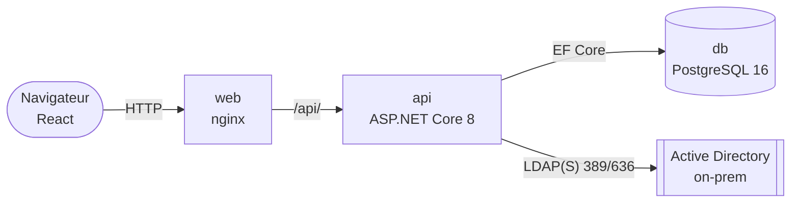
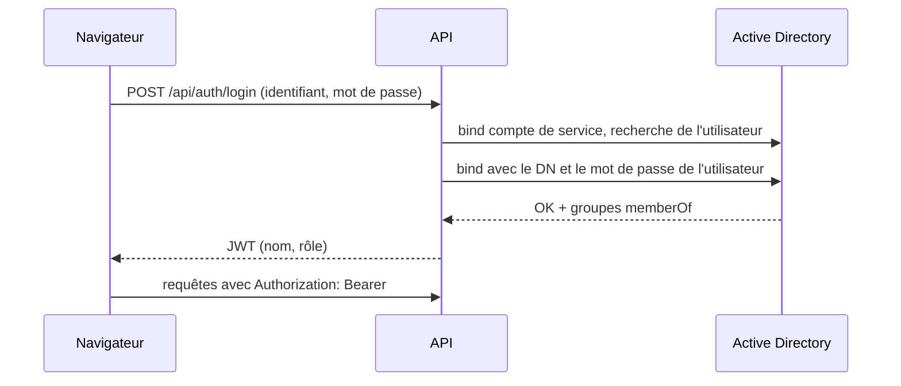

# 🏗️ Architecture

> Comment S-Aloha est construit : containers, socle et modules, authentification, API.

<sub>[← Documentation](../readme.md) · [Produit](produit.md) · [Règles métier](regles-metier.md) · [Architecture](architecture.md) · [Base de données](base-de-donnees.md) · [Frontend](frontend.md) · [Exploitation](exploitation.md) · [Sécurité](securite.md) · [Glossaire](glossaire.md)</sub>

## 1. Vue d'ensemble



Trois containers orchestrés par `docker-compose.yml` : **web** (nginx sert le build React et proxifie `/api/` vers l'API), **api** (ASP.NET Core 8), **db** (PostgreSQL 16, volume persistant `pgdata`).

## 2. Stack

| Couche | Choix | Notes |
|---|---|---|
| Frontend | React 18 + Vite, react-router | Build statique servi par nginx ; aucune dépendance UI lourde (CSS natif à jetons, voir [frontend.md](frontend.md)) |
| Backend | ASP.NET Core 8 Web API | Controllers REST, Swagger exposé sur `/swagger` |
| ORM | Entity Framework Core 8 (8.0.31) | Provider Npgsql ; schéma créé par `EnsureCreated()` au démarrage |
| Base | PostgreSQL 16 (provider Npgsql EF 8.0.11) | Remplaçable par SQL Server (provider EF + image du compose) |
| Annuaire | Novell.Directory.Ldap.NETStandard | Bind de service pour la recherche, bind utilisateur pour l'authentification |
| Auth API | JWT Bearer (HS256, JwtBearer 8.0.31) | Claims : name, displayName, role ; expiration paramétrable |

## 3. Organisation du code : socle et modules

S-Aloha est une **plateforme modulaire** : un **socle** (*Core*) transverse à tous les processus ITIL, et un **module** par processus. Seul le module *Gestion des problèmes* est implémenté ; les autres sont déclarés « bientôt » dans le registre frontend (voir [produit.md](produit.md)).

```
backend/                              # projet SAloha.Api (namespace SAloha.Api.*)
├── Program.cs                        # DI, JWT, policies, CORS, EnsureCreated
├── Core/                             # socle — ne dépend d'aucun module
│   ├── Auth/                         # AuthController, LdapService, TokenService, AuthDtos
│   ├── Data/                         # AppDbContext (unique, toutes les entités)
│   ├── Directory/                    # DirectoryController, DirectoryEntry (recherche AD)
│   └── Pilotage/                     # ConsoleController, ReportsController (vues transverses)
└── Modules/
    └── ProblemManagement/            # processus « Gestion des problèmes »
        ├── Controllers/              # Problems, Analyses, Actions
        └── Models/                   # Entities, Dtos
```

Règles de dépendance :
- un **module** peut utiliser le socle (auth, annuaire, `AppDbContext`) ;
- le **socle** n'importe pas le code d'un module, à l'exception de `Core/Pilotage` et `Core/Data` qui agrègent les données des modules (console, reporting, `DbSet`) ;
- un module n'appelle pas un autre module directement.

Ajouter un module : créer `Modules/<Processus>/{Controllers,Models}`, déclarer ses `DbSet` dans `AppDbContext`, puis son interface côté frontend (voir [frontend.md](frontend.md) § Ajouter un module).

## 4. Authentification et autorisation



1. `POST /api/auth/login` : l'API se connecte à l'AD avec le **compte de service** (`Ldap:BindUser`), recherche l'utilisateur (`Ldap:UserFilter`), puis valide le mot de passe par un **bind avec le DN de l'utilisateur**.
2. Les groupes `memberOf` sont comparés au mapping `Ldap:Groups` (Admin > Manager > User). Aucun groupe correspondant ⇒ connexion refusée.
3. Un **JWT** est émis avec le rôle en claim ; il porte le `sAMAccountName` renvoyé par l'annuaire, non l'identifiant tel que tapé (de même que `LoginResponse.username`). Les comparaisons d'identifiants (console « Mes … », filtre `assignee` de `GET /api/actions`) ignorent la casse. Le frontend le stocke en `sessionStorage` et l'envoie en `Authorization: Bearer`.
4. Côté API, trois policies imbriquées : `User` (tous les rôles), `Manager` (Manager + Admin), `Admin`.
5. La console (`GET /api/console`) compose sa réponse **côté serveur** selon le rôle du jeton ; le frontend n'y reçoit que les blocs autorisés, classés pour mettre l'actionnable en premier.

Modèle de sécurité et points de durcissement : [`securite.md`](securite.md).

## 5. Modèle de données

Une base PostgreSQL, un `AppDbContext` unique déclarant les entités de tous les modules.
Module Gestion des problèmes : `Problem 1──∞ RcaAnalysis`, `Problem 1──∞ CorrectiveAction 1──∞ RaciAssignment`,
analyses RCA stockées en JSON (`DataJson`) pour ajouter une méthode sans évolution de
schéma. Détail des tables, contraintes et formats JSON : [`base-de-donnees.md`](base-de-donnees.md).

Sérialisation JSON de l'API : `ReferenceHandler.IgnoreCycles` (`backend/Program.cs`), car
les entités EF sont renvoyées avec leurs navigations (`Analysis → Problem → Analyses`).

## 6. API (résumé)

| Méthode / Route | Policy | Rôle métier | Emplacement |
|---|---|---|---|
| POST `/api/auth/login` | — | Authentification AD → JWT | Core/Auth |
| GET `/api/console` | User | Console par rôle, orientée action (blocs « à traiter » / « à suivre ») | Core/Pilotage |
| GET/POST `/api/problems`, GET `/api/problems/{id}` | User | Liste (filtres statut, texte), détail, déclaration | Modules/ProblemManagement |
| PUT `/api/problems/{id}` | Manager | Qualification, statuts, cause racine, contournement | Modules/ProblemManagement |
| DELETE `/api/problems/{id}` | Admin | Suppression | Modules/ProblemManagement |
| GET/POST/PUT `/api/problems/{id}/analyses[...]` | User | Analyses RCA (DELETE : Manager) | Modules/ProblemManagement |
| GET `/api/actions`, POST `/api/problems/{id}/actions`, PUT `/api/actions/{id}` | User | Actions + RACI (DELETE : Manager) | Modules/ProblemManagement |
| GET `/api/directory/search?q=` | User | Recherche utilisateurs/groupes AD (sélecteur RACI) | Core/Directory |
| GET `/api/reports/summary` | User | Indicateurs globaux : statuts, priorités, catégories, retards, MTTR + volumétrie (totaux, analyses, déclarants, dernière activité) | Core/Pilotage |

## 7. Frontend

```
src/
├── api.js                        # client fetch + gestion JWT (401 ⇒ retour login)
├── App.jsx                       # routes : / (Console), /reports, /problems, /problems/:id, /actions
├── styles.css                    # jetons de design, thèmes clair/sombre
├── core/                         # socle UI
│   ├── components/               # Layout (sidebar), ThemeToggle, icons, RaciEditor
│   └── pages/                    # Login, Console, Reporting
└── modules/
    ├── registry.js               # registre des processus ITIL : source unique de la navigation
    └── problem-management/
        ├── components/           # FiveWhys, Ishikawa, FtaTree
        └── pages/                # Problems, ProblemDetail (onglets), Actions
```

Détails (registre des modules, thème, design) : [frontend.md](frontend.md).

## 8. Build et déploiement

- `docker compose up -d --build` : build multi-étapes (SDK .NET → runtime ASP.NET ; node → nginx), projet compose `s-aloha`.
- Frontend exposé sur **:80**, API sur **:8080** (Swagger : `/swagger`).
- Configuration, Active Directory, mise à jour d'une installation existante : [`exploitation.md`](exploitation.md).
- Points de durcissement avant production : [`securite.md`](securite.md#points-de-durcissement-avant-production).

## 9. Tests

| Suite | Commande | Outillage |
|---|---|---|
| API (intégration) | `TESTCONTAINERS_RYUK_DISABLED=true dotnet test tests/SAloha.Api.Tests` | xUnit + `WebApplicationFactory` sur un PostgreSQL jetable (Testcontainers 4.15, image `postgres:18-alpine`) ; **Docker requis** |
| Frontend | `cd frontend && npm test` | Vitest + Testing Library (jsdom) |

- Le projet de tests cible **net10.0** alors que l'API reste en **net8.0** : un hôte de
  test 8.0 exécuté sur le runtime 10 répond 500 à toute écriture JSON.
- Les jetons sont signés par la fixture (`ApiFixture`) avec la clé de configuration :
  l'Active Directory n'est pas sollicité.
- Couverture actuelle : bloquants B1 à B3 et majeurs M1, M2, M4, M5, M6 de la
  [revue fonctionnelle](../archives/revue-fonctionnelle-2026-10-06.md) — 6 tests d'API
  (`ProblemReferenceTests`, `ProblemLifecycleTests`) et 4 tests d'interface
  (`ProblemDetail.test.jsx`, `FtaTree.test.jsx`), qui échouent tous sur le code d'avant correctif.
