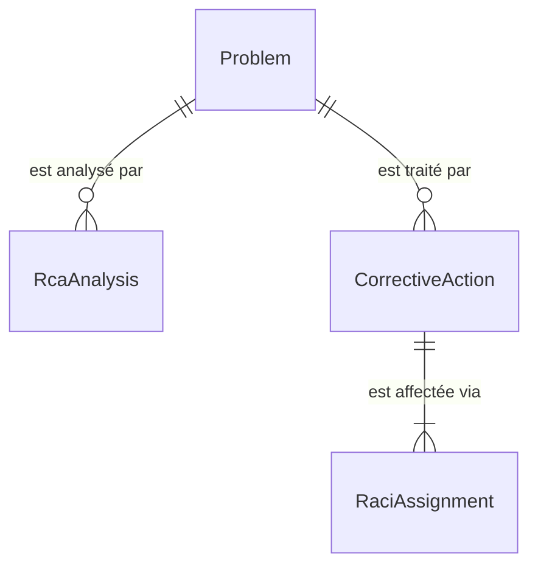

# 🗄️ Base de données

> PostgreSQL 16 via Entity Framework Core 8 (Npgsql). Base et utilisateur `saloha` par défaut, contexte unique `backend/Core/Data/AppDbContext.cs`.

[← Documentation](../readme.md) · [Produit](produit.md) · [Règles métier](regles-metier.md) · [Architecture](architecture.md) · [Base de données](base-de-donnees.md) · [Frontend](frontend.md) · [Exploitation](exploitation.md) · [Sécurité](securite.md) · [Glossaire](glossaire.md)

## Gestion du schéma

Le schéma est créé au démarrage de l'API par `Database.EnsureCreated()`
(`backend/Program.cs`) : **il n'y a pas de migrations EF**.

Conséquence : `EnsureCreated` ne crée le schéma que si la base est vide. Une évolution du
modèle (colonne, table, contrainte) **n'est pas appliquée** à une base existante. Tant que
les migrations ne sont pas en place (chantier dans [`plan-action.md`](../plan-action.md)),
toute évolution du modèle impose de recréer la base ou de l'altérer à la main.

## Entités — module Gestion des problèmes

Source : `backend/Modules/ProblemManagement/Models/Entities.cs`.

| `DbSet` | Entité | Table |
|---|---|---|
| `Problems` | `Problem` | `Problems` |
| `Analyses` | `RcaAnalysis` | `Analyses` |
| `Actions` | `CorrectiveAction` | `Actions` |
| `RaciAssignments` | `RaciAssignment` | `RaciAssignments` |

### Problem

| Champ | Type | Règle |
|---|---|---|
| `Reference` | texte (20) | **unique** (index) — `PRB-AAAA-NNNN` |
| `Title` | texte (200) | |
| `Description` | texte | |
| `Status` | texte (30) | `Nouveau`, `En analyse`, `Erreur connue`, `Résolu`, `Clos` |
| `Impact` | texte (10) | `Faible`, `Moyen`, `Élevé` |
| `Urgency` | texte (10) | `Faible`, `Moyenne`, `Élevée` |
| `Priority` | texte (10) | `P1`…`P4`, **dérivée** impact × urgence |
| `Category`, `AffectedService` | texte (100 / 150) | |
| `CreatedBy`, `CreatedByDisplayName` | texte (100 / 200) | `sAMAccountName` et nom AD du déclarant |
| `KnownErrorWorkaround` | texte, nullable | contournement (erreur connue) |
| `RootCause` | texte, nullable | cause racine **validée** |
| `CreatedAt`, `UpdatedAt` | horodatage UTC | |
| `ClosedAt` | horodatage UTC, nullable | posé au passage à `Clos` — base du MTTR |

### RcaAnalysis

| Champ | Type | Règle |
|---|---|---|
| `ProblemId` | FK → `Problem` | cascade |
| `Method` | texte (20) | `FIVE_WHYS`, `ISHIKAWA`, `FTA` |
| `DataJson` | texte (JSON) | structure propre à la méthode, voir ci-dessous |
| `Conclusion` | texte, nullable | cause racine identifiée par l'analyse |
| `CreatedBy`, `CreatedAt`, `UpdatedAt` | | |

### CorrectiveAction

| Champ | Type | Règle |
|---|---|---|
| `ProblemId` | FK → `Problem` | cascade |
| `Title` (200), `Description` | texte | |
| `Status` | texte (20) | `À faire`, `En cours`, `Terminée`, `Annulée` |
| `DueDate` | horodatage, nullable | échéance — base du calcul de retard |
| `CompletedAt` | horodatage, nullable | posé au passage à `Terminée` |
| `CreatedBy`, `CreatedAt` | | |

### RaciAssignment

| Champ | Type | Règle |
|---|---|---|
| `CorrectiveActionId` | FK → `CorrectiveAction` | cascade |
| `Role` | texte (1) | `R`, `A`, `C`, `I` |
| `AssigneeType` | texte (10) | `User` ou `Group` |
| `AssigneeId` | texte (200) | `sAMAccountName` (utilisateur) ou `cn` (groupe AD) |
| `AssigneeDisplayName` | texte (250) | nom d'affichage au moment de l'affectation |

Les identités sont des **chaînes AD**, sans table d'utilisateurs : un renommage dans l'AD
n'est pas répercuté sur les enregistrements existants.

### Suppressions

En cascade : `Problem` → `RcaAnalysis` et `CorrectiveAction` → `RaciAssignment`.

## Formats JSON des analyses (`DataJson`)

Le JSON permet d'ajouter une méthodologie sans évolution de schéma.

- **5 Pourquoi** : `{ "problem": "...", "whys": ["...", ...], "rootCause": "..." }`
- **Ishikawa (6M)** : `{ "categories": { "Méthode": ["..."], ... }, "rootCause": "..." }`
- **FTA** : arbre récursif `{ "root": { "label": "...", "gate": "OR|AND", "children": [...] }, "rootCause": "..." }`

## Ajouter les entités d'un module

1. Déclarer les entités dans `backend/Modules/<Processus>/Models/`.
2. Ajouter les `DbSet` et la configuration (`OnModelCreating`) dans `AppDbContext`.
3. Documenter les tables ici, dans une section par module.
