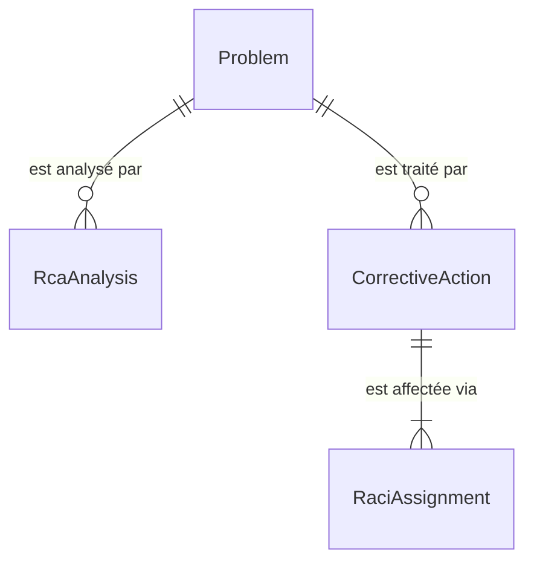
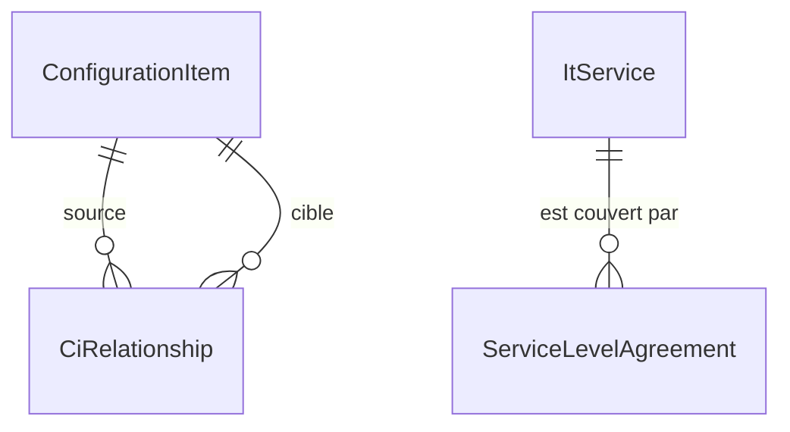

# 🗄️ Base de données

> PostgreSQL 16 via Entity Framework Core 8 (Npgsql). Base et utilisateur `saloha` par défaut, contexte unique `backend/Core/Data/AppDbContext.cs`.

[← Documentation](../readme.md) · [Produit](produit.md) · [Règles métier](regles-metier.md) · [Architecture](architecture.md) · [Base de données](base-de-donnees.md) · [Frontend](frontend.md) · [Exploitation](exploitation.md) · [Sécurité](securite.md) · [Glossaire](glossaire.md)

## Gestion du schéma

Le schéma est tenu par les **migrations EF** (`backend/Core/Data/Migrations`), appliquées
au démarrage de l'API par `DatabaseSchema.Migrate` (`backend/Core/Data/DatabaseSchema.cs`) ;
l'historique est dans la table `__EFMigrationsHistory`
([ADR-0008](../decisions/adr-0008-migrations-ef.md)).

| Migration | Contenu |
|---|---|
| `Initial` | Schéma du module Problèmes : `Problems`, `Analyses`, `Actions`, `RaciAssignments` — identique à ce que créait `EnsureCreated` avant les modules ITIL 4 |
| `ItilModules` | Les dix tables des autres processus et des liens (`ItemLinks`, `Incidents`, `ServiceRequests`, `Changes`, `ConfigurationItems`, `CiRelationships`, `Services`, `Agreements`, `KnowledgeArticles`, `Improvements`) ; aucune modification des tables existantes |

**Reprise d'une base créée par `EnsureCreated`** (installations antérieures, sans
historique) : au démarrage, si `__EFMigrationsHistory` n'existe pas mais que `Problems`
existe, l'API inscrit `Initial` comme appliquée — et `ItilModules` si `Incidents` existe
aussi —, puis applique les migrations restantes. Les données sont conservées.

Faire évoluer le modèle : [exploitation § Évolutions de schéma](exploitation.md#évolutions-de-schéma).

## Entités — module Gestion des problèmes

Source : `backend/Modules/ProblemManagement/Models/Entities.cs`.

| `DbSet` | Entité | Table |
|---|---|---|
| `Problems` | `Problem` | `Problems` |
| `Analyses` | `RcaAnalysis` | `Analyses` |
| `Actions` | `CorrectiveAction` | `Actions` |
| `RaciAssignments` | `RaciAssignment` | `RaciAssignments` |

### Problem

| Champ | Type | Règle |
|---|---|---|
| `Reference` | texte (20) | **unique** (index) — `PRB-AAAA-NNNN` |
| `Title` | texte (200) | |
| `Description` | texte | |
| `Status` | texte (30) | `Nouveau`, `En analyse`, `Erreur connue`, `Résolu`, `Clos` |
| `Impact` | texte (10) | `Faible`, `Moyen`, `Élevé` |
| `Urgency` | texte (10) | `Faible`, `Moyenne`, `Élevée` |
| `Priority` | texte (10) | `P1`…`P4`, **dérivée** impact × urgence |
| `Category`, `AffectedService` | texte (100 / 150) | |
| `CreatedBy`, `CreatedByDisplayName` | texte (100 / 200) | `sAMAccountName` et nom AD du déclarant |
| `KnownErrorWorkaround` | texte, nullable | contournement (erreur connue) |
| `RootCause` | texte, nullable | cause racine **validée** |
| `CreatedAt`, `UpdatedAt` | horodatage UTC | |
| `ClosedAt` | horodatage UTC, nullable | posé au passage à `Clos` — base du MTTR |

### RcaAnalysis

| Champ | Type | Règle |
|---|---|---|
| `ProblemId` | FK → `Problem` | cascade |
| `Method` | texte (20) | `FIVE_WHYS`, `ISHIKAWA`, `FTA` |
| `DataJson` | texte (JSON) | structure propre à la méthode, voir ci-dessous |
| `Conclusion` | texte, nullable | cause racine identifiée par l'analyse |
| `CreatedBy`, `CreatedAt`, `UpdatedAt` | | |

### CorrectiveAction

| Champ | Type | Règle |
|---|---|---|
| `ProblemId` | FK → `Problem` | cascade |
| `Title` (200), `Description` | texte | |
| `Status` | texte (20) | `À faire`, `En cours`, `Terminée`, `Annulée` |
| `DueDate` | horodatage, nullable | échéance — base du calcul de retard |
| `CompletedAt` | horodatage, nullable | posé au passage à `Terminée` |
| `CreatedBy`, `CreatedAt` | | |

### RaciAssignment

| Champ | Type | Règle |
|---|---|---|
| `CorrectiveActionId` | FK → `CorrectiveAction` | cascade |
| `Role` | texte (1) | `R`, `A`, `C`, `I` |
| `AssigneeType` | texte (10) | `User` ou `Group` |
| `AssigneeId` | texte (200) | `sAMAccountName` (utilisateur) ou `cn` (groupe AD) |
| `AssigneeDisplayName` | texte (250) | nom d'affichage au moment de l'affectation |

Les identités sont des **chaînes AD**, sans table d'utilisateurs : un renommage dans l'AD
n'est pas répercuté sur les enregistrements existants.

### Suppressions

En cascade : `Problem` → `RcaAnalysis` et `CorrectiveAction` → `RaciAssignment`.

## Formats JSON des analyses (`DataJson`)

Le JSON permet d'ajouter une méthodologie sans évolution de schéma.

- **5 Pourquoi** : `{ "problem": "...", "whys": ["...", ...], "rootCause": "..." }`
- **Ishikawa (6M)** : `{ "categories": { "Méthode": ["..."], ... }, "rootCause": "..." }`
- **FTA** : arbre récursif `{ "root": { "label": "...", "gate": "OR|AND", "children": [...] }, "rootCause": "..." }`

## Entités — socle commun des processus

Les entités des autres processus dérivent de `Record` (`backend/Core/Records/Record.cs`,
classe non mappée) : chaque processus a sa table, avec ces colonnes communes.

| Champ | Type | Règle |
|---|---|---|
| `Reference` | texte (20) | **unique** (index par table) — `XXX-AAAA-NNNN` |
| `Title` | texte (200) | obligatoire ; porte le *nom* pour un CI ou un service |
| `Description` | texte | |
| `Status` | texte (30) | liste fermée propre au processus ([règles métier](regles-metier.md#8-règles-communes-aux-processus)) |
| `OwnerType`, `OwnerId`, `OwnerDisplayName` | texte (10 / 200 / 250), nullable | responsable AD : `User` ou `Group` |
| `CreatedBy`, `CreatedByDisplayName` | texte (100 / 200) | |
| `CreatedAt`, `UpdatedAt` | horodatage UTC | |

### Tables des processus

| Table (entité) | Préfixe | Colonnes propres |
|---|---|---|
| `Incidents` (`Incident`) | INC | `Impact`, `Urgency`, `Priority` (dérivée), `Category`, `AffectedService`, `IsMajor`, `Resolution`, `ResolvedAt`, `ClosedAt` |
| `ServiceRequests` (`ServiceRequest`) | REQ | `RequestedItem`, `RequestedFor`, `RequestedForDisplayName`, `DueDate`, `ApprovedBy`, `ApprovedAt`, `FulfilledAt`, `ClosedAt` |
| `Changes` (`Change`) | CHG | `ChangeType`, `Risk`, `PlannedStart`, `PlannedEnd`, `ImplementationPlan`, `BackoutPlan`, `Outcome`, `AuthorizedBy`, `AuthorizedAt`, `ClosedAt` |
| `ConfigurationItems` (`ConfigurationItem`) | CI | `CiType`, `Environment`, `Location` |
| `Services` (`ItService`) | SVC | `Criticality`, `ServiceHours` |
| `Agreements` (`ServiceLevelAgreement`) | SLA | `ServiceId` (FK → `Services`, cascade), `Customer`, `AvailabilityTarget` (décimal 5,2), `ResolutionHoursP1`…`P4`, `ValidFrom`, `ValidTo`, `ReviewDate` |
| `KnowledgeArticles` (`KnowledgeArticle`) | KB | `ArticleType`, `Content`, `Keywords`, `ReviewDate`, `PublishedBy`, `PublishedAt` |
| `Improvements` (`Improvement`) | AMI | `Step` (1–7), `Priority`, `Benefit`, `Baseline`, `Target`, `Outcome`, `DueDate`, `ValidatedBy`, `ValidatedAt`, `CompletedAt` |

- **`CiRelationships`** : `SourceId`, `TargetId` (FK → `ConfigurationItems`, cascade des deux
  côtés), `Type` (`Dépend de`, `Héberge`, `Fait partie de`, `Se connecte à`).
- **`ItemLinks`** (socle, `backend/Core/Links/ItemLink.cs`) : `FromType`, `FromId`, `ToType`,
  `ToId`, `CreatedBy`, `CreatedAt`. Types : `problem`, `incident`, `request`, `change`, `ci`,
  `service`, `agreement`, `article`, `improvement`. Pas de clé étrangère (une extrémité
  peut appartenir à n'importe quelle table) : les liens d'un enregistrement sont supprimés
  avec lui par l'API, et un lien orphelin est ignoré à la lecture. Index sur
  (`FromType`, `FromId`) et (`ToType`, `ToId`).
- Les dates saisies sans fuseau sont lues en UTC (`Dates.Utc`) : les colonnes sont en `timestamptz`.

## Ajouter les entités d'un module

1. Déclarer les entités dans `backend/Modules/<Processus>/Models/` (dérivées de `Record` pour un processus).
2. Ajouter les `DbSet`, l'index unique de la référence et la configuration (`OnModelCreating`) dans `AppDbContext`.
3. Documenter les tables ici.
