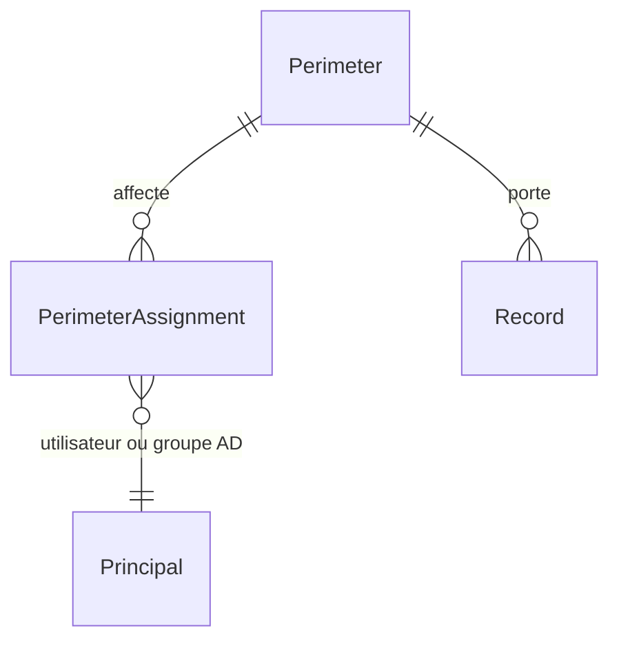

# 🧭 Périmètres

[← Documentation](../readme.md) · [Règles métier](regles-metier.md) · [Frontend](frontend.md) · [ADR-0014](../decisions/adr-0014-perimetres-droits-scopes.md)

> Droits **scopés par périmètre** : un périmètre est une partie de l'organisation (direction,
> site, entité) ; un gestionnaire ou un intervenant n'agit que sur les enregistrements de ses
> périmètres, l'administrateur sur tous. Règles préfixées **PER**. Statut : **spécifié, à
> implémenter** (étape 6 du [plan du lot 1](processus/readme.md#plan-dimplémentation-conseillé--lot-1)) ;
> les choix marqués *à confirmer* sont tranchés dans l'[ADR-0014](../decisions/adr-0014-perimetres-droits-scopes.md).

## 1. Pourquoi

Aujourd'hui, le rôle d'un utilisateur vient de ses groupes Active Directory et vaut pour
**toute** la plateforme : un Manager de la direction financière peut autoriser un changement
du site de production, un intervenant voit les incidents de toutes les entités. Dès qu'une
DSI sert plusieurs directions ou sites, il faut que les décisions de gestionnaire — et, selon
le choix retenu, la visibilité — se limitent au périmètre de chacun.

## 2. Modèle

| Objet | Champs | Règle |
|---|---|---|
| **Périmètre** (`Perimeter`) | nom (unique), description, suppression douce (`DeletedAt`, `DeletedBy`) | PER-01 |
| **Affectation** (`PerimeterAssignment`) | principal AD (`User` ou `Group`, identifiant, nom affiché), rôle (`Manager` ou `User`), périmètre ; unique (principal, rôle, périmètre) | PER-02 |
| **Enregistrement** de pratique | `PerimeterId` (obligatoire) | PER-04 |

- **Admin** : portée **globale**, jamais affecté à un périmètre (l'affectation d'un Admin à un
  périmètre est refusée).
- **Manager** et **User** : une ou plusieurs affectations ; un même compte peut être Manager
  sur un périmètre et User sur un autre.
- Le **groupe AD de rôle** (`Ldap:Groups`) continue de donner l'**accès** à la plateforme et
  le statut d'Admin ; les **affectations** donnent la **portée** et le rôle par périmètre.

## 3. Règles

| ID | Règle | Statut | Lot |
|---|---|---|---|
| PER-01 | **Périmètre** : nom unique (insensible à la casse) et description ; créé, renommé et supprimé par l'**Admin** seul. Suppression **douce** (restaurable) ; suppression définitive seulement si aucun enregistrement ni affectation n'y est rattaché (409 sinon, avec les compteurs) | 🔜 | 1 |
| PER-02 | **Affectation** d'un utilisateur ou d'un **groupe AD** à un périmètre avec le rôle Manager ou User, par l'Admin ; plusieurs affectations par compte ; jamais d'Admin scopé | 🔜 | 1 |
| PER-03 | **Rôle effectif** sur un enregistrement : le plus élevé des rôles que l'utilisateur tient sur le périmètre de l'enregistrement, directement ou par un de ses groupes (étape 5, SOC-10) ; Admin partout | 🔜 | 1 |
| PER-04 | Tout enregistrement de pratique **porte un périmètre**, obligatoire à la création ; proposé par défaut quand l'utilisateur n'a qu'un périmètre ; on ne crée que dans un périmètre où l'on est affecté | 🔜 | 1 |
| PER-05 | **Visibilité** : un utilisateur voit les enregistrements de ses périmètres ; les **référentiels partagés** (catalogue des services, articles publiés) restent visibles de tous — *à confirmer* (ADR-0014, D2) | 🔜 | 1 |
| PER-06 | Les **décisions de gestionnaire** (autoriser, approuver, publier, valider, qualifier un problème, transitions réservées) exigent le rôle **Manager sur le périmètre** de l'enregistrement | 🔜 | 1 |
| PER-07 | **Changer le périmètre** d'un enregistrement : Manager des deux périmètres, ou Admin ; tracé au journal d'audit (SOC-20) | 🔜 | 1 |
| PER-08 | **Liens** entre enregistrements de périmètres différents : permis si l'utilisateur voit les deux ; un lien ne donne pas accès à l'enregistrement d'un autre périmètre | 🔜 | 1 |
| PER-09 | **Console, reporting, recherche, cas similaires** : limités aux périmètres de l'utilisateur ; l'Admin voit tout, avec un filtre par périmètre | 🔜 | 1 |
| PER-10 | **Reprise des données** : à la mise à niveau, un périmètre « Organisation » est créé et reçoit tous les enregistrements ; tant qu'aucune affectation n'existe, chaque utilisateur est réputé affecté à ce périmètre avec son rôle AD (comportement inchangé) — *à confirmer* (D3) | 🔜 | 1 |
| PER-11 | Créations, modifications, suppressions de périmètres et d'affectations sont **tracées** au journal d'audit (SOC-20) | 🔜 | 1 |
| PER-12 | Fiche d'un périmètre : compteurs des enregistrements rattachés par pratique et liste des affectations | 🔜 | 1 |

## 4. Administration

Entrée **Administration › Périmètres** (Admin), voir [frontend § Administration](frontend.md#administration) :

- **Liste** des périmètres (dont supprimés, grisés, restaurables), création, renommage ;
- **Fiche** : description, compteurs par pratique (PER-12), affectations (ajout par
  recherche dans l'annuaire, utilisateur ou groupe, rôle Manager ou User ; retrait) ;
- **Suppression** douce, restauration, suppression définitive si rien n'est rattaché (PER-01).

L'entrée **Utilisateurs et rôles** (SOC-26) affiche, pour chaque compte constaté, son rôle AD
et ses affectations.

## 5. API (cible)

| Route | Policy | Rôle |
|---|---|---|
| GET `/api/perimeters` | User | Périmètres visibles de l'utilisateur (sélecteurs) |
| GET/POST/PUT `/api/admin/perimeters[/{id}]`, DELETE `…/{id}` (douce), POST `…/{id}/restore`, DELETE `…/{id}/purge` | Admin | Gestion des périmètres |
| GET/POST `/api/admin/perimeters/{id}/assignments`, DELETE `/api/admin/assignments/{id}` | Admin | Affectations |
| `PerimeterId` sur chaque enregistrement ; `?perimeter=` sur les listes | selon PER-05, PER-06 | Portée |

## 6. Scénarios d'acceptation

- **PER-06** — *Étant donné* Lova, Manager du périmètre « Siège » et User du périmètre
  « Usine », *quand* elle autorise un changement de l'Usine, *alors* 403 ; un changement du
  Siège, *alors* il est autorisé.
- **PER-04** — *Étant donné* un utilisateur affecté au seul périmètre « Siège », *quand* il
  déclare un incident, *alors* l'incident porte le Siège ; dans un périmètre où il n'est pas
  affecté, 403.
- **PER-01** — *Étant donné* un périmètre qui porte des incidents, *quand* l'Admin le purge,
  *alors* 409 avec les compteurs ; supprimé en douceur, il disparaît des sélecteurs et se
  restaure.
- **PER-10** — *Étant donné* une installation existante sans affectation, *après* la mise à
  niveau, *alors* tout est rattaché à « Organisation » et chacun garde ses droits actuels.
