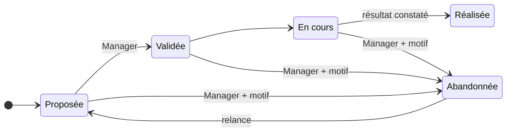

# 📈 Amélioration continue

> Pratique ITIL 4 *Continual improvement*. Code : `backend/Modules/ContinualImprovement`,
> `frontend/src/modules/continual-improvement`. Préfixe des règles : **CSI**. Socle commun
> et conventions (✅ / 🔜, lots) : [règles métier](../regles-metier.md).

[← Règles métier](../regles-metier.md) · [Toutes les pratiques](readme.md)

## 1. Objectif et périmètre

*Objectif ITIL 4 : aligner les pratiques et les services de l'organisation sur l'évolution
des besoins métier, par l'amélioration continue des produits, des services, des pratiques
et de tout élément de leur gestion.*

Le **registre d'amélioration continue** recense les opportunités d'amélioration, de la
proposition à la mesure du résultat, selon le **modèle d'amélioration continue ITIL 4** en
sept étapes. Toute pratique peut l'alimenter : un SLA non tenu, une tendance d'incidents,
un problème systémique, une suggestion. Hors périmètre : la gestion de portefeuille de
projets.

## 2. Rôles et droits

| Rôle ITIL | Rôle applicatif | Responsabilités |
|---|---|---|
| Contributeur | Tous | Propose une amélioration |
| Porteur | Responsable AD | Conduit l'amélioration, mesure le résultat |
| Gestionnaire de l'amélioration continue | Manager | Valide, priorise, abandonne, revoit le registre |

| Action | User | Manager | Admin | Statut |
|---|---|---|---|---|
| Proposer, modifier, faire avancer une amélioration validée | ✔ | ✔ | ✔ | ✅ |
| Valider / abandonner | ✘ | ✔ | ✔ | ✅ |
| Supprimer | ✘ | ✘ | ✔ | ✅ |

## 3. Données

Champs communs (référence `AMI-AAAA-NNNN`, titre = opportunité, description, statut,
porteur AD, créateur, dates) : [socle](../regles-metier.md#5-règles-communes-aux-processus).

| Champ | Type | Oblig. | Valeurs / règle | Statut |
|---|---|---|---|---|
| `Step` | entier | ✔ | 1 à 7 (modèle ITIL 4, ci-dessous) | ✅ |
| `Priority` | texte 10 | ✔ | Faible, Moyenne, Élevée | ✅ (calculée 🔜 CSI-12) |
| `Benefit` | texte | | Valeur attendue | ✅ |
| `Baseline`, `Target` | texte 300 | | Mesure de départ, mesure cible | ✅ |
| `Outcome` | texte | à la réalisation | Résultat constaté | ✅ |
| `DueDate` | date | | Échéance | ✅ |
| `ValidatedBy`, `ValidatedAt`, `CompletedAt` | texte, date | auto | SOC-08 | ✅ |
| `Source` | texte 20 | ✔ (🔜) | Suggestion, Incident, Problème, SLA, Audit, Retour client | 🔜 CSI-10 |
| `Value`, `Effort` | entier 1–3 | à la validation | Valeur métier, effort estimé | 🔜 CSI-12 |
| `AbandonReason` | texte | à l'abandon | Motif | 🔜 CSI-13 |
| `FollowUpDate` | date | | Date de contrôle de la durabilité (étape 7) | 🔜 CSI-15 |

**Modèle d'amélioration continue ITIL 4** : 1. *Quelle est la vision ?* — 2. *Où en
sommes-nous ?* — 3. *Où voulons-nous être ?* — 4. *Comment y parvenir ?* — 5. *Passer à
l'action* — 6. *Y sommes-nous parvenus ?* — 7. *Comment maintenir la dynamique ?*

## 4. Cycle de vie

**Aujourd'hui (✅)** : conditions de statut tenues, autres transitions libres. **Cible
(🔜 CSI-11, lot 1)** : seules les transitions ci-dessous (SOC-05).

| De → Vers | Qui | Conditions (400 sinon) | Effets | Statut |
|---|---|---|---|---|
| — → Proposée | Tous | Titre, étape | Référence | ✅ |
| Proposée → Validée | Manager | Valeur attendue, mesure de départ et mesure cible renseignées | `ValidatedAt`, `ValidatedBy` | ✅ (horodatage) / 🔜 CSI-14 |
| Validée → En cours | Porteur, Manager | Validée ; porteur renseigné | | ✅ / 🔜 |
| En cours → Réalisée | Porteur, Manager | Résultat constaté ; étape ≥ 6 | `CompletedAt` | ✅ (résultat) / 🔜 (étape) |
| Proposée, Validée, En cours → Abandonnée | Manager | Motif | Validation retirée | ✅ / 🔜 CSI-13 |
| Abandonnée → Proposée | Tous | | Nouvelle validation nécessaire | ✅ |
| Réalisée → … | — | Statut final | | 🔜 CSI-11 |

## 5. Règles de gestion

| ID | Règle | Statut | Lot |
|---|---|---|---|
| CSI-01 | Registre : opportunité, valeur attendue, mesure de départ et cible, priorité, porteur, échéance, résultat constaté | ✅ | |
| CSI-02 | Avancement selon le **modèle ITIL 4**, étape 1 à 7 ; hors de 1 à 7 ⇒ 400 | ✅ | |
| CSI-03 | **Validée** et **Abandonnée** : gestionnaire uniquement | ✅ | |
| CSI-04 | **En cours** et **Réalisée** exigent une amélioration validée ; **Réalisée** exige le résultat constaté | ✅ | |
| CSI-05 | **Abandonner**, comme revenir à Proposée, **retire la validation** : relancer demande une nouvelle validation | ✅ | |
| CSI-10 | **Source** de l'amélioration et lien vers l'enregistrement d'origine (incident, problème, SLA) quand il existe | 🔜 | 2 |
| CSI-11 | **Transitions contraintes** selon le § 4 (SOC-05) ; Réalisée est finale | ✅ | 1 |
| CSI-12 | **Priorisation** : à la validation, le gestionnaire note la valeur et l'effort (1 à 3) ; la priorité est calculée : valeur 3 et effort 1–2 → Élevée ; valeur 1 et effort 2–3 → Faible ; sinon Moyenne | 🔜 | 2 |
| CSI-13 | **Abandon** motivé : le motif est obligatoire et visible sur la fiche | 🔜 | 1 |
| CSI-14 | **Validation** exige valeur attendue, mesure de départ et mesure cible (une amélioration se mesure) | 🔜 | 1 |
| CSI-15 | **Durabilité** (étape 7) : une amélioration Réalisée peut porter une date de contrôle ; à cette date, le porteur confirme que le résultat tient, ou ouvre une nouvelle amélioration reliée | 🔜 | 3 |
| CSI-16 | **Réalisée** exige l'étape 6 au moins (« Y sommes-nous parvenus ? ») : le résultat est comparé à la cible | 🔜 | 1 |

## 6. Délais, calculs et alertes

| ID | Règle | Statut | Lot |
|---|---|---|---|
| CSI-20 | **Amélioration proposée par le système** depuis un SLA sous la cible (SLM-23) ou un problème récurrent (PRB-23) : brouillon Proposée, source et lien renseignés, à valider par un gestionnaire | 🔜 | 2 |
| CSI-21 | Une amélioration **En cours** dont l'échéance est passée remonte en relance à son porteur (même règle de date que PRB-19) | 🔜 | 2 |
| CSI-22 | **Revue du registre** : les améliorations Proposée depuis plus de 30 jours remontent dans « Décisions » des gestionnaires | 🔜 | 2 |
| CSI-23 | Notifications (SOC-21) : proposition → gestionnaires ; validation ou abandon → proposant et porteur | 🔜 | 2 |

## 7. Liens avec les autres pratiques

| Lien | Sens | Règle | Statut |
|---|---|---|---|
| SLA → Amélioration | Cible non tenue | CSI-20, SLM-23 | 🔜 |
| Problème → Amélioration | Cause systémique, récurrence | CSI-20, PRB-23 | ✅ (lien) / 🔜 |
| Incident → Amélioration | Tendance | CSI-10 | ✅ (lien) / 🔜 |
| Amélioration → Changement | Mise en œuvre | Lien manuel | ✅ |

## 8. Console et indicateurs

Console ✅ : améliorations Proposée dans « Décisions » (gestionnaires) ; mes améliorations
ouvertes (Mon travail). À venir : échéances dépassées (Relances, CSI-21), contrôles de
durabilité du jour (Mon travail, CSI-15).

| Indicateur | Calcul | Statut |
|---|---|---|
| Volumétrie par statut | | ✅ |
| Améliorations réalisées sur la période, par source | | 🔜 CSI-30 (lot 2) |
| Délai moyen de réalisation | `CompletedAt − ValidatedAt` | 🔜 CSI-31 (lot 2) |
| Taux d'abandon | Abandonnées / (Réalisées + Abandonnées) | 🔜 CSI-32 (lot 3) |

## 9. API

| Route | Policy | Rôle |
|---|---|---|
| `GET /api/improvements` (filtres `status`, `q`, `owner`), `GET /api/improvements/{id}` | User | Registre, fiche |
| `POST /api/improvements`, `PUT /api/improvements/{id}` | User (Validée/Abandonnée : Manager) | Proposition, avancement, transitions |
| `DELETE /api/improvements/{id}` | Admin | Suppression |

## 10. Scénarios d'acceptation

- **CSI-02** — *Quand* on enregistre une étape 8, *alors* 400 « L'étape du modèle d'amélioration va de 1 à 7 ».
- **CSI-04** — *Étant donné* une amélioration Proposée, *quand* on la passe En cours, *alors* 400 « doit d'abord être validée ».
- **CSI-05** — *Étant donné* une amélioration Validée, *quand* un Manager l'abandonne puis qu'on la repasse Proposée, *alors* `ValidatedAt` est vide.
- **CSI-12** — *Quand* un Manager valide avec valeur 3 et effort 1, *alors* la priorité devient Élevée.
- **CSI-16** — *Étant donné* une amélioration En cours à l'étape 5 avec un résultat, *quand* on la passe Réalisée, *alors* 400 « étape 6 requise ».
