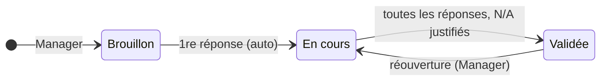

# 🛡️ Conformité NIS 2

> Pratique ITIL 4 *Information security management*, appliquée à l'évaluation de la
> conformité à la directive NIS 2. Code : `backend/Modules/ComplianceAssessment`,
> `frontend/src/modules/compliance-assessment`. Préfixe des règles : **NIS**. Socle commun et
> conventions (✅ / 🔜, lots) : [règles métier](../regles-metier.md).

[← Règles métier](../regles-metier.md) · [Toutes les pratiques](readme.md)

## 1. Objectif et périmètre

*Objectif ITIL 4 (gestion de la sécurité de l'information) : protéger l'information dont
l'organisation a besoin pour conduire ses activités, en comprenant et en gérant les risques
pour sa confidentialité, son intégrité et sa disponibilité.*

La pratique mesure la **conformité d'un périmètre** (une organisation, une entité, un
système) aux exigences de la directive **NIS 2**, telles que déclinées par l'ANSSI dans le
**Référentiel Cyber France (ReCyF)** : 20 objectifs de sécurité répartis en quatre piliers
(Gouvernance, Protection, Défense, Résilience), 152 exigences. Une **évaluation** note
chaque exigence applicable, calcule les scores et la maturité, liste les écarts et
alimente le registre d'**amélioration continue**.

**Référentiel** : ReCyF v2.5 du 17/03/2026, marqué « version de travail » par l'ANSSI. Le
dépôt ne contient que sa **structure** (numéros, titres d'objectifs, piliers, codes
d'exigences, thématiques, cibles, numéros de mesures ISO 27002) ; le **texte** des
exigences est **importé par l'administrateur** depuis le document de l'ANSSI : sa
réutilisation commerciale est soumise à autorisation, incompatible avec l'AGPLv3
([ADR-0012](../../decisions/adr-0012-referentiel-nis2-structure-versionnee-texte-importe.md)).
Les correspondances avec les mesures **ISO/IEC 27002:2022** sont celles de la **table de
correspondance publiée par l'ANSSI** (ReCyF ↔ ISO/IEC 27001, 27002 et 27005, portail
[MesServicesCyber](https://messervices.cyber.gouv.fr)) ; seuls les **numéros** des mesures
figurent, sans leurs intitulés, protégés par le droit d'auteur de l'ISO.

Hors périmètre : la déclaration d'incidents aux autorités, l'analyse de risques
détaillée, la certification.

## 2. Rôles et droits

| Rôle ITIL | Rôle applicatif | Responsabilités |
|---|---|---|
| Responsable de la sécurité / de la conformité | Manager | Crée et pilote les évaluations, les valide, les rouvre |
| Contributeur | User | Répond aux exigences de son domaine |
| Administrateur | Admin | Importe le texte du référentiel, supprime |

| Action | User | Manager | Admin | Statut |
|---|---|---|---|---|
| Consulter le référentiel et les évaluations | ✔ | ✔ | ✔ | ✅ NIS-20 |
| Répondre à une exigence (score ou non applicable) | ✔ | ✔ | ✔ | ✅ NIS-04 |
| Créer, modifier, valider, rouvrir une évaluation | ✘ | ✔ | ✔ | ✅ NIS-02 |
| Créer une action d'amélioration depuis un écart | ✘ | ✔ | ✔ | ✅ NIS-15 |
| Importer le texte des exigences | ✘ | ✘ | ✔ | ✅ NIS-21 |
| Supprimer une évaluation | ✘ | ✘ | ✔ | ✅ NIS-02 |

## 3. Données

### Référentiel (structure embarquée)

Fichiers `backend/Modules/ComplianceAssessment/Referential/objectifs.csv` et
`exigences.csv`, ressources embarquées dans l'API ; la base est **alignée sur eux à chaque
démarrage**.

| Objet | Champs | Statut |
|---|---|---|
| Objectif (`SecurityObjectives`) | Numéro (1 à 20), titre, pilier : Gouvernance (6), Protection (9), Défense (2), Résilience (3) | ✅ |
| Exigence (`SecurityRequirements`) | Code (ex. `5.B.4-EI/EE`), objectif, thématique, cibles (`ForImportant`, `ForEssential`), numéros des mesures ISO 27002 correspondantes selon la table de l'ANSSI (séparés par des espaces), ordre, **texte importé** et date d'import | ✅ |

Cibles : 76 exigences « EI/EE » (entités importantes et essentielles) et 76 exigences
« EE » (entités essentielles seulement) ; 130 exigences portent au moins une mesure ISO.

### Évaluation (`Assessments`, `EVA-AAAA-NNNN`)

Champs communs (référence, titre, description = périmètre évalué, statut, responsable AD,
créateur, dates) : [socle](../regles-metier.md#5-règles-communes-aux-processus).

| Champ | Type | Oblig. | Valeurs / règle | Statut |
|---|---|---|---|---|
| `EntityCategory` | texte 30 | ✔ | Entité importante, Entité essentielle | ✅ |
| `Status` | texte 30 | auto | Brouillon, En cours, Validée | ✅ |
| `ValidatedBy`, `ValidatedAt` | texte, date | auto | Validation (SOC-08) | ✅ |
| `ReferentialVersion` | texte | auto | Version du référentiel évaluée | 🔜 NIS-18 |
| `NextAssessmentDate` | date | | Prochaine évaluation | 🔜 NIS-16 |

### Réponse (`AssessmentResponses`)

| Champ | Type | Règle | Statut |
|---|---|---|---|
| `RequirementId` | lien | Exigence applicable à la catégorie | ✅ |
| `Score` | entier | 0 (absent) à 3 (maîtrisé) ; vide si non applicable | ✅ |
| `NotApplicable` | booléen | Exige une justification à la validation | ✅ |
| `Justification` | texte | | ✅ |
| `UpdatedBy`, `UpdatedAt` | | Dernier répondant | ✅ |
| Preuves | liens, pièces jointes | | 🔜 NIS-08 |

## 4. Cycle de vie

| De → Vers | Qui | Conditions (400 sinon) | Effets | Statut |
|---|---|---|---|---|
| — → Brouillon | Manager | Titre, catégorie d'entité | Référence | ✅ |
| Brouillon → En cours | Auto | Première réponse enregistrée | | ✅ NIS-03 |
| En cours → Validée | Manager | Toutes les exigences applicables ont une réponse ; tout « non applicable » est justifié | `ValidatedAt`, `ValidatedBy` ; réponses et champs figés | ✅ NIS-05, NIS-06 |
| Validée → En cours | Manager | | Validation effacée | ✅ NIS-07 |

## 5. Règles de gestion

| ID | Règle | Statut | Lot |
|---|---|---|---|
| NIS-01 | La **catégorie d'entité** filtre les exigences applicables : *Entité importante* → exigences « EI/EE » ; *Entité essentielle* → toutes | ✅ | |
| NIS-02 | Créer, modifier, valider, rouvrir : Manager ou Admin ; supprimer : Admin. Référence `EVA-AAAA-NNNN`, statuts Brouillon → En cours → Validée | ✅ | |
| NIS-03 | La **première réponse** fait passer l'évaluation de Brouillon à En cours | ✅ | |
| NIS-04 | Tout rôle répond à une exigence **applicable** : score 0 à 3, ou « non applicable » avec justification ; une exigence non applicable à la catégorie ⇒ 400 | ✅ | |
| NIS-05 | **Validation** seulement si toutes les exigences applicables ont une réponse et si tout « non applicable » est justifié (400 avec le nombre manquant) | ✅ | |
| NIS-06 | Une évaluation **validée est figée** : ses réponses et ses champs ne se modifient plus (400) | ✅ | |
| NIS-07 | Seul un gestionnaire la **rouvre** (statut En cours), ce qui efface la validation | ✅ | |
| NIS-08 | **Preuves** : chaque réponse peut porter des liens vers des enregistrements (changement, article, CI) et des pièces jointes (SOC-25) | 🔜 | 2 |
| NIS-09 | **Comparaison** de deux évaluations du même périmètre : évolution des scores par exigence, thématique, objectif et pilier | 🔜 | 2 |
| NIS-16 | **Revue périodique** : une évaluation validée porte la date de la prochaine évaluation (12 mois par défaut) ; à l'échéance, relance au responsable (console, Relances) | 🔜 | 2 |
| NIS-17 | **Export** de la synthèse (CSV : exigence, score, justification, écart, action liée) pour les auditeurs | 🔜 | 2 |
| NIS-18 | Une évaluation enregistre la **version du référentiel** évaluée ; une nouvelle version embarquée ne modifie pas une évaluation validée | 🔜 | 1 |

### Référentiel

| ID | Règle | Statut | Lot |
|---|---|---|---|
| NIS-20 | Tout rôle consulte le référentiel (objectifs, exigences, structure et texte importé) | ✅ | |
| NIS-21 | **Import du texte** réservé à l'Admin (section Paramétrage) : CSV séparé par `;` ou `,`, avec une colonne d'identifiant (« Référence » ou « Code ») et une colonne de texte (« Contenu » ou « Texte ») ; BOM et champs multilignes acceptés ; compte rendu : exigences mises à jour, inchangées, codes inconnus, exigences encore sans texte | ✅ | |
| NIS-22 | L'**alignement au démarrage** ajoute ce qui manque, met à jour thématique, cibles et mesures ISO, **n'écrase jamais le texte importé**, et garde en base une exigence retirée de la structure (des réponses peuvent la viser) | ✅ | |
| NIS-23 | Les exigences **encore sans texte** sont signalées à l'Admin (console, Relances) tant que l'import n'est pas complet | 🔜 | 2 |

## 6. Délais, calculs et alertes

| ID | Règle | Statut | Lot |
|---|---|---|---|
| NIS-10 | **Score** (%) = Σ scores / (3 × nombre de réponses notées) × 100, arrondi au dixième ; « non applicable » et exigences sans réponse exclus. Même formule par thématique, objectif, pilier et global : chaque exigence pèse autant | ✅ | |
| NIS-11 | Score **vide** (null) s'il n'y a aucune réponse notée | ✅ | |
| NIS-12 | **Maturité** (échelle inspirée du CMMI) : 1 *Initial* < 25 % ; 2 *Géré* ≥ 25 % ; 3 *Défini* ≥ 50 % ; 4 *Maîtrisé et mesuré* ≥ 75 % ; 5 *Optimisé* ≥ 90 % | ✅ | |
| NIS-13 | **Écart** d'une exigence = 3 − score ; la liste des écarts est triée par écart décroissant | ✅ | |
| NIS-14 | La synthèse montre, pour chaque écart, l'**action d'amélioration** liée et son statut (plan de traitement) | 🔜 | 2 |
| NIS-15 | **Créer une action d'amélioration** depuis un écart : enregistrement AMI (étape 2, priorité Élevée si score ≤ 1, sinon Moyenne ; mesure de départ = score, cible 3/3) relié à l'évaluation ; un seul par exigence (409 sinon, avec la référence existante) ; refusé sans écart noté (400) | ✅ | |
| NIS-24 | Notifications (SOC-21) : évaluation créée → responsable ; validation ou réouverture → responsable et contributeurs | 🔜 | 3 |

## 7. Liens avec les autres pratiques

| Lien | Sens | Règle | Statut |
|---|---|---|---|
| Évaluation → Amélioration | Traitement d'un écart | NIS-15, [CSI-10](amelioration-continue.md) | ✅ |
| Évaluation → Changement, Article, CI | Preuves de mise en œuvre | NIS-08 | ✅ (lien manuel) / 🔜 |
| Évaluation → Évaluation | Évaluation précédente du même périmètre | NIS-09 | 🔜 |

## 8. Console et indicateurs

Console : mes évaluations ouvertes (Mon travail) — 🔜 (lot 2). À venir : évaluations à
renouveler (Relances, NIS-16), texte du référentiel incomplet (Relances, Admin, NIS-23).

| Indicateur | Calcul | Statut |
|---|---|---|
| Score global, par pilier, objectif, thématique | NIS-10 | ✅ (synthèse de l'évaluation) |
| Niveau de maturité | NIS-12 | ✅ |
| Écarts | NIS-13 | ✅ |
| Évolution entre deux évaluations | NIS-09 | 🔜 NIS-30 (lot 2) |
| Écarts traités | Écarts avec action d'amélioration / écarts | 🔜 NIS-31 (lot 2) |

### Interface

- **Registre** des évaluations (Pratiques › Conformité NIS 2).
- **Fiche** : Informations · **Questionnaire** · **Synthèse** · Liens.
  - *Questionnaire* : exigences applicables regroupées par objectif (blocs repliables) ;
    score ou « non applicable » enregistrés à la saisie, justification enregistrée à la
    sortie du champ ; lecture seule si l'évaluation est validée. Tant que le texte d'une
    exigence n'est pas importé, elle s'affiche par son identifiant et ses mesures ISO, avec
    un message qui renvoie vers l'import (Paramétrage).
  - *Synthèse* : score global, maturité, couverture (réponses / exigences applicables),
    scores par pilier et par objectif (un bloc par objectif), écarts triés avec le bouton
    « Créer une action d'amélioration », remplacé par le lien vers l'AMI une fois créée.
- **Paramétrage › Référentiel NIS 2** (Admin) : structure embarquée et import du texte.

## 9. API

| Route | Policy | Rôle |
|---|---|---|
| `GET /api/assessments` (filtres `status`, `q`, `owner`), `GET /api/assessments/{id}` | User | Registre, fiche |
| `POST /api/assessments`, `PUT /api/assessments/{id}` | Manager | Création, modification, validation, réouverture |
| `DELETE /api/assessments/{id}` | Admin | Suppression |
| `GET /api/assessments/{id}/questionnaire` | User | Exigences applicables et réponses |
| `PUT /api/assessments/{id}/responses/{requirementId}` | User | Réponse à une exigence |
| `GET /api/assessments/{id}/score` | User | Scores, maturité, écarts |
| `POST /api/assessments/{id}/improvements` (`{ code }`) | Manager | Action d'amélioration depuis un écart |
| `GET /api/compliance/referential` | User | Référentiel (objectifs et exigences) |
| `POST /api/compliance/referential/import` | Admin | Import du texte des exigences |

Type de lien inter-processus : `assessment` (préfixe `EVA`).

## 10. Scénarios d'acceptation

- **NIS-01** — *Étant donné* une évaluation d'entité importante, *alors* le questionnaire contient les 76 exigences « EI/EE » ; d'entité essentielle, les 152.
- **NIS-03** — *Étant donné* une évaluation Brouillon, *quand* un User note une exigence, *alors* elle passe En cours.
- **NIS-04** — *Étant donné* une évaluation d'entité importante, *quand* on répond à une exigence « EE », *alors* 400.
- **NIS-05** — *Étant donné* une évaluation avec une exigence sans réponse, *quand* un Manager la valide, *alors* 400 « 1 exigence(s) applicable(s) sans réponse » ; avec un « non applicable » sans justification, 400.
- **NIS-06 / NIS-07** — *Étant donné* une évaluation Validée, *quand* on modifie une réponse, *alors* 400 ; un Manager la rouvre, elle repasse En cours et `ValidatedAt` est vide.
- **NIS-10** — *Étant donné* trois réponses notées 3, 2 et 0 et une « non applicable », *alors* le score vaut 55,6 % (5 / 9) et la maturité 3 *Défini*.
- **NIS-15** — *Étant donné* une exigence notée 1, *quand* un Manager crée l'action d'amélioration, *alors* un AMI à l'étape 2, priorité Élevée, est créé et relié ; une seconde demande pour la même exigence renvoie 409 avec la référence existante.
- **NIS-21** — *Étant donné* un CSV avec les colonnes « Code » et « Texte », une ligne au code inconnu et un texte sur deux lignes, *quand* l'Admin l'importe, *alors* le compte rendu cite le code inconnu et le texte multiligne est conservé.
