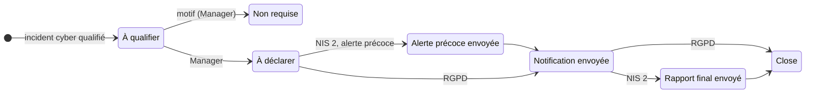

# 📣 Déclarations réglementaires

> Obligations de déclaration des **incidents de sécurité (cyber)** aux autorités. Relève de
> la pratique ITIL 4 *Information security management*, aux côtés de la
> [conformité NIS 2](conformite-nis2.md). Préfixe des règles : **DRG**. Socle commun et
> conventions (✅ / 🔜, lots) : [règles métier](../regles-metier.md). **Tout est à
> implémenter** (🔜).

[← Règles métier](../regles-metier.md) · [Toutes les pratiques](readme.md)

## 1. Objectif et périmètre

Un incident cyber peut imposer des **déclarations à délais légaux**. S-Aloha associe à
l'incident une **déclaration réglementaire** par régime applicable, calcule ses
échéances, les rappelle, et garde la trace de chaque envoi.

| Régime | Quand | Autorité (France) | Échéances, à compter de la prise de connaissance |
|---|---|---|---|
| **NIS 2** (directive (UE) 2022/2555, art. 23) | Incident **important** affectant une entité importante ou essentielle | ANSSI | **Alerte précoce sous 24 h** ; **notification d'incident sous 72 h** ; rapport intermédiaire à la demande de l'autorité ; **rapport final au plus tard un mois** après la notification |
| **RGPD** (règlement (UE) 2016/679, art. 33) | **Violation de données à caractère personnel** présentant un risque pour les personnes | CNIL | **Notification sous 72 h**, si possible ; au-delà, motifs du retard ; informations complémentaires par étapes |

Ces échéances reprennent les textes européens ; les modalités françaises (seuils
d'« incident important », portail et formulaires de l'autorité) relèvent des textes de
transposition et se **vérifient** auprès de l'ANSSI et de la CNIL. Le **régime** est une
liste fermée extensible : d'autres obligations sectorielles s'ajouteront par la même
mécanique.

**Hors périmètre** : l'envoi lui-même. La déclaration se fait sur le **portail de
l'autorité** ; S-Aloha prépare le contenu, rappelle les échéances et enregistre ce qui a
été envoyé, quand et sous quelle référence de dossier.

## 2. Rôles et droits

| Rôle | Rôle applicatif | Responsabilités |
|---|---|---|
| Responsable de la déclaration (RSSI, responsable conformité) | Manager | Qualifie l'incident, décide de déclarer ou non, enregistre les envois |
| Délégué à la protection des données | Manager | Mêmes droits pour le régime RGPD |
| Contributeur | User | Complète le contenu (impact, mesures prises) |

| Action | User | Manager | Admin | Statut |
|---|---|---|---|---|
| Consulter une déclaration | ✔ | ✔ | ✔ | 🔜 |
| Compléter le contenu | ✔ | ✔ | ✔ | 🔜 DRG-07 |
| Qualifier l'incident, créer, décider « non requise », enregistrer un envoi, clore | ✘ | ✔ | ✔ | 🔜 DRG-02 |
| Supprimer | ✘ | ✘ | ✔ | 🔜 |

## 3. Données

Déclaration réglementaire (`RegulatoryNotifications`, `DRG-AAAA-NNNN`) ; champs communs :
[socle](../regles-metier.md#5-règles-communes-aux-processus).

| Champ | Type | Oblig. | Valeurs / règle | Statut |
|---|---|---|---|---|
| `IncidentId` | lien | ✔ | Incident cyber à l'origine | 🔜 |
| `Regime` | texte 20 | ✔ | NIS 2, RGPD | 🔜 |
| `Authority` | texte 100 | ✔ | Par défaut : ANSSI (NIS 2), CNIL (RGPD) | 🔜 |
| `AwareAt` | date UTC | ✔ | **Prise de connaissance** de l'incident, point de départ des délais ; par défaut la création de l'incident ; modifiable par un Manager, avec motif tracé (SOC-20) | 🔜 |
| `EarlyWarningDueAt`, `NotificationDueAt`, `FinalReportDueAt` | date UTC | calculé | DRG-10 | 🔜 |
| `EarlyWarningSentAt`, `NotificationSentAt`, `FinalReportSentAt` | date UTC | à l'envoi | Date réelle de chaque envoi | 🔜 |
| `AuthorityCaseRef` | texte 100 | | Référence du dossier chez l'autorité | 🔜 |
| `Summary`, `Impact`, `MeasuresTaken` | texte | à la notification | Résumé, impact (services, personnes, durée), mesures prises | 🔜 |
| `SuspectedMalicious`, `CrossBorderImpact` | booléen | NIS 2 | Cause supposée malveillante ; effets transfrontières (contenu de l'alerte précoce) | 🔜 |
| `PersonalDataCategories`, `DataSubjectsCount` | texte, entier | RGPD | Catégories de données, nombre approximatif de personnes | 🔜 |
| `NotRequiredReason` | texte | si non requise | Motif de non-déclaration | 🔜 |

## 4. Cycle de vie

| De → Vers | Qui | Conditions (400 sinon) | Effets |
|---|---|---|---|
| — → À qualifier | Auto (INC-41) ou Manager | Incident cyber | Échéances calculées depuis `AwareAt` |
| À qualifier → Non requise | Manager | Motif | Statut final |
| À qualifier → À déclarer | Manager | | |
| À déclarer → Alerte précoce envoyée | Manager | NIS 2 ; date d'envoi ; malveillance supposée et effets transfrontières renseignés | `EarlyWarningSentAt` |
| Alerte précoce envoyée → Notification envoyée | Manager | Date d'envoi ; résumé, impact et mesures prises | `NotificationSentAt` ; `FinalReportDueAt` recalculée |
| À déclarer → Notification envoyée | Manager | RGPD ; date d'envoi ; résumé, impact, catégories de données, nombre de personnes | `NotificationSentAt` |
| Notification envoyée → Rapport final envoyé | Manager | NIS 2 ; date d'envoi | `FinalReportSentAt` |
| Rapport final envoyé (NIS 2), Notification envoyée (RGPD) → Close | Manager | | Statut final |

## 5. Règles de gestion

| ID | Règle | Statut | Lot |
|---|---|---|---|
| DRG-01 | Une déclaration est toujours **associée à un incident** de nature cyber (INC-40), et visible sur sa fiche | 🔜 | 2 |
| DRG-02 | Qualifier, décider, enregistrer un envoi et clore : **Manager** ; transitions selon le § 4 (SOC-05) | 🔜 | 2 |
| DRG-03 | **Une déclaration par régime** et par incident (409 sinon) : un même incident peut appeler une déclaration NIS 2 et une déclaration RGPD | 🔜 | 2 |
| DRG-04 | **Non requise** exige un motif (ex. incident non important au sens NIS 2, absence de risque pour les personnes) ; la décision et son auteur sont tracés | 🔜 | 2 |
| DRG-05 | Chaque **envoi** enregistre sa date réelle ; elle ne peut précéder `AwareAt` ni être dans le futur | 🔜 | 2 |
| DRG-06 | Une déclaration NIS 2 ne passe à **Notification envoyée** qu'après l'alerte précoce | 🔜 | 2 |
| DRG-07 | Tout rôle complète le **contenu** (résumé, impact, mesures) tant que la déclaration n'est pas close ; le contenu envoyé est figé à chaque envoi (version conservée) | 🔜 | 2 |
| DRG-08 | **Modèle de contenu** par régime : la fiche propose les rubriques attendues (NIS 2 : malveillance supposée, effets transfrontières, gravité, impact, indicateurs de compromission ; RGPD : nature de la violation, catégories et nombre de personnes, conséquences probables, mesures) | 🔜 | 3 |

## 6. Délais, calculs et alertes

Les délais légaux se comptent en **heures calendaires**, nuits et jours fériés compris :
pas en heures de service (contrairement aux SLA, SLM-14).

| ID | Règle | Statut | Lot |
|---|---|---|---|
| DRG-10 | **Échéances** : NIS 2 — `EarlyWarningDueAt` = `AwareAt` + 24 h, `NotificationDueAt` = `AwareAt` + 72 h, `FinalReportDueAt` = `NotificationSentAt` + 1 mois (à défaut, `NotificationDueAt` + 1 mois) ; RGPD — `NotificationDueAt` = `AwareAt` + 72 h. Recalculées si `AwareAt` change | 🔜 | 2 |
| DRG-11 | **Échéance proche** (moins de 6 h) ou **dépassée** ⇒ bloc « Urgent » de la console des gestionnaires, avec le temps restant ; une échéance dépassée reste signalée sur la fiche, même après l'envoi | 🔜 | 2 |
| DRG-12 | **RGPD hors délai** : une notification envoyée après 72 h exige les **motifs du retard** | 🔜 | 2 |
| DRG-13 | Notifications (SOC-21) : déclaration créée → tous les gestionnaires ; échéance à 6 h → responsable et gestionnaires ; échéance dépassée → idem, chaque heure jusqu'à l'envoi | 🔜 | 2 |

## 7. Liens avec les autres pratiques

| Lien | Sens | Règle |
|---|---|---|
| Incident → Déclaration | Incident cyber à déclarer | INC-40 à INC-44, DRG-01 |
| Déclaration → Problème | Cause racine à établir pour le rapport final | Lien manuel |
| Déclaration → Changement | Mesures correctives | Lien manuel |
| Déclaration → Évaluation NIS 2 | Exigences de gestion des incidents du ReCyF concernées | Lien manuel ([conformité NIS 2](conformite-nis2.md)) |

## 8. Console et indicateurs

Console (🔜) : incidents cyber à qualifier et déclarations à échéance proche ou dépassée
(Urgent, gestionnaires) ; déclarations en cours (Mon travail du responsable).

| Indicateur | Calcul | Statut |
|---|---|---|
| Respect des délais | Envois faits avant leur échéance / envois, par régime et par étape | 🔜 DRG-20 (lot 2) |
| Délai moyen de qualification | Qualification − `AwareAt` | 🔜 DRG-21 (lot 3) |
| Déclarations par régime et par issue | Déclarées, non requises | 🔜 DRG-22 (lot 3) |

## 9. API

| Route | Policy | Rôle |
|---|---|---|
| `GET /api/regulatory-notifications` (filtres `status`, `regime`), `GET /api/regulatory-notifications/{id}` | User | Registre, fiche — 🔜 |
| `POST /api/regulatory-notifications`, `PUT /api/regulatory-notifications/{id}` | Manager (contenu : User) | Création, contenu, transitions — 🔜 |
| `DELETE /api/regulatory-notifications/{id}` | Admin | Suppression — 🔜 |

Type de lien inter-processus : `notification` (préfixe `DRG`).

## 10. Scénarios d'acceptation

- **DRG-10** — *Étant donné* un incident cyber dont la prise de connaissance date du lundi 10 h, *quand* une déclaration NIS 2 est créée, *alors* l'alerte précoce est due le mardi 10 h et la notification le jeudi 10 h, week-end ou non.
- **DRG-03** — *Étant donné* une déclaration NIS 2 sur un incident, *quand* on en crée une seconde NIS 2, *alors* 409 ; une déclaration RGPD est acceptée.
- **DRG-06** — *Étant donné* une déclaration NIS 2 À déclarer, *quand* on enregistre la notification sans alerte précoce, *alors* 400.
- **DRG-11** — *Étant donné* une alerte précoce due dans 5 h, *alors* la déclaration figure dans le bloc Urgent des gestionnaires.
- **DRG-12** — *Étant donné* une déclaration RGPD dont la prise de connaissance date de 80 h, *quand* on enregistre la notification sans motif de retard, *alors* 400.
- **INC-43** — *Étant donné* un incident cyber avec une déclaration À déclarer, *quand* un Manager clôt l'incident, *alors* 400 qui cite la déclaration.
