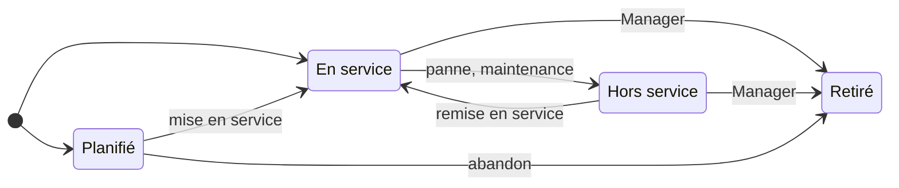

# 🧩 Gestion de la configuration

> Pratique ITIL 4 *Service configuration management*. Code :
> `backend/Modules/ServiceConfigurationManagement`,
> `frontend/src/modules/service-configuration-management`. Préfixe des règles : **CFG**.
> Socle commun et conventions (✅ / 🔜, lots) : [règles métier](../regles-metier.md).

[← Règles métier](../regles-metier.md) · [Toutes les pratiques](readme.md)

## 1. Objectif et périmètre

*Objectif ITIL 4 : s'assurer que des informations exactes et fiables sur la configuration
des services, et sur les éléments de configuration qui les supportent, sont disponibles
quand et où elles sont nécessaires.*

Un **élément de configuration (CI)** est tout composant à gérer pour fournir un service :
application, serveur, base de données, équipement réseau… La base des CI et de leurs
**relations** (CMDB) sert l'analyse d'impact des incidents et des changements. Hors
périmètre : l'inventaire comptable des actifs (gestion des actifs informatiques), la
découverte automatique du réseau.

## 2. Rôles et droits

| Rôle ITIL | Rôle applicatif | Responsabilités |
|---|---|---|
| Gestionnaire de la configuration | Manager | Garant de l'exactitude de la CMDB, vérifications, retraits |
| Propriétaire de CI | Responsable AD du CI | Tient la fiche à jour, la vérifie |
| Contributeur | User | Crée et met à jour les CI et relations |
| Administrateur | Admin | Droits du Manager, suppression, import |

| Action | User | Manager | Admin | Statut |
|---|---|---|---|---|
| Créer, modifier un CI, gérer ses relations | ✔ | ✔ | ✔ | ✅ |
| Passer un CI à **Retiré** | ✘ | ✔ | ✔ | 🔜 CFG-12 |
| Enregistrer une vérification | Propriétaire | ✔ | ✔ | 🔜 CFG-15 |
| Importer en masse | ✘ | ✘ | ✔ | 🔜 CFG-30 |
| Supprimer | ✘ | ✘ | ✔ | ✅ |

## 3. Données

Champs communs (référence `CI-AAAA-NNNN`, nom = titre, description, statut, propriétaire
AD, créateur, dates) : [socle](../regles-metier.md#5-règles-communes-aux-processus).

| Champ | Type | Oblig. | Valeurs / règle | Statut |
|---|---|---|---|---|
| `CiType` | texte 30 | ✔ | Application, Serveur, Base de données, Réseau, Stockage, Poste de travail, Logiciel, Autre | ✅ |
| `Environment` | texte 20 | ✔ | Production, Recette, Développement, Autre | ✅ |
| `Location` | texte 150 | | Emplacement | ✅ |
| `Status` | texte 30 | ✔ | Planifié, En service, Hors service, Retiré ; choisi à la création (défaut En service) | ✅ |
| `Owner…` | AD | ✔ (🔜) | Propriétaire du CI | ✅ |
| `Attributes` | clé/valeur | | Attributs propres au type (version, adresse IP, éditeur, numéro de série…) | 🔜 CFG-16 |
| `LastVerifiedAt`, `LastVerifiedBy` | date, AD | auto | Dernière vérification | 🔜 CFG-15 |
| `ServiceIds` | liens | | Services supportés | 🔜 CFG-21 |

**Relation** (`CiRelationships`) : source, cible, type orienté — *Dépend de*, *Héberge*,
*Fait partie de*, *Se connecte à*. ✅

## 4. Cycle de vie

**Aujourd'hui (✅)** : statut choisi à la création, transitions libres. **Cible (🔜
CFG-10, lot 1)** : seules les transitions ci-dessous (SOC-05).

| De → Vers | Qui | Conditions (400 sinon) | Effets | Statut |
|---|---|---|---|---|
| — → Planifié ou En service | Tous | Nom, type, environnement | Référence | ✅ |
| Planifié → En service | Tous | Propriétaire renseigné | | ✅ |
| En service ⇄ Hors service | Tous | | | ✅ |
| En service, Hors service, Planifié → Retiré | Manager | Aucun incident ni changement ouvert relié (CFG-13) | Relations conservées (historique), CI exclu des nouveaux liens (CFG-14) | 🔜 CFG-12 |
| Retiré → … | — | Statut final | | 🔜 CFG-10 |

## 5. Règles de gestion

| ID | Règle | Statut | Lot |
|---|---|---|---|
| CFG-01 | Un CI porte un nom, un type, un environnement, un emplacement et un propriétaire ; statut choisi à la création (« En service » par défaut) | ✅ | |
| CFG-02 | **Relations** orientées entre CI (*Dépend de*, *Héberge*, *Fait partie de*, *Se connecte à*) ; la fiche montre les relations sortantes et entrantes | ✅ | |
| CFG-03 | Pas de relation d'un CI vers lui-même (400), ni de doublon même source, cible et type (409) | ✅ | |
| CFG-04 | **Vue d'impact** transitive : **en aval**, les CI touchés si ce CI tombe ; **en amont**, ceux dont il dépend | ✅ | |
| CFG-05 | **Sens de propagation** d'une panne : « A *dépend de* / *se connecte à* B » — la panne de B touche A ; « A *héberge* / *fait partie de* B » — la panne de A touche B | ✅ | |
| CFG-06 | Dans la vue d'impact, chaque CI n'apparaît qu'une fois, à sa plus courte distance, avec la relation par laquelle il est atteint ; un cycle ne boucle pas | ✅ | |
| CFG-07 | Registre filtrable par type (`type`), statut et texte | ✅ | |
| CFG-10 | **Transitions contraintes** selon le § 4 (SOC-05) ; Retiré est final | ✅ | 1 |
| CFG-11 | Le **propriétaire** est obligatoire pour un CI En service | ✅ | 1 |
| CFG-12 | **Retirer** un CI : Manager uniquement | 🔜 | 1 |
| CFG-13 | Un CI relié à un **incident ou changement ouvert** ne peut pas être retiré (400, avec les références en cause) | 🔜 | 1 |
| CFG-14 | Un CI **Retiré** ne peut plus être relié à un nouvel incident, changement ou CI (400) ; ses liens existants restent visibles | 🔜 | 1 |
| CFG-15 | **Vérification** : le propriétaire ou un Manager atteste que la fiche est exacte (`LastVerifiedAt`) ; un CI En service non vérifié depuis **12 mois** remonte en relance au propriétaire | 🔜 | 2 |
| CFG-16 | **Attributs par type** : chaque type de CI définit des attributs facultatifs (Serveur : système, adresse IP, CPU, mémoire ; Application : version, éditeur, URL ; Poste de travail : numéro de série, utilisateur…) | 🔜 | 3 |
| CFG-17 | **Unicité** : deux CI non retirés ne peuvent pas avoir le même nom dans le même environnement (409) | ✅ | 1 |
| CFG-18 | Un CI **Hors service** relié à un service En service signale ce service « dégradé » sur la fiche du service | 🔜 | 2 |

## 6. Délais, calculs et alertes

| ID | Règle | Statut | Lot |
|---|---|---|---|
| CFG-20 | **Analyse d'impact d'un changement** : la fiche d'un changement montre, pour ses CI, la vue d'impact aval et les services touchés (CFG-21) | 🔜 | 2 |
| CFG-21 | **Rattachement CI ↔ service** (F5) : un CI supporte un ou plusieurs services du catalogue ; la vue d'impact aval d'un CI liste les services touchés | 🔜 | 2 |
| CFG-22 | Notifications (SOC-21) : CI passé Hors service → propriétaire et responsables des services touchés | 🔜 | 2 |

## 7. Liens avec les autres pratiques

| Lien | Sens | Règle | Statut |
|---|---|---|---|
| CI → CI | Relations de dépendance | CFG-02 à CFG-06 | ✅ |
| CI → Service | Services supportés | CFG-21 | 🔜 |
| Incident → CI | CI affecté | CFG-14 | ✅ (lien) / 🔜 |
| Changement → CI | CI modifié ; conflits au calendrier | CHG-09, CFG-20 | ✅ / 🔜 |
| Problème → CI | CI en cause | Lien manuel | ✅ |

## 8. Console et indicateurs

Console : mes CI (Mon travail) ✅. À venir : CI à vérifier (Relances, CFG-15), CI Hors
service depuis plus de 7 jours (Relances, gestionnaires, lot 2).

| Indicateur | Calcul | Statut |
|---|---|---|
| Volumétrie par statut | | ✅ |
| CI par type et environnement | | 🔜 CFG-31 (lot 2) |
| Exactitude de la CMDB | Part des CI En service vérifiés depuis moins de 12 mois | 🔜 CFG-32 (lot 2) |
| CI les plus impliqués | CI reliés au plus d'incidents sur la période | 🔜 CFG-33 (lot 2) |
| CI sans propriétaire ni relation | Qualité des données | 🔜 CFG-34 (lot 2) |

## 9. API

| Route | Policy | Rôle |
|---|---|---|
| `GET /api/configuration-items` (filtres `status`, `q`, `owner`, `type`), `GET /api/configuration-items/{id}` | User | Registre, fiche (relations) |
| `GET /api/configuration-items/{id}/impact` | User | Vue d'impact amont et aval |
| `POST /api/configuration-items`, `PUT /api/configuration-items/{id}` | User | Création, modification |
| `POST /api/configuration-items/{id}/relations`, `DELETE /api/configuration-items/relations/{id}` | User | Relations |
| `DELETE /api/configuration-items/{id}` | Admin | Suppression |
| `POST /api/configuration-items/import` | Admin | Import CSV — 🔜 CFG-30 |

| ID | Règle | Statut | Lot |
|---|---|---|---|
| CFG-30 | **Import en masse** (CSV : nom, type, environnement, emplacement, propriétaire, statut) : validation ligne à ligne, rapport des lignes refusées, aucun enregistrement partiel en cas d'erreur de format | 🔜 | 3 |

## 10. Scénarios d'acceptation

- **CFG-03** — *Quand* on relie un CI à lui-même, *alors* 400 ; une relation identique déjà présente, 409.
- **CFG-05** — *Étant donné* `SRV-MAIL-01` *dépend de* `FW-SIEGE-01`, *alors* la vue aval de `FW-SIEGE-01` contient `SRV-MAIL-01`, et la vue amont de `SRV-MAIL-01` contient `FW-SIEGE-01`.
- **CFG-06** — *Étant donné* A dépend de B et B dépend de A, *alors* la vue d'impact de A se termine et liste B une seule fois.
- **CFG-13** — *Étant donné* un CI relié à un incident En cours, *quand* un Manager le retire, *alors* 400 qui cite l'incident.
- **CFG-14** — *Étant donné* un CI Retiré, *quand* on le relie à un nouveau changement, *alors* 400.
- **CFG-17** — *Étant donné* un CI `SRV-MAIL-01` en Production, *quand* on en crée un second du même nom en Production, *alors* 409 ; en Recette, accepté.
