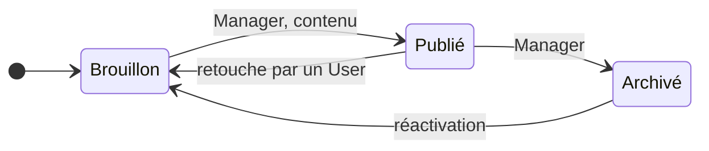

# 📚 Gestion des connaissances

> Pratique ITIL 4 *Knowledge management*. Code : `backend/Modules/KnowledgeManagement`,
> `frontend/src/modules/knowledge-management`. Préfixe des règles : **KB**. Socle commun et
> conventions (✅ / 🔜, lots) : [règles métier](../regles-metier.md).

[← Règles métier](../regles-metier.md) · [Toutes les pratiques](readme.md)

## 1. Objectif et périmètre

*Objectif ITIL 4 : maintenir et améliorer l'utilisation efficace, efficiente et pratique
de l'information et des connaissances dans toute l'organisation.*

Un **article** capitalise une solution, une procédure, une erreur connue ou une réponse
fréquente, pour qu'elle serve à nouveau (résolution d'incident plus rapide, exécution de
demande homogène). La pratique couvre la rédaction, la validation, la publication, la
revue périodique et le retrait. Hors périmètre : la documentation du projet S-Aloha
lui-même.

## 2. Rôles et droits

| Rôle ITIL | Rôle applicatif | Responsabilités |
|---|---|---|
| Rédacteur | User | Rédige et met à jour les brouillons |
| Responsable d'article | Responsable AD | Garant de l'exactitude, conduit les revues |
| Gestionnaire des connaissances | Manager | Valide et publie, archive |

| Action | User | Manager | Admin | Statut |
|---|---|---|---|---|
| Créer, modifier un brouillon | ✔ | ✔ | ✔ | ✅ |
| Publier | ✘ | ✔ | ✔ | ✅ |
| Retoucher un article publié | ✔ (repasse en Brouillon) | ✔ (reste publié) | ✔ | ✅ |
| Archiver | ✘ | ✔ | ✔ | 🔜 KB-18 (aujourd'hui : tous) |
| Supprimer | ✘ | ✘ | ✔ | ✅ |

## 3. Données

Champs communs (référence `KB-AAAA-NNNN`, titre, résumé = description, statut,
responsable AD, créateur, dates) : [socle](../regles-metier.md#5-règles-communes-aux-processus).

| Champ | Type | Oblig. | Valeurs / règle | Statut |
|---|---|---|---|---|
| `ArticleType` | texte 20 | ✔ | Solution, Procédure, Erreur connue, FAQ | ✅ |
| `Content` | texte | à la publication | Contenu ; Markdown 🔜 KB-10 | ✅ |
| `Keywords` | texte 300 | | Mots-clés, séparés par des virgules | ✅ |
| `ReviewDate` | date | | Prochaine revue | ✅ (défaut 🔜 KB-11) |
| `PublishedBy`, `PublishedAt` | texte, date | auto | Publication (SOC-08) | ✅ |
| `HelpfulCount`, `NotHelpfulCount` | entier | auto | Retours des lecteurs | 🔜 KB-13 |
| `Version` | entier | auto | Incrémentée à chaque publication | 🔜 KB-15 |

## 4. Cycle de vie

| De → Vers | Qui | Conditions (400 sinon) | Effets | Statut |
|---|---|---|---|---|
| — → Brouillon | Tous | Titre, type | Référence | ✅ |
| Brouillon → Publié | Manager | Contenu renseigné | `PublishedAt`, `PublishedBy` ; `ReviewDate` par défaut (KB-11) ; version + 1 (KB-15) | ✅ / 🔜 |
| Publié → Brouillon | Auto | Retouche du titre, résumé, contenu ou type par un User | Publication effacée | ✅ |
| Publié → Archivé | Manager | | Retiré des suggestions et de la recherche par défaut | ✅ (statut) / 🔜 KB-18 |
| Archivé → Brouillon | Manager | | | 🔜 KB-18 |
| Brouillon → Archivé | Manager | Abandon d'un brouillon | | 🔜 KB-18 |

## 5. Règles de gestion

| ID | Règle | Statut | Lot |
|---|---|---|---|
| KB-01 | Types d'article : Solution, Procédure, Erreur connue, FAQ ; résumé, contenu, mots-clés, date de revue | ✅ | |
| KB-02 | **Publié** : gestionnaire uniquement, contenu obligatoire ; horodate `PublishedAt` / `PublishedBy`, effacés au retour en Brouillon | ✅ | |
| KB-03 | **Retoucher un article publié** (titre, résumé, contenu ou type) le ramène en **Brouillon** ; la retouche par un gestionnaire vaut publication ; mots-clés, date de revue et responsable se modifient librement | ✅ | |
| KB-04 | La **recherche** du registre porte sur le titre, la référence, les mots-clés et le contenu, sans tenir compte de la casse ; le registre ne renvoie pas le contenu (SOC-13). En tête du registre, le bloc « **Chercher d'abord** » interroge la **recherche hybride** (mots et sens) sur les articles publiés, problèmes établis et incidents résolus ([RAG-05](../recherche.md)) | ✅ | |
| KB-05 | **Revue échue** : un article Publié dont la date de revue est passée remonte dans « Relances » des gestionnaires | ✅ | |
| KB-10 | Le contenu est rendu en **Markdown** (titres, listes, code), sans interpréter de HTML brut | 🔜 [#25](https://github.com/christian-raj/S-Aloha/issues/25) | 1 |
| KB-11 | À la publication, une date de revue vide est fixée à **publication + 12 mois** | 🔜 | 2 |
| KB-12 | **Article d'erreur connue** créé depuis un problème (PRB-30) : type *Erreur connue*, titre, symptômes (description du problème) et contournement repris, relié au problème ; quand le problème est Clos *Corrigé*, l'article est proposé à l'archivage | 🔜 | 2 |
| KB-13 | **Retour des lecteurs** : « utile / pas utile » sur un article publié, un vote par utilisateur ; 3 « pas utile » de plus que d'« utile » le signalent en relance à son responsable | 🔜 | 3 |
| KB-14 | **Utilisation** : nombre d'incidents et de demandes reliés à l'article (INC-19), affiché sur la fiche | 🔜 | 2 |
| KB-15 | **Versions** : chaque publication conserve la version précédente (contenu, auteur, date), consultable sur la fiche | 🔜 | 3 |
| KB-16 | **Quatre yeux** : un gestionnaire ne publie pas un article dont il est le seul rédacteur, sauf Admin | 🔜 | 3 |
| KB-17 | **Revue** : à la date de revue, le responsable confirme l'article (nouvelle date de revue, sans repasser en Brouillon) ou demande son archivage | 🔜 | 2 |
| KB-18 | **Archiver** et réactiver : gestionnaire uniquement ; transitions selon le § 4 (SOC-05) | ✅ (transitions) / 🔜 (gestionnaire uniquement) | 1 |

## 6. Délais, calculs et alertes

| ID | Règle | Statut | Lot |
|---|---|---|---|
| KB-20 | Notifications (SOC-21) : brouillon soumis à publication → gestionnaires ; publication → rédacteur ; revue échue → responsable | 🔜 | 2 |
| KB-21 | **Soumettre à publication** : un User marque son brouillon « prêt » ; il remonte dans « Décisions » des gestionnaires | 🔜 | 2 |

## 7. Liens avec les autres pratiques

| Lien | Sens | Règle | Statut |
|---|---|---|---|
| Problème → Article | Erreur connue | KB-12, PRB-30 | 🔜 |
| Incident → Article | Solution utilisée, suggestion | INC-19, KB-14 | 🔜 |
| Demande → Article | Procédure d'exécution | Lien manuel | ✅ |
| Changement → Article | Procédure de mise en œuvre | Lien manuel | ✅ |

## 8. Console et indicateurs

Console ✅ : articles à revoir (Relances, gestionnaires) ; mes articles (Mon travail). À
venir : brouillons prêts à publier (Décisions, KB-21), articles signalés peu utiles
(Relances, KB-13).

| Indicateur | Calcul | Statut |
|---|---|---|
| Volumétrie par statut et par type | | ✅ (statut) / 🔜 |
| Articles les plus utilisés | KB-14, top 10 | 🔜 KB-30 (lot 2) |
| Part des articles à jour | Publiés dont la revue n'est pas échue | 🔜 KB-31 (lot 2) |
| Incidents résolus avec un article | Incidents résolus reliés à un article / incidents résolus | 🔜 KB-32 (lot 2) |

## 9. API

| Route | Policy | Rôle |
|---|---|---|
| `GET /api/knowledge` (filtres `status`, `q`, `owner`), `GET /api/knowledge/{id}` | User | Registre (sans contenu), fiche |
| `POST /api/knowledge`, `PUT /api/knowledge/{id}` | User (Publié : Manager) | Rédaction, transitions |
| `DELETE /api/knowledge/{id}` | Admin | Suppression |
| `GET /api/knowledge/suggest?text=` | User | Suggestions pour un incident — 🔜 INC-19 |
| `POST /api/knowledge/{id}/feedback` | User | Retour utile / pas utile — 🔜 KB-13 |

## 10. Scénarios d'acceptation

- **KB-02** — *Étant donné* un brouillon sans contenu, *quand* un Manager le publie, *alors* 400 ; un User qui publie, 403.
- **KB-03** — *Étant donné* un article Publié, *quand* un User modifie son contenu, *alors* il repasse Brouillon, `PublishedAt` vide ; s'il ne modifie que les mots-clés, il reste Publié.
- **KB-10** — *Étant donné* un contenu « `# Étapes` » et « `<script>` », *alors* la fiche affiche un titre et le texte `<script>` échappé.
- **KB-11** — *Quand* un Manager publie un article sans date de revue le 7 octobre 2026, *alors* sa date de revue est le 7 octobre 2027.
- **KB-12** — *Étant donné* un problème passé Erreur connue, *quand* on accepte la proposition, *alors* un brouillon *Erreur connue* reprend le contournement et est relié au problème.
