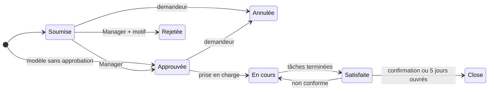

# 🧾 Gestion des demandes de service

> Pratique ITIL 4 *Service request management*. Code :
> `backend/Modules/ServiceRequestManagement`, `frontend/src/modules/service-request-management`.
> Préfixe des règles : **REQ**. Socle commun et conventions (✅ / 🔜, lots) :
> [règles métier](../regles-metier.md).

[← Règles métier](../regles-metier.md) · [Toutes les pratiques](readme.md)

## 1. Objectif et périmètre

*Objectif ITIL 4 : soutenir la qualité de service convenue en traitant, de manière
efficace et conviviale, toutes les demandes de service prédéfinies initiées par les
utilisateurs.*

Une **demande de service** est une sollicitation **prévue** : accès, matériel, logiciel,
information. Elle suit un **modèle** connu à l'avance (catalogue de demandes), avec ou sans
approbation. Hors périmètre : un dysfonctionnement (→ [incident](gestion-des-incidents.md)),
une modification non standard du SI (→ [changement](habilitation-des-changements.md)).

## 2. Rôles et droits

| Rôle ITIL | Rôle applicatif | Responsabilités |
|---|---|---|
| Demandeur | Tous (créateur) | Soumet, suit, annule, confirme la satisfaction |
| Bénéficiaire | Utilisateur AD | Reçoit le service demandé (peut différer du demandeur) |
| Approbateur | Manager | Approuve ou rejette |
| Agent d'exécution | User (responsable) | Réalise la demande et ses tâches |
| Gestionnaire du catalogue | Manager | Tient les modèles de demande |

| Action | User | Manager | Admin | Statut |
|---|---|---|---|---|
| Soumettre, modifier, traiter une demande approuvée | ✔ | ✔ | ✔ | ✅ |
| Approuver / rejeter | ✘ | ✔ | ✔ | ✅ |
| Annuler sa propre demande avant traitement | Demandeur | ✔ | ✔ | 🔜 REQ-09 |
| Tenir le catalogue de demandes | ✘ | ✔ | ✔ | 🔜 REQ-20 |
| Supprimer | ✘ | ✘ | ✔ | ✅ |

## 3. Données

Champs communs (référence `REQ-AAAA-NNNN`, titre, description, statut, responsable AD,
créateur = demandeur, dates) : [socle](../regles-metier.md#5-règles-communes-aux-processus).

| Champ | Type | Oblig. | Valeurs / règle | Statut |
|---|---|---|---|---|
| `RequestedItem` | texte 200 | ✔ | Objet demandé ; repris du modèle (🔜) | ✅ |
| `RequestedFor`, `RequestedForDisplayName` | AD | | Bénéficiaire ; par défaut le demandeur (🔜) | ✅ |
| `DueDate` | date | | Échéance souhaitée ; calculée depuis le modèle (🔜 REQ-22) | ✅ |
| `ApprovedBy`, `ApprovedAt` | texte, date | auto | Approbation (SOC-08) | ✅ |
| `FulfilledAt`, `ClosedAt` | date UTC | auto | Satisfaction, clôture | ✅ |
| `CatalogItemId` | lien | ✔ (🔜) | Modèle du catalogue de demandes | 🔜 REQ-20 |
| `RejectionReason` | texte | au rejet | Motif communiqué au demandeur | 🔜 REQ-06 |
| `CancelledAt` | date UTC | auto | Annulation | 🔜 REQ-09 |

**Modèle de demande** (`RequestCatalogItems`, 🔜 REQ-20) : nom, description, service du
catalogue, approbation requise (oui/non), délai cible (heures de service), groupe
d'exécution (AD), tâches prédéfinies, actif/inactif.

**Tâche d'exécution** (`RequestTasks`, 🔜 REQ-24) : titre, responsable AD, statut (À faire,
En cours, Terminée, Annulée), ordre.

## 4. Cycle de vie

**Aujourd'hui (✅)** : statuts Soumise, Approuvée, Rejetée, En cours, Satisfaite, Close ;
approbation réservée aux gestionnaires ; traitement seulement après approbation.
**Cible (🔜 REQ-08, lot 1)** : seules les transitions ci-dessous (SOC-05) ; statut
*Annulée* ajouté.

| De → Vers | Qui | Conditions (400 sinon) | Effets | Statut |
|---|---|---|---|---|
| — → Soumise | Tous | Titre, objet demandé | Référence | ✅ |
| — → Approuvée | Auto | Modèle sans approbation | `ApprovedBy` = « Modèle pré-approuvé » | 🔜 REQ-21 |
| Soumise → Approuvée | Manager | | `ApprovedAt`, `ApprovedBy` | ✅ |
| Soumise → Rejetée | Manager | Motif de rejet | | ✅ (statut) / 🔜 REQ-06 (motif) |
| Soumise, Approuvée → Annulée | Demandeur, Manager | Pas encore En cours | `CancelledAt` | 🔜 REQ-09 |
| Approuvée → En cours | Tous | Responsable renseigné | | ✅ (approbation exigée) / 🔜 (responsable) |
| En cours → Satisfaite | Responsable, Manager | Toutes les tâches Terminée ou Annulée | `FulfilledAt` | ✅ (horodatage) / 🔜 REQ-25 |
| Satisfaite → En cours | Demandeur, bénéficiaire, Manager | Motif ; dans les 5 jours ouvrés | `FulfilledAt` effacé | 🔜 REQ-10 |
| Satisfaite → Close | Demandeur, Manager, ou auto après 5 jours ouvrés | | `ClosedAt` | ✅ (horodatage) / 🔜 REQ-11 |
| Rejetée, Annulée, Close → … | — | Statuts finaux | | 🔜 REQ-08 |

## 5. Règles de gestion

| ID | Règle | Statut | Lot |
|---|---|---|---|
| REQ-01 | Demande créée au statut **Soumise**, référence `REQ-AAAA-NNNN` ; l'objet demandé est obligatoire | ✅ | |
| REQ-02 | **Approuvée** et **Rejetée** : gestionnaire uniquement ; l'approbation horodate `ApprovedAt` / `ApprovedBy` | ✅ | |
| REQ-03 | **En cours**, **Satisfaite** et **Close** exigent une demande approuvée : une demande **rejetée est terminée** | ✅ | |
| REQ-04 | Revenir à Soumise ou passer à Rejetée **efface l'approbation** | ✅ | |
| REQ-05 | `FulfilledAt` posé à Satisfaite, `ClosedAt` à Close, effacés à la sortie (SOC-08) | ✅ | |
| REQ-06 | Un **rejet** exige un motif, communiqué au demandeur | 🔜 | 1 |
| REQ-07 | Le **bénéficiaire** vaut le demandeur par défaut ; une demande pour autrui garde les deux | 🔜 | 2 |
| REQ-08 | **Transitions contraintes** selon le § 4 (SOC-05) ; Rejetée, Annulée et Close sont finales | 🔜 | 1 |
| REQ-09 | Statut **Annulée** : le demandeur (ou un Manager) annule une demande Soumise ou Approuvée, tant qu'elle n'est pas En cours | 🔜 | 1 |
| REQ-10 | **Contestation** : dans les 5 jours ouvrés, le demandeur ou le bénéficiaire renvoie une demande Satisfaite En cours, avec motif | 🔜 | 2 |
| REQ-11 | **Clôture** à la confirmation du demandeur, ou automatique 5 jours ouvrés après Satisfaite | 🔜 | 3 |
| REQ-12 | Une demande qui révèle un **besoin non standard** se requalifie : créer un changement (ou un incident) relié, puis annuler la demande avec ce motif | 🔜 | 2 |

### Catalogue de demandes

| ID | Règle | Statut | Lot |
|---|---|---|---|
| REQ-20 | **Catalogue de demandes** tenu par les gestionnaires : chaque demande se crée depuis un **modèle actif** ; l'objet demandé et le service en sont repris | 🔜 | 2 |
| REQ-21 | Un modèle **sans approbation** crée la demande directement **Approuvée** (« Modèle pré-approuvé »), comme un changement standard | 🔜 | 2 |
| REQ-22 | **Échéance** = soumission (ou approbation si requise) + délai cible du modèle, en heures de service (SLM-14) ; modifiable par un Manager seulement | 🔜 | 2 |
| REQ-23 | Le **groupe d'exécution** du modèle devient le responsable de la demande approuvée | 🔜 | 2 |
| REQ-24 | **Tâches d'exécution** : les tâches prédéfinies du modèle sont créées à l'approbation, chacune avec son responsable ; on peut en ajouter | 🔜 | 3 |
| REQ-25 | **Satisfaite** exige que toutes les tâches soient Terminée ou Annulée | 🔜 | 3 |

## 6. Délais, calculs et alertes

| ID | Règle | Statut | Lot |
|---|---|---|---|
| REQ-30 | Une demande est **en retard** si son échéance est passée et qu'elle n'est ni Satisfaite, ni Close, ni Rejetée, ni Annulée ; même règle de date que PRB-19 (en retard le lendemain) | 🔜 | 2 |
| REQ-31 | Notifications (SOC-21) : soumission → approbateurs ; approbation ou rejet → demandeur ; affectation → responsable ; satisfaction → demandeur et bénéficiaire | 🔜 | 2 |
| REQ-32 | **Enquête de satisfaction** à la clôture (note 1 à 5, commentaire), facultative | 🔜 | 3 |

## 7. Liens avec les autres pratiques

| Lien | Sens | Règle | Statut |
|---|---|---|---|
| Demande → Service | Service du catalogue concerné | REQ-20 | 🔜 |
| Demande → Changement | Besoin non standard | REQ-12 | ✅ (lien manuel) / 🔜 |
| Demande → CI | Matériel ou logiciel fourni | Lien manuel | ✅ |
| Demande → Article | Procédure d'exécution | Lien manuel | ✅ |

## 8. Console et indicateurs

Console ✅ : demandes Soumise dans « Décisions » (gestionnaires) ; mes demandes ouvertes
(Mon travail). À venir : demandes en retard (Relances, REQ-30), demandes approuvées non
prises en charge depuis plus d'un jour ouvré (Relances, lot 2).

| Indicateur | Calcul | Statut |
|---|---|---|
| Volumétrie par statut | | ✅ |
| Délai moyen de traitement | `FulfilledAt − CreatedAt`, par modèle | 🔜 REQ-40 (lot 2) |
| Respect des délais | Part des demandes satisfaites avant l'échéance | 🔜 REQ-41 (lot 2) |
| Taux d'approbation | Approuvées / (approuvées + rejetées), par modèle | 🔜 REQ-42 (lot 2) |
| Satisfaction moyenne | REQ-32 | 🔜 REQ-43 (lot 3) |

## 9. API

| Route | Policy | Rôle |
|---|---|---|
| `GET /api/requests` (filtres `status`, `q`, `owner`), `GET /api/requests/{id}` | User | Registre, fiche |
| `POST /api/requests`, `PUT /api/requests/{id}` | User (Approuvée/Rejetée : Manager) | Création, modification, transitions |
| `DELETE /api/requests/{id}` | Admin | Suppression |
| `GET/POST/PUT /api/request-catalog[/{id}]` | User (lecture), Manager (écriture) | Catalogue de demandes — 🔜 REQ-20 |

## 10. Scénarios d'acceptation

- **REQ-02** — *Étant donné* une demande Soumise, *quand* un User la passe à Approuvée, *alors* 403.
- **REQ-03** — *Étant donné* une demande Rejetée, *quand* on la passe En cours, *alors* 400 « doit d'abord être approuvée ».
- **REQ-06** — *Étant donné* une demande Soumise, *quand* un Manager la rejette sans motif, *alors* 400.
- **REQ-09** — *Étant donné* une demande Approuvée créée par Ursula, *quand* Ursula l'annule, *alors* elle est Annulée ; En cours, l'annulation est refusée (400).
- **REQ-21** — *Étant donné* un modèle « Compte VPN » sans approbation, *quand* on crée une demande depuis ce modèle, *alors* elle est Approuvée, `ApprovedBy` = « Modèle pré-approuvé ».
- **REQ-30** — *Étant donné* une demande En cours due hier, *alors* elle figure dans les demandes en retard ; due aujourd'hui, non.
