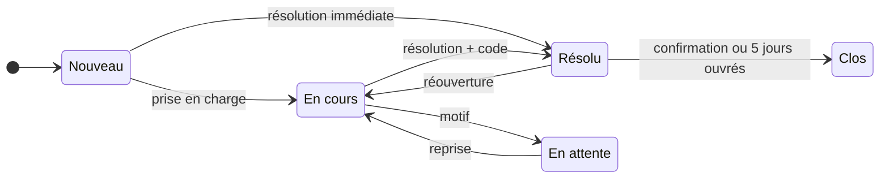

# 🚨 Gestion des incidents

> Pratique ITIL 4 *Incident management*. Code : `backend/Modules/IncidentManagement`,
> `frontend/src/modules/incident-management`. Préfixe des règles : **INC**. Socle commun et
> conventions (✅ / 🔜, lots) : [règles métier](../regles-metier.md).

[← Règles métier](../regles-metier.md) · [Toutes les pratiques](readme.md)

## 1. Objectif et périmètre

*Objectif ITIL 4 : minimiser l'impact négatif des incidents en rétablissant le
fonctionnement normal du service le plus rapidement possible.*

Un **incident** est une interruption non planifiée d'un service, ou une baisse de sa
qualité. La pratique couvre l'enregistrement, la priorisation, la prise en charge,
l'escalade, la résolution et la clôture, ainsi que le traitement particulier de
l'**incident majeur**. Hors périmètre : chercher la cause (→ [problèmes](gestion-des-problemes.md)),
traiter une demande prédéfinie (→ [demandes](gestion-des-demandes.md)).

## 2. Rôles et droits

| Rôle ITIL | Rôle applicatif | Responsabilités |
|---|---|---|
| Gestionnaire des incidents | Manager | Supervise la file, déclare et pilote l'incident majeur, clôt |
| Agent de support (niveaux 1 à 3) | User | Enregistre, prend en charge, diagnostique, résout |
| Groupe de support | Groupe AD | Responsable d'un incident en attente d'un agent |
| Administrateur | Admin | Droits du Manager, suppression |

| Action | User | Manager | Admin | Statut |
|---|---|---|---|---|
| Créer, modifier, prendre en charge, résoudre | ✔ | ✔ | ✔ | ✅ |
| Déclarer / retirer le caractère **majeur** | ✘ | ✔ | ✔ | 🔜 INC-13 (aujourd'hui : tous) |
| Clore | ✘ | ✔ | ✔ | 🔜 INC-10 (aujourd'hui : tous) |
| Rouvrir un incident résolu | ✔ | ✔ | ✔ | ✅ (contraintes 🔜 INC-11) |
| Supprimer | ✘ | ✘ | ✔ | ✅ |

## 3. Données

Champs communs (référence `INC-AAAA-NNNN`, titre, description, statut, responsable AD,
créateur, dates) : [socle](../regles-metier.md#5-règles-communes-aux-processus).

| Champ | Type | Oblig. | Valeurs / règle | Statut |
|---|---|---|---|---|
| `Impact` / `Urgency` | texte 10 | ✔ | Faible, Moyen, Élevé / Faible, Moyenne, Élevée | ✅ |
| `Priority` | texte 10 | calculé | P1–P4 ([matrice](../regles-metier.md#6-priorité)) | ✅ |
| `Category` | texte 100 | | Texte libre ; référentiel 🔜 SOC-27 | ✅ |
| `AffectedService` | texte 150 | | Texte libre ; remplacé par `ServiceId` 🔜 | ✅ |
| `IsMajor` | booléen | | Incident majeur | ✅ |
| `Resolution` | texte | à la résolution | Description de la résolution | ✅ |
| `ResolvedAt`, `ClosedAt` | date UTC | auto | SOC-08 | ✅ |
| `ServiceId` | lien | ✔ (🔜) | Service du catalogue ([SLM-10](gestion-des-niveaux-de-service.md)) | 🔜 INC-20 |
| `Channel` | texte 20 | | Portail, Téléphone, Courriel, Supervision, Sur place | 🔜 INC-04 |
| `CallerId`, `CallerDisplayName` | AD | | Utilisateur affecté (déclarant métier) | 🔜 INC-05 |
| `OnHoldReason` | texte 30 | si En attente | Attente utilisateur, Attente fournisseur, Attente changement | 🔜 INC-07 |
| `ResolutionCode` | texte 30 | à la résolution | Correctif appliqué, Contournement, Résolu sans action, Non reproductible, Doublon | 🔜 INC-08 |
| `FirstResponseAt` | date UTC | auto | Première prise en charge (passage à En cours) | 🔜 INC-06 |
| `ResponseDueAt`, `ResolutionDueAt` | date UTC | calculé | Échéances tirées du SLA (§ 6) | 🔜 INC-21 |
| `ReopenCount` | entier | auto | Nombre de réouvertures | 🔜 INC-11 |
| `ParentId` | lien | | Incident parent (incidents liés à une même panne) | 🔜 INC-16 |

## 4. Cycle de vie

**Aujourd'hui (✅)** : transitions libres ; Résolu et Clos exigent une résolution.
**Cible (🔜 INC-09, lot 1)** : seules les transitions ci-dessous (SOC-05).

| De → Vers | Qui | Conditions (400 sinon) | Effets | Statut |
|---|---|---|---|---|
| — → Nouveau | Tous | Titre, impact, urgence | Référence, priorité | ✅ |
| Nouveau → En cours | Tous | Responsable renseigné (utilisateur ou groupe) | `FirstResponseAt` | 🔜 INC-06 |
| Nouveau → Résolu | Tous | Résolution et code | `ResolvedAt` ; résolu au premier contact (INC-23) | ✅ (résolution) / 🔜 (code) |
| En cours → En attente | Tous | `OnHoldReason` | Horloge SLA suspendue (INC-22) | 🔜 INC-07 |
| En attente → En cours | Tous | | `OnHoldReason` effacé, horloge reprise | 🔜 INC-07 |
| En cours → Résolu | Tous | Résolution et `ResolutionCode` | `ResolvedAt` | ✅ / 🔜 INC-08 |
| Résolu → En cours | Tous | Motif ; dans les 10 jours ouvrés suivant la résolution | `ResolvedAt` effacé, `ReopenCount` + 1 | ✅ (effacement) / 🔜 INC-11 |
| Résolu → Clos | Manager, ou automatique après 5 jours ouvrés | | `ClosedAt` | ✅ (horodatage) / 🔜 INC-10 |
| Clos → … | — | Aucune : un nouvel incident est créé et relié | | 🔜 INC-11 |

## 5. Règles de gestion

| ID | Règle | Statut | Lot |
|---|---|---|---|
| INC-01 | Incident créé au statut **Nouveau**, référence `INC-AAAA-NNNN` | ✅ | |
| INC-02 | Priorité **P1–P4** calculée par la matrice impact × urgence ([socle § 6](../regles-metier.md#6-priorité)) | ✅ | |
| INC-03 | **Résolu** ou **Clos** exige une résolution décrite, y compris aux modifications ultérieures (SOC-06) | ✅ | |
| INC-04 | **Canal** de signalement enregistré (Portail, Téléphone, Courriel, Supervision, Sur place) | 🔜 | 2 |
| INC-05 | **Utilisateur affecté** (AD) distinct du créateur : un agent enregistre pour un utilisateur ; l'utilisateur affecté reçoit les notifications publiques | 🔜 | 2 |
| INC-06 | **Prise en charge** : passer à En cours exige un responsable ; horodate `FirstResponseAt` (délai de prise en charge, INC-21) | 🔜 | 1 |
| INC-07 | **En attente** exige un motif fermé ; le temps passé En attente ne compte pas dans les délais SLA | 🔜 | 2 |
| INC-08 | La résolution exige un **code de résolution** fermé ; *Doublon* exige un lien vers l'incident conservé | 🔜 | 1 |
| INC-09 | **Transitions contraintes** selon le § 4 (SOC-05) | 🔜 | 1 |
| INC-10 | **Clôture** par un Manager, ou **automatique** 5 jours ouvrés après la résolution sans réouverture | 🔜 | 2 (manuelle) / 3 (auto) |
| INC-11 | **Réouverture** d'un incident Résolu dans les 10 jours ouvrés, avec motif, `ReopenCount` + 1 ; au-delà, ou une fois Clos, un **nouvel** incident est créé et relié | 🔜 | 1 |
| INC-12 | **Incident majeur** : remonte dans la console des gestionnaires tant qu'il n'est ni Résolu ni Clos | ✅ | |
| INC-13 | Seul un **Manager** déclare ou retire le caractère majeur ; un incident majeur a toujours priorité P1 et un Manager pour responsable | 🔜 | 1 |
| INC-14 | **Ouvrir un problème lié** depuis l'incident : crée le problème avec les mêmes titre, description, impact, urgence, catégorie et service, puis relie les deux | ✅ | |
| INC-15 | Un incident **majeur** ne passe à Résolu que relié à un **problème** (existant ou créé, INC-14) : la revue de l'incident majeur s'y conduit | 🔜 | 2 |
| INC-16 | **Incidents enfants** : un incident peut être rattaché à un incident parent (même panne) ; résoudre le parent résout ses enfants avec la même résolution | 🔜 | 3 |
| INC-17 | **Escalade fonctionnelle** : changer le responsable vers un autre groupe est tracé (SOC-20) avec un motif | 🔜 | 2 |
| INC-18 | **Escalade hiérarchique** : un P1, ou un incident dont l'échéance de résolution est dépassée, notifie les gestionnaires (SOC-21) | 🔜 | 2 |
| INC-19 | **Suggestion de connaissance** : l'onglet Informations de la fiche présente les « **Cas similaires** » (articles publiés, problèmes établis, incidents résolus) par la recherche hybride ([RAG-06](../recherche.md)) ; relier en un clic l'élément retenu à l'incident : [RAG-09](../recherche.md) | ✅ (relier : 🔜 RAG-09) | 2 |

## 6. Délais, calculs et alertes

Les cibles viennent du **SLA en vigueur** du service affecté
([niveaux de service](gestion-des-niveaux-de-service.md)) : délai de résolution par
priorité (aujourd'hui enregistré, pas mesuré).

| ID | Règle | Statut | Lot |
|---|---|---|---|
| INC-20 | Le service affecté est choisi dans le **catalogue** (`ServiceId`) ; l'ancien texte libre est repris à la migration | 🔜 | 2 |
| INC-21 | **Échéances** calculées à la création et au changement de priorité : `ResolutionDueAt` = création + délai de résolution de la priorité (SLA du service) ; `ResponseDueAt` = création + délai de prise en charge (SLM-13). Sans SLA : pas d'échéance | 🔜 | 2 |
| INC-22 | Les délais se comptent en **heures de service** du service (SLM-14) et excluent le temps En attente | 🔜 | 2 |
| INC-23 | **Résolu au premier contact** : résolu sans passer par En cours ni changer de responsable | 🔜 | 2 |
| INC-24 | **SLA en risque** : moins de 25 % du délai de résolution restant ⇒ bloc « Urgent » de la console du responsable et des gestionnaires ; **SLA dépassé** ⇒ marqué sur la fiche et le registre | 🔜 | 2 |
| INC-25 | Notifications (SOC-21) : affectation → responsable (ou membres du groupe) ; résolution → utilisateur affecté ; incident majeur déclaré → tous les gestionnaires ; SLA en risque → responsable | 🔜 | 2 |
| INC-26 | Un incident **En attente** depuis plus de 5 jours ouvrés remonte en relance au responsable | 🔜 | 3 |

## 7. Liens avec les autres pratiques

| Lien | Sens | Règle | Statut |
|---|---|---|---|
| Incident → Problème | Cause à rechercher | INC-14, INC-15 | ✅ / 🔜 |
| Incident → CI | CI affecté | Lien manuel ; CI Retiré refusé (CFG-14) | ✅ / 🔜 |
| Incident → Service / SLA | Service affecté, cibles | INC-20, INC-21 | 🔜 |
| Incident → Article | Solution utilisée, cas similaires | INC-19, RAG-06, RAG-09 | ✅ (suggestion) / 🔜 (lien en un clic) |
| Incident → Changement | Changement à l'origine de l'incident | Lien manuel ; indicateur CHG-33 | ✅ / 🔜 |

## 8. Console et indicateurs

Console ✅ : incidents majeurs en cours (Urgent, gestionnaires) ; mes incidents ouverts
(Mon travail). À venir : SLA en risque (Urgent, INC-24), incidents non pris en charge
depuis plus d'une heure (Décisions, gestionnaires, lot 2), En attente prolongés
(Relances, INC-26).

| Indicateur | Calcul | Statut |
|---|---|---|
| MTTR incidents | Moyenne en heures (`ResolvedAt − CreatedAt`), incidents résolus ou clos | ✅ |
| Incidents majeurs ouverts | Majeurs ni Résolu ni Clos | ✅ |
| Volumétrie par statut | | ✅ |
| Respect du SLA | Part des incidents résolus avant `ResolutionDueAt`, par service et priorité | 🔜 INC-30 (lot 2) |
| Délai moyen de prise en charge | `FirstResponseAt − CreatedAt` | 🔜 INC-31 (lot 2) |
| Résolution au premier contact | Part INC-23 | 🔜 INC-32 (lot 2) |
| Taux de réouverture | Incidents avec `ReopenCount` > 0 / résolus | 🔜 INC-33 (lot 2) |
| Stock par ancienneté | Incidents ouverts par tranche d'âge (< 1 j, 1–3 j, 3–7 j, > 7 j) et priorité | 🔜 INC-34 (lot 3) |

## 9. API

| Route | Policy | Rôle |
|---|---|---|
| `GET /api/incidents` (filtres `status`, `q`, `owner`), `GET /api/incidents/{id}` | User | Registre, fiche |
| `POST /api/incidents`, `PUT /api/incidents/{id}` | User | Création, modification, transitions |
| `DELETE /api/incidents/{id}` | Admin | Suppression (liens compris) |
| `GET/POST /api/links`, `DELETE /api/links/{id}` | User | Liens (problème, CI, article…) |

## 10. Scénarios d'acceptation

- **INC-03** — *Étant donné* un incident En cours sans résolution, *quand* on le passe à Résolu, *alors* 400 « Décrire la résolution… ».
- **INC-06** — *Étant donné* un incident Nouveau sans responsable, *quand* on le passe à En cours, *alors* 400 ; avec un responsable, `FirstResponseAt` est posé.
- **INC-07** — *Étant donné* un incident En cours, *quand* on le passe En attente sans motif, *alors* 400.
- **INC-11** — *Étant donné* un incident Clos, *quand* on le passe à En cours, *alors* 400 « créer un nouvel incident » ; Résolu depuis 2 jours, la réouverture passe et `ReopenCount` vaut 1.
- **INC-13** — *Étant donné* un User, *quand* il coche « incident majeur », *alors* 403.
- **INC-15** — *Étant donné* un incident majeur sans problème relié, *quand* on le passe à Résolu, *alors* 400 qui demande de relier ou d'ouvrir un problème.
- **INC-21** — *Étant donné* un service avec un SLA en vigueur (P2 = 8 h) et des heures de service 24/7, *quand* on crée un incident P2 à 10 h, *alors* `ResolutionDueAt` = 18 h le même jour.
