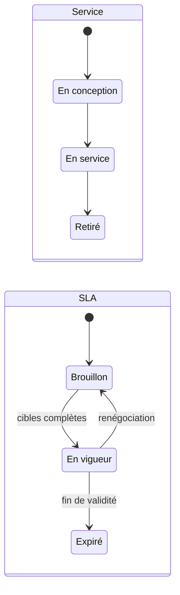

# 📏 Gestion des niveaux de service

> Pratique ITIL 4 *Service level management*. Code :
> `backend/Modules/ServiceLevelManagement`, `frontend/src/modules/service-level-management`.
> Préfixe des règles : **SLM**. Socle commun et conventions (✅ / 🔜, lots) :
> [règles métier](../regles-metier.md).

[← Règles métier](../regles-metier.md) · [Toutes les pratiques](readme.md)

## 1. Objectif et périmètre

*Objectif ITIL 4 : fixer des cibles claires, orientées métier, pour les niveaux de
service, et s'assurer que la prestation est correctement évaluée, suivie et gérée au
regard de ces cibles.*

La pratique tient le **catalogue des services** (ce que la DSI fournit) et les **accords de
niveau de service** (SLA : ce qu'elle s'engage à fournir, à qui), puis **mesure** la
prestation réelle. Hors périmètre : les contrats fournisseurs (gestion des fournisseurs),
la facturation des services.

## 2. Rôles et droits

| Rôle ITIL | Rôle applicatif | Responsabilités |
|---|---|---|
| Gestionnaire des niveaux de service | Manager | Négocie et tient les SLA, conduit les revues |
| Propriétaire de service | Responsable AD du service | Garant du service et de ses résultats |
| Client | Texte (direction, entité) | Partie de l'accord |
| Consultation | User | Lit le catalogue et les SLA |

| Action | User | Manager | Admin | Statut |
|---|---|---|---|---|
| Consulter le catalogue et les SLA | ✔ | ✔ | ✔ | ✅ |
| Créer, modifier un service ou un SLA | ✘ | ✔ | ✔ | ✅ |
| Enregistrer une revue de SLA | ✘ | ✔ | ✔ | 🔜 SLM-22 |
| Supprimer | ✘ | ✘ | ✔ | ✅ |

## 3. Données

Champs communs (référence, titre, description, statut, responsable AD, créateur, dates) :
[socle](../regles-metier.md#5-règles-communes-aux-processus).

### Service (`Services`, `SVC-AAAA-NNNN`)

| Champ | Type | Oblig. | Valeurs / règle | Statut |
|---|---|---|---|---|
| `Status` | texte 30 | ✔ | En conception, En service, Retiré ; choisi à la création | ✅ |
| `Criticality` | texte 10 | ✔ | Faible, Moyenne, Élevée | ✅ |
| `ServiceHours` | texte 150 | | Heures de service, texte libre (« Lun–Ven 8 h–18 h ») | ✅ (structuré 🔜 SLM-14) |
| `Owner…` | AD | ✔ (🔜) | Propriétaire de service | ✅ (facultatif) / 🔜 SLM-11 |
| `ServiceCalendar` | structure | | Jours, plages horaires, jours fériés, fuseau | 🔜 SLM-14 |

### Accord de niveau de service (`Agreements`, `SLA-AAAA-NNNN`)

| Champ | Type | Oblig. | Valeurs / règle | Statut |
|---|---|---|---|---|
| `ServiceId` | lien | ✔ | Service couvert | ✅ |
| `Customer` | texte 200 | | Client de l'accord | ✅ |
| `Status` | texte 30 | auto | Brouillon, En vigueur, Expiré | ✅ |
| `AvailabilityTarget` | décimal | | Disponibilité cible en % (ex. 99,5) | ✅ |
| `ResolutionHoursP1` … `P4` | entier | | Délai de résolution par priorité, en heures de service | ✅ |
| `ResponseHoursP1` … `P4` | entier | | Délai de prise en charge par priorité | 🔜 SLM-13 |
| `ValidFrom`, `ValidTo`, `ReviewDate` | date | | Validité, prochaine revue | ✅ |

## 4. Cycle de vie

**Aujourd'hui (✅)** : transitions libres, réservées aux gestionnaires. **Cible (🔜 SLM-12,
lot 1)** : seules les transitions ci-dessous (SOC-05).

| Objet | De → Vers | Qui | Conditions (400 sinon) | Statut |
|---|---|---|---|---|
| Service | En conception → En service | Manager | Propriétaire renseigné, heures de service | 🔜 SLM-11 |
| Service | En service → Retiré | Manager | Aucun SLA En vigueur ; aucun incident ou demande ouvert sur le service | 🔜 SLM-15 |
| SLA | Brouillon → En vigueur | Manager | Service En service ; délais P1–P4 renseignés et croissants (P1 ≤ P2 ≤ P3 ≤ P4) ; `ValidFrom` ; pas d'autre SLA En vigueur pour le même service et le même client | 🔜 SLM-03 |
| SLA | En vigueur → Expiré | Auto, ou Manager | `ValidTo` passé (auto) | 🔜 SLM-04 |
| SLA | En vigueur → Brouillon | Manager | Renégociation ; les mesures en cours restent sur la version précédente | 🔜 SLM-12 |
| SLA | Expiré → … | — | Statut final ; un nouvel accord se crée | 🔜 SLM-12 |

## 5. Règles de gestion

| ID | Règle | Statut | Lot |
|---|---|---|---|
| SLM-01 | **Catalogue des services** : nom, criticité, heures de service, responsable ; tenu par les gestionnaires | ✅ | |
| SLM-02 | **SLA** rattaché à un service : client, disponibilité cible, délais de résolution P1 à P4, validité, date de revue ; tenus par les gestionnaires ; supprimer un service supprime ses SLA | ✅ | |
| SLM-03 | Passer un SLA **En vigueur** exige des cibles complètes et croissantes, et l'unicité (service, client) parmi les SLA En vigueur | 🔜 | 1 |
| SLM-04 | Un SLA passe **Expiré** automatiquement le lendemain de `ValidTo` | 🔜 | 2 |
| SLM-05 | **Revue échue** : un SLA En vigueur dont la date de revue est passée remonte dans « Relances » des gestionnaires | ✅ | |
| SLM-10 | Les incidents (INC-20), problèmes et demandes désignent leur **service** dans le catalogue (`ServiceId`) au lieu d'un texte libre | 🔜 | 2 |
| SLM-11 | Un service **En service** a obligatoirement un propriétaire | 🔜 | 1 |
| SLM-12 | **Transitions contraintes** selon le § 4 (SOC-05) | 🔜 | 1 |
| SLM-13 | **Délais de prise en charge** P1 à P4 dans le SLA (`ResponseHoursP1…P4`), mesurés sur `FirstResponseAt` des incidents (INC-06) | 🔜 | 2 |
| SLM-14 | **Heures de service structurées** : jours ouvrés, plages horaires, jours fériés, fuseau (défaut : 24 h/24 et 7 j/7) ; tous les délais SLA se comptent dans ces heures | 🔜 | 2 |
| SLM-15 | Un service **Retiré** ne peut plus être choisi pour un nouvel incident, demande ou SLA | 🔜 | 2 |

## 6. Délais, calculs et alertes

| ID | Règle | Statut | Lot |
|---|---|---|---|
| SLM-20 | **Mesure du respect** (F1) : pour chaque SLA En vigueur, chaque mois, part des incidents du service (et de sa priorité) résolus dans le délai — échéances calculées par INC-21, hors temps En attente (INC-22) | 🔜 | 2 |
| SLM-21 | **Disponibilité mesurée** : 100 % moins la durée cumulée des incidents **majeurs** du service (création → résolution, dans les heures de service), rapportée aux heures de service du mois ; comparée à `AvailabilityTarget` | 🔜 | 3 |
| SLM-22 | **Revue de SLA** : le gestionnaire enregistre la revue (date, constats, décisions) ; la prochaine date de revue est reportée de 12 mois par défaut | 🔜 | 2 |
| SLM-23 | Un mois sous la cible (SLM-20 ou SLM-21) crée une **alerte** pour le gestionnaire et propose une **amélioration** reliée (CSI-20) | 🔜 | 2 |
| SLM-24 | Notifications (SOC-21) : SLA expirant dans 30 jours → gestionnaires ; revue échue → propriétaire du service | 🔜 | 2 |

## 7. Liens avec les autres pratiques

| Lien | Sens | Règle | Statut |
|---|---|---|---|
| Service → SLA | Engagements | SLM-02 | ✅ |
| Incident → Service | Mesure du respect | SLM-10, SLM-20 | 🔜 |
| CI → Service | Services supportés | CFG-21 | 🔜 |
| Demande → Service | Modèles de demande par service | REQ-20 | 🔜 |
| SLA → Amélioration | Écart à la cible | SLM-23, CSI-20 | 🔜 |

## 8. Console et indicateurs

Console ✅ : SLA à revoir (Relances, gestionnaires). À venir : SLA sous la cible ce mois
(Urgent, gestionnaires, SLM-23), SLA expirant dans 30 jours (Relances, SLM-24).

| Indicateur | Calcul | Statut |
|---|---|---|
| Volumétrie (services, SLA par statut) | | ✅ |
| Respect des SLA | SLM-20, par SLA et par mois | 🔜 SLM-30 (lot 2) |
| Disponibilité mesurée | SLM-21 | 🔜 SLM-31 (lot 3) |
| SLA à revoir, expirant | SLM-05, SLM-24 | ✅ / 🔜 |

## 9. API

| Route | Policy | Rôle |
|---|---|---|
| `GET /api/services`, `GET /api/services/{id}` (avec SLA) | User | Catalogue |
| `POST/PUT /api/services[/{id}]` | Manager | Tenue du catalogue |
| `GET /api/agreements`, `GET /api/agreements/{id}` | User | SLA |
| `POST/PUT /api/agreements[/{id}]` | Manager | Tenue des SLA |
| `DELETE /api/services/{id}`, `/api/agreements/{id}` | Admin | Suppression |
| `GET /api/agreements/{id}/compliance?from=&to=` | User | Respect mesuré — 🔜 SLM-20 |

## 10. Scénarios d'acceptation

- **SLM-02** — *Quand* un User crée un service, *alors* 403.
- **SLM-03** — *Étant donné* un SLA Brouillon avec P1 = 8 h et P2 = 4 h, *quand* un Manager le passe En vigueur, *alors* 400 « délais non croissants » ; un second SLA En vigueur pour le même service et le même client, 409.
- **SLM-04** — *Étant donné* un SLA En vigueur dont `ValidTo` était hier, *alors* il est Expiré.
- **SLM-14** — *Étant donné* des heures de service Lun–Ven 8 h–18 h, *quand* un incident P3 (24 h) est créé vendredi à 17 h, *alors* son échéance est mercredi à 11 h (1 h vendredi + 10 h lundi + 10 h mardi + 3 h mercredi = 24 h de service).
- **SLM-20** — *Étant donné* 10 incidents P2 du service en octobre, dont 9 résolus dans le délai, *alors* le respect d'octobre vaut 90 %.
