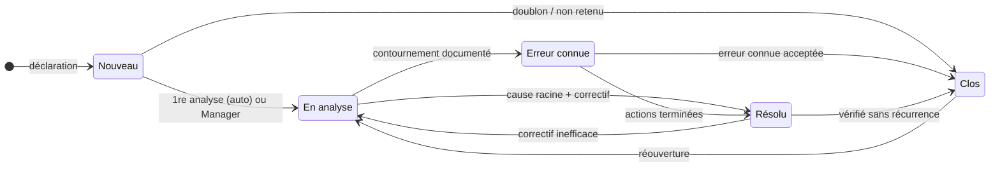

# 🔍 Gestion des problèmes

> Pratique ITIL 4 *Problem management*. Code : `backend/Modules/ProblemManagement`,
> `frontend/src/modules/problem-management`. Préfixe des règles : **PRB**. Socle commun et
> conventions (✅ / 🔜, lots) : [règles métier](../regles-metier.md).

[← Règles métier](../regles-metier.md) · [Toutes les pratiques](readme.md)

## 1. Objectif et périmètre

*Objectif ITIL 4 : réduire la probabilité et l'impact des incidents en identifiant leurs
causes réelles et potentielles, et en gérant les contournements et les erreurs connues.*

Un **problème** est la cause, inconnue au départ, d'un ou plusieurs incidents. La pratique
couvre trois phases ITIL : **identification** (réactive, depuis des incidents, ou
proactive, depuis une tendance), **contrôle** (analyse, contournement, erreur connue) et
**résolution** (correctif, souvent par un changement). Hors périmètre : rétablir le service
(→ [incidents](gestion-des-incidents.md)), mettre en œuvre le correctif (→
[changements](habilitation-des-changements.md)).

## 2. Rôles et droits

| Rôle ITIL | Rôle applicatif | Responsabilités |
|---|---|---|
| Gestionnaire des problèmes | Manager | Qualifie, pilote les statuts, valide la cause racine, clôt |
| Analyste / intervenant | User | Déclare, analyse (RCA), réalise les actions RACI |
| Administrateur | Admin | Droits du Manager, suppression du problème |

| Action | User | Manager | Admin | Statut |
|---|---|---|---|---|
| Déclarer un problème | ✔ | ✔ | ✔ | ✅ |
| Créer / modifier une analyse RCA | ✔ | ✔ | ✔ | ✅ |
| Créer / mettre à jour le statut d'une action corrective | ✔ | ✔ | ✔ | ✅ |
| Modifier une action (titre, échéance, RACI) | R ou A de l'action | ✔ | ✔ | 🔜 PRB-24 |
| Qualifier : statut, impact, urgence, catégorie, cause racine, contournement | ✘ | ✔ | ✔ | ✅ |
| Supprimer une analyse ou une action | ✘ | ✔ | ✔ | ✅ |
| Supprimer un problème | ✘ | ✘ | ✔ | ✅ |

## 3. Données

### Problème (`Problems`)

| Champ | Type | Oblig. | Valeurs / règle | Statut |
|---|---|---|---|---|
| `Reference` | texte 20 | auto | `PRB-AAAA-NNNN` (SOC-01) | ✅ |
| `Title` | texte 200 | ✔ | | ✅ |
| `Description` | texte | | | ✅ |
| `Status` | texte 30 | auto | Nouveau, En analyse, Erreur connue, Résolu, Clos | ✅ |
| `Impact` / `Urgency` | texte 10 | ✔ | Faible, Moyen, Élevé / Faible, Moyenne, Élevée | ✅ (valeurs contrôlées 🔜 PRB-02) |
| `Priority` | texte 10 | calculé | P1–P4 ([matrice](../regles-metier.md#6-priorité)) | ✅ |
| `Category`, `AffectedService` | texte 100 / 150 | | Texte libre aujourd'hui ; référentiel 🔜 SOC-27 | ✅ |
| `KnownErrorWorkaround` | texte | | Contournement | ✅ |
| `RootCause` | texte | | Cause racine **validée** | ✅ |
| `CreatedBy`, `CreatedByDisplayName` | texte | auto | Déclarant AD | ✅ |
| `CreatedAt`, `UpdatedAt`, `ClosedAt` | date UTC | auto | `ClosedAt` : SOC-08 | ✅ |
| `Source` | texte 10 | ✔ | Réactif (défaut), Proactif | 🔜 PRB-20 |
| `OwnerType/Id/DisplayName` | AD | | Gestionnaire du problème | 🔜 PRB-21 |
| `ClosureCode` | texte 30 | à la clôture | Corrigé, Erreur connue acceptée, Doublon, Non retenu | 🔜 PRB-13 |
| `ResolvedAt` | date UTC | auto | Posée à l'entrée de Résolu (SOC-08) | 🔜 PRB-14 |

### Analyse RCA (`Analyses`)

`Method` (FIVE_WHYS, ISHIKAWA, FTA), `DataJson` (format par méthode :
[base de données](../base-de-donnees.md)), `Conclusion`, `CreatedBy`, dates. ✅

### Action corrective (`Actions`) et RACI (`RaciAssignments`)

Action : `Title`, `Description`, `Status` (À faire, En cours, Terminée, Annulée), `DueDate`
(date), `CompletedAt`. RACI : `Role` (R, A, C, I), `AssigneeType` (User, Group),
`AssigneeId`, `AssigneeDisplayName`. ✅

## 4. Cycle de vie

**Aujourd'hui (✅)** : un Manager passe librement d'un statut à l'autre ; seule la
transition automatique Nouveau → En analyse est codée. **Cible (🔜 PRB-10, lot 1)** :
seules les transitions ci-dessous sont permises (SOC-05).

| De → Vers | Qui | Conditions (400 sinon) | Effets | Statut |
|---|---|---|---|---|
| — → Nouveau | Tous | Titre, impact, urgence | Référence, priorité calculée | ✅ |
| Nouveau → En analyse | Auto à la 1re analyse, ou Manager | | | ✅ |
| Nouveau → Clos | Manager | `ClosureCode` = Doublon ou Non retenu ; un doublon est relié au problème conservé | `ClosedAt` | 🔜 PRB-10, PRB-13 |
| En analyse → Erreur connue | Manager | Contournement renseigné | Proposition d'article KB (PRB-30) | 🔜 PRB-11 |
| En analyse → Résolu | Manager | Cause racine renseignée ; aucune action ouverte | `ResolvedAt` | 🔜 PRB-12 |
| Erreur connue → Résolu | Manager | Cause racine renseignée ; aucune action ouverte (toutes Terminée ou Annulée), au moins une Terminée | `ResolvedAt` | 🔜 PRB-12 |
| Erreur connue → Clos | Manager | `ClosureCode` = Erreur connue acceptée (pas de correctif, risque accepté) | `ClosedAt` | 🔜 PRB-13 |
| Résolu → Clos | Manager | `ClosureCode` = Corrigé | `ClosedAt` | ✅ (horodatage) / 🔜 (code) |
| Résolu → En analyse | Manager | Motif (commentaire) | `ResolvedAt` effacé | 🔜 PRB-10 |
| Clos → En analyse | Manager | Motif (commentaire) | `ClosedAt` et `ClosureCode` effacés | ✅ (`ClosedAt`) / 🔜 |

## 5. Règles de gestion

| ID | Règle | Statut | Lot |
|---|---|---|---|
| PRB-01 | Un problème est créé au statut **Nouveau** avec une référence `PRB-AAAA-NNNN` (SOC-01) | ✅ | |
| PRB-02 | Impact, urgence, statut, méthode d'analyse, statut d'action et rôle RACI sont des **valeurs fermées** (SOC-02) | 🔜 [#28](https://github.com/christian-raj/S-Aloha/issues/28) | 1 |
| PRB-03 | La **priorité** est calculée par la matrice impact × urgence, jamais saisie | ✅ | |
| PRB-04 | La création d'une **première analyse** fait passer un problème Nouveau à **En analyse** | ✅ | |
| PRB-05 | Plusieurs analyses, de méthodes différentes, peuvent coexister sur un problème. Méthodes : **5 Pourquoi**, **Ishikawa (6M)**, **arbre des défaillances (FTA)** avec portes ET/OU | ✅ | |
| PRB-06 | La « cause racine identifiée » d'une analyse alimente sa **conclusion** ; la cause racine **validée** du problème est saisie par un Manager | ✅ | |
| PRB-07 | Un Manager peut **valider la conclusion** d'une analyse comme cause racine du problème en un clic (copie dans `RootCause`) | 🔜 | 2 |
| PRB-08 | Le passage à **Clos** horodate `ClosedAt` ; quitter Clos l'efface (SOC-08) ; seul un problème actuellement clos compte dans le MTTR | ✅ | |
| PRB-09 | Recherche (titre, référence) insensible à la casse | ✅ | |
| PRB-10 | **Transitions contraintes** selon le tableau du § 4 (SOC-05) ; une réouverture exige un motif — résout R4 | 🔜 | 1 |
| PRB-11 | **Erreur connue** exige un contournement renseigné (aujourd'hui : bonne pratique non bloquante) | 🔜 | 1 |
| PRB-12 | **Résolu** exige une cause racine validée et aucune action corrective ouverte | 🔜 | 1 |
| PRB-13 | **Clos** exige un code de clôture : *Corrigé* (depuis Résolu), *Erreur connue acceptée* (depuis Erreur connue), *Doublon* ou *Non retenu* (depuis Nouveau) | 🔜 | 1 |
| PRB-14 | `ResolvedAt` posé à l'entrée de Résolu, effacé à la sortie vers En analyse | 🔜 | 1 |
| PRB-15 | Chaque action porte titre, description, échéance (date) et statut (À faire, En cours, Terminée, Annulée) | ✅ | |
| PRB-16 | **RACI** à la création : au moins **un R** et exactement **un A** ; C et I libres ; chaque rôle est un utilisateur ou un groupe AD (recherche dans l'annuaire) | ✅ | |
| PRB-17 | Les règles RACI s'appliquent aussi **à la modification** d'une action | 🔜 [#23](https://github.com/christian-raj/S-Aloha/issues/23) | 1 |
| PRB-18 | `CompletedAt` posé **uniquement** au passage à Terminée, effacé si l'action en sort ; renommer une action terminée ne le change pas | 🔜 [#24](https://github.com/christian-raj/S-Aloha/issues/24) | 1 |
| PRB-19 | Une action est **en retard** si son échéance est dépassée et son statut ni Terminée ni Annulée ; l'échéance est une date : en retard à partir du **lendemain**, jamais le jour même | ✅ | |
| PRB-20 | **Source** du problème : *Réactif* (issu d'incidents) ou *Proactif* (tendance, analyse de risque) ; un problème réactif doit être relié à au moins un incident avant de quitter Nouveau | 🔜 | 2 |
| PRB-21 | **Gestionnaire du problème** (responsable AD) : par défaut le Manager qui qualifie ; « Mon travail » de ce gestionnaire | 🔜 | 2 |
| PRB-22 | Un **incident majeur** résolu sans problème relié crée une alerte « problème à ouvrir » (voir INC-15) | 🔜 | 2 |
| PRB-23 | **Récurrence** : un problème Résolu ou Clos qui reçoit un nouvel incident relié est signalé aux gestionnaires (« récurrence après correctif ») | 🔜 | 2 |
| PRB-24 | **Modifier une action** (titre, description, échéance, RACI) : son R, son A ou un Manager — résout M7 | 🔜 | 1 |
| PRB-25 | Une action ne passe à **Terminée** que si son A l'approuve (ou un Manager) : un R la passe à *En cours*, puis demande l'approbation | 🔜 | 2 |
| PRB-26 | Les actions confiées à un **groupe AD** apparaissent pour chaque membre du groupe (SOC-10) — résout M3 | 🔜 | 1 |
| PRB-27 | Depuis une action, **créer un changement** lié (correctif à mettre en œuvre) : titre et description repris | 🔜 | 2 |

## 6. Délais, calculs et alertes

| ID | Règle | Statut | Lot |
|---|---|---|---|
| PRB-30 | Au passage à **Erreur connue**, l'interface propose de créer un article de connaissance de type *Erreur connue* (symptômes, contournement) relié au problème | 🔜 | 2 |
| PRB-31 | Notifications (SOC-21) : action affectée → R et A ; action en retard → R, A, gestionnaire ; problème qualifié ou clos → déclarant | 🔜 | 2 |
| PRB-32 | Un problème **sans activité depuis 30 jours** (aucune analyse, action ni modification) remonte en relance aux gestionnaires | 🔜 | 3 |

## 7. Liens avec les autres pratiques

| Lien | Sens | Règle | Statut |
|---|---|---|---|
| Incident → Problème | Un ou plusieurs incidents causés par le problème | Ouverture depuis l'incident (INC-14) ; PRB-20 | ✅ / 🔜 |
| Problème → Article | Erreur connue publiée comme article | PRB-30, KB-12 | 🔜 |
| Problème → Changement | Correctif mis en œuvre | PRB-27, CHG-23 | ✅ (lien manuel) / 🔜 |
| Problème → CI | CI en cause | Lien manuel | ✅ |
| Problème → cas similaires | Articles, problèmes et incidents proches, dans l'onglet Informations | [RAG-06](../recherche.md) | ✅ |
| Problème → Amélioration | Tendance, cause systémique | Lien manuel | ✅ |

## 8. Console et indicateurs

Console : problèmes à qualifier, erreurs connues sans action, analyses sans cause racine,
mes problèmes déclarés, mes actions (en retard, en cours), actions en retard toutes
équipes ([socle § 2](../regles-metier.md#2-consoles-par-rôle)). ✅

| Indicateur | Calcul | Statut |
|---|---|---|
| MTTR problèmes | Moyenne en jours (`ClosedAt − CreatedAt`), problèmes clos | ✅ |
| Problèmes ouverts, erreurs connues | Comptes par statut, priorité, catégorie | ✅ |
| Actions en retard | PRB-19, avec leurs R | ✅ |
| Part des problèmes avec cause racine | Problèmes Résolu ou Clos avec `RootCause` / total Résolu ou Clos | 🔜 PRB-33 (lot 2) |
| Incidents par problème | Nombre d'incidents reliés, moyenne et top 5 | 🔜 PRB-34 (lot 2) |
| Récurrences | Problèmes ayant reçu un incident après Résolu (PRB-23) | 🔜 PRB-35 (lot 3) |

## 9. API

| Route | Policy | Rôle |
|---|---|---|
| `GET/POST /api/problems`, `GET /api/problems/{id}` | User | Liste (filtres `status`, `q`), détail, déclaration |
| `PUT /api/problems/{id}` | Manager | Qualification, statut |
| `DELETE /api/problems/{id}` | Admin | Suppression (liens compris) |
| `GET/POST/PUT /api/problems/{id}/analyses[/{id}]`, `DELETE` : Manager | User | Analyses RCA |
| `GET /api/actions`, `POST /api/problems/{id}/actions`, `PUT /api/actions/{id}`, `DELETE` : Manager | User | Actions et RACI |

## 10. Scénarios d'acceptation

- **PRB-04** — *Étant donné* un problème Nouveau, *quand* un User crée une analyse 5 Pourquoi, *alors* le problème passe En analyse.
- **PRB-10** — *Étant donné* un problème Clos, *quand* un Manager le passe à Nouveau, *alors* 400 « Transition de Clos vers Nouveau non permise ».
- **PRB-12** — *Étant donné* un problème En analyse avec une action À faire, *quand* un Manager le passe à Résolu, *alors* 400 qui cite l'action ouverte.
- **PRB-13** — *Étant donné* un problème Nouveau, *quand* un Manager le clôt avec le code *Doublon*, *alors* il est Clos, `ClosedAt` posé ; sans code, 400.
- **PRB-17** — *Étant donné* une action avec un R et un A, *quand* on la modifie avec deux A, *alors* 400 et le message de la création.
- **PRB-18** — *Étant donné* une action Terminée hier, *quand* on la renomme, *alors* `CompletedAt` reste à hier.
- **PRB-19** — *Étant donné* une action due aujourd'hui, *alors* elle n'est pas en retard ; demain, elle l'est.
