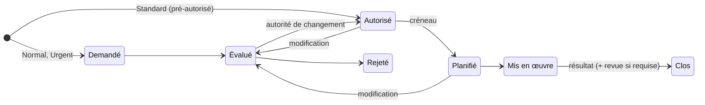

# 🔁 Habilitation des changements

> Pratique ITIL 4 *Change enablement*. Code : `backend/Modules/ChangeEnablement`,
> `frontend/src/modules/change-enablement`. Préfixe des règles : **CHG**. Socle commun et
> conventions (✅ / 🔜, lots) : [règles métier](../regles-metier.md).

[← Règles métier](../regles-metier.md) · [Toutes les pratiques](readme.md)

## 1. Objectif et périmètre

*Objectif ITIL 4 : maximiser le nombre de changements de services et de produits réussis,
en veillant à ce que les risques soient correctement évalués, en autorisant les changements
et en gérant le calendrier des changements.*

Un **changement** est l'ajout, la modification ou le retrait de tout élément susceptible
d'avoir un effet sur les services. ITIL distingue trois types : **standard** (faible
risque, pré-autorisé, suit un modèle), **normal** (évalué et autorisé au cas par cas),
**urgent** (à mettre en œuvre au plus vite, autorisation accélérée). Hors périmètre :
réaliser techniquement le changement (outils de déploiement).

## 2. Rôles et droits

| Rôle ITIL | Rôle applicatif | Responsabilités |
|---|---|---|
| Demandeur du changement | Tous | Décrit, évalue, planifie |
| Responsable du changement | User (responsable) | Prépare les plans, met en œuvre, renseigne le résultat |
| Autorité de changement | Manager | Autorise ou rejette ; selon le risque, seul ou en comité (CHG-20) |
| Comité consultatif (CAB) | 2 Managers distincts | Autorise les changements normaux à risque Élevé (CHG-20) |
| Administrateur | Admin | Droits du Manager, suppression |

| Action | User | Manager | Admin | Statut |
|---|---|---|---|---|
| Créer, évaluer, planifier, mettre en œuvre, clore | ✔ | ✔ | ✔ | ✅ |
| Autoriser / rejeter | ✘ | ✔ | ✔ | ✅ |
| Définir les périodes de gel | ✘ | ✔ | ✔ | 🔜 CHG-25 |
| Tenir les modèles de changement standard | ✘ | ✔ | ✔ | 🔜 CHG-26 |
| Supprimer | ✘ | ✘ | ✔ | ✅ |

## 3. Données

Champs communs (référence `CHG-AAAA-NNNN`, titre, description, statut, responsable AD,
créateur, dates) : [socle](../regles-metier.md#5-règles-communes-aux-processus).

| Champ | Type | Oblig. | Valeurs / règle | Statut |
|---|---|---|---|---|
| `ChangeType` | texte 10 | ✔ | Standard, Normal, Urgent | ✅ |
| `Risk` | texte 10 | ✔ | Faible, Moyen, Élevé | ✅ |
| `PlannedStart`, `PlannedEnd` | date UTC | à la planification | Fin ≥ début | ✅ |
| `ImplementationPlan` | texte | | Plan de mise en œuvre | ✅ (exigé 🔜 CHG-12) |
| `BackoutPlan` | texte | | Plan de retour arrière | ✅ (exigé 🔜 CHG-12) |
| `Outcome` | texte 10 | à la clôture | Réussi, Échoué | ✅ |
| `AuthorizedBy`, `AuthorizedAt` | texte, date | auto | Autorisation (SOC-08) | ✅ |
| `ClosedAt` | date UTC | auto | | ✅ |
| `ActualStart`, `ActualEnd` | date UTC | à la mise en œuvre | Dates réelles | 🔜 CHG-14 |
| `PirNotes`, `PirAt` | texte, date | selon CHG-15 | Revue post-implémentation | 🔜 CHG-15 |
| `ModelId` | lien | si Standard (🔜) | Modèle de changement standard | 🔜 CHG-26 |
| `Approvals` | liste | si CAB | Approbateur, décision, date, commentaire | 🔜 CHG-20 |

## 4. Cycle de vie

**Aujourd'hui (✅)** : les conditions de statut ci-dessous sont tenues ; les autres
transitions sont libres. **Cible (🔜 CHG-11, lot 1)** : seules ces transitions (SOC-05).

| De → Vers | Qui | Conditions (400 sinon) | Effets | Statut |
|---|---|---|---|---|
| — → Demandé | Tous | Type Normal ou Urgent | | ✅ |
| — → Autorisé | Auto | Type Standard | `AuthorizedBy` = « Modèle standard (pré-autorisé) » | ✅ |
| Demandé → Évalué | Tous | Risque, plan de mise en œuvre, plan de retour arrière | | ✅ (transition) / 🔜 CHG-12 |
| Évalué → Autorisé | Manager (CAB si Normal à risque Élevé) | | `AuthorizedAt`, `AuthorizedBy` | ✅ / 🔜 CHG-20 |
| Évalué → Rejeté | Manager | Motif | | ✅ / 🔜 (motif) |
| Autorisé → Planifié | Tous | Début et fin planifiés ; hors période de gel (sauf Urgent) | Inscrit au calendrier | ✅ (début) / 🔜 CHG-13, CHG-25 |
| Autorisé, Planifié → Évalué | Auto | Modification d'un champ d'évaluation par un User (CHG-07) | Autorisation effacée | ✅ |
| Planifié → Mis en œuvre | Responsable, Manager | Début réel | `ActualStart` | ✅ (autorisation exigée) / 🔜 CHG-14 |
| Mis en œuvre → Clos | Responsable, Manager | Résultat ; fin réelle ; revue si requise (CHG-15) | `ClosedAt` | ✅ (résultat) / 🔜 |
| Rejeté, Clos → … | — | Statuts finaux | | 🔜 CHG-11 |

## 5. Règles de gestion

| ID | Règle | Statut | Lot |
|---|---|---|---|
| CHG-01 | Types **Standard**, **Normal**, **Urgent** ; risque **Faible**, **Moyen**, **Élevé** | ✅ | |
| CHG-02 | Un changement **standard** (modèle déjà évalué) est créé directement **Autorisé**, autorisation « Modèle standard (pré-autorisé) » | ✅ | |
| CHG-03 | **Autorisé** et **Rejeté** : gestionnaire uniquement ; l'autorisation horodate `AuthorizedAt` / `AuthorizedBy` | ✅ | |
| CHG-04 | **Planifié**, **Mis en œuvre** et **Clos** exigent un changement autorisé ; **Planifié** exige un début planifié ; **Clos** exige le résultat (*Réussi* ou *Échoué*) | ✅ | |
| CHG-05 | Un changement **rejeté est terminé** : ni planifié, ni mis en œuvre, ni clos | ✅ | |
| CHG-06 | Revenir à Demandé ou Évalué **efface l'autorisation** ; la fin planifiée ne peut précéder le début | ✅ | |
| CHG-07 | **Modifier un changement autorisé** (Autorisé ou Planifié) — type, risque, plans ou créneau — le **ramène à Évalué** et efface l'autorisation. Exceptions : la modification par un gestionnaire vaut autorisation ; replanifier un changement **standard** ne retire pas son autorisation ; titre, description et responsable se modifient librement | ✅ | |
| CHG-08 | **Calendrier des changements** : changements non rejetés ayant un début planifié, depuis une semaine, regroupés par semaine | ✅ | |
| CHG-09 | **Conflit de calendrier** : deux changements non rejetés liés à un **même CI** (lien dans un sens ou dans l'autre) dont les créneaux **se chevauchent** (bout à bout : pas de chevauchement ; sans fin, un changement occupe une heure). Signalé sur le calendrier et la fiche, avec le changement et le CI en cause ; non bloquant | ✅ | |
| CHG-10 | Recherche (titre, référence) insensible à la casse ; le registre ne renvoie pas les plans (SOC-13) | ✅ | |
| CHG-11 | **Transitions contraintes** selon le § 4 (SOC-05) ; Rejeté et Clos sont finaux | 🔜 | 1 |
| CHG-12 | Passer à **Évalué** exige un plan de mise en œuvre et un plan de retour arrière renseignés (Normal et Urgent) | 🔜 | 1 |
| CHG-13 | **Planifié** exige aussi une fin planifiée | 🔜 | 1 |
| CHG-14 | **Dates réelles** : `ActualStart` exigé à Mis en œuvre, `ActualEnd` à Clos ; un dépassement de la fin planifiée est signalé | 🔜 | 2 |
| CHG-15 | **Revue post-implémentation** exigée avant Clos pour tout changement **Urgent** ou de résultat **Échoué** (`PirNotes` : ce qui s'est passé, causes, enseignements) | 🔜 | 2 |
| CHG-16 | Un changement **Normal** ou **Urgent** doit être relié à au moins un **CI** avant d'être Évalué (analyse d'impact, CFG-20) | 🔜 | 2 |
| CHG-17 | Un **rejet** exige un motif, communiqué au demandeur | 🔜 | 1 |

### Autorité de changement

| ID | Règle | Statut | Lot |
|---|---|---|---|
| CHG-20 | **Autorité selon le risque** : Normal à risque Faible ou Moyen → un Manager ; Normal à risque **Élevé** → **CAB** : deux Managers distincts approuvent (`Approvals`), un seul rejet suffit à rejeter ; Urgent → un Manager (autorisation accélérée), revue obligatoire (CHG-15) | 🔜 | 2 |
| CHG-21 | Le demandeur d'un changement ne peut pas l'autoriser lui-même (séparation des tâches), sauf Admin | 🔜 | 2 |
| CHG-22 | **Conflit non résolu** : autoriser un changement en conflit de calendrier (CHG-09) exige un commentaire de l'autorité | 🔜 | 2 |
| CHG-23 | Un changement peut être **créé depuis un problème ou une action corrective** (PRB-27) : titre, description et lien repris | 🔜 | 2 |
| CHG-24 | Notifications (SOC-21) : changement Évalué → autorité (ou CAB) ; autorisation ou rejet → demandeur et responsable ; J-1 de la mise en œuvre → responsable | 🔜 | 2 |

### Calendrier, gel et modèles

| ID | Règle | Statut | Lot |
|---|---|---|---|
| CHG-25 | **Périodes de gel** (début, fin, motif) définies par les gestionnaires : planifier un créneau qui les chevauche est refusé, sauf changement **Urgent** ; elles apparaissent sur le calendrier | 🔜 | 2 |
| CHG-26 | **Modèles de changement standard** (F4) : nom, plan de mise en œuvre et de retour arrière types, risque, CI concernés ; un changement Standard se crée depuis un modèle actif dont il reprend les plans | 🔜 | 2 |
| CHG-27 | Un modèle standard dont un changement a échoué est **suspendu** jusqu'à revue par un Manager | 🔜 | 3 |

## 6. Délais, calculs et alertes

| ID | Règle | Statut | Lot |
|---|---|---|---|
| CHG-30 | Un changement **Planifié** dont la fin planifiée est passée sans être Mis en œuvre est signalé en relance au responsable | 🔜 | 2 |
| CHG-31 | Un changement **Mis en œuvre** depuis plus de 2 jours ouvrés sans être Clos (résultat non renseigné) remonte en relance | 🔜 | 2 |

## 7. Liens avec les autres pratiques

| Lien | Sens | Règle | Statut |
|---|---|---|---|
| Changement → CI | CI modifiés | CHG-09, CHG-16 ; vue d'impact (CFG-20) | ✅ / 🔜 |
| Problème → Changement | Correctif | CHG-23 | ✅ (lien) / 🔜 |
| Demande → Changement | Besoin non standard | REQ-12 | ✅ (lien) / 🔜 |
| Changement → Incident | Incident causé par le changement | CHG-33 | ✅ (lien) / 🔜 |
| Changement → Article | Procédure | Lien manuel | ✅ |

## 8. Console et indicateurs

Console ✅ : changements Demandé et Évalué dans « Décisions » (gestionnaires) ; mes
changements ouverts (Mon travail). À venir : mises en œuvre du jour (Mon travail),
relances CHG-30 et CHG-31, changements Urgent sans revue (Relances).

| Indicateur | Calcul | Statut |
|---|---|---|
| Taux de changements réussis | Réussi / résultats renseignés | ✅ |
| Volumétrie par statut | | ✅ |
| Part des changements urgents | Urgent / total, par mois | 🔜 CHG-32 (lot 2) |
| Changements ayant causé un incident | Changements reliés à un incident créé dans les 7 jours suivant leur mise en œuvre | 🔜 CHG-33 (lot 2) |
| Délai moyen d'autorisation | `AuthorizedAt − CreatedAt`, Normal et Urgent | 🔜 CHG-34 (lot 2) |
| Respect des créneaux | Changements mis en œuvre dans leur créneau planifié | 🔜 CHG-35 (lot 3) |

## 9. API

| Route | Policy | Rôle |
|---|---|---|
| `GET /api/changes` (filtres `status`, `q`, `owner`), `GET /api/changes/{id}` | User | Registre, fiche (avec conflits) |
| `GET /api/changes/schedule` | User | Calendrier (avec conflits) |
| `POST /api/changes`, `PUT /api/changes/{id}` | User (Autorisé/Rejeté : Manager) | Création, modification, transitions |
| `DELETE /api/changes/{id}` | Admin | Suppression |
| `GET/POST/PUT /api/change-models`, `/api/change-freezes` | User (lecture), Manager (écriture) | Modèles standard, périodes de gel — 🔜 CHG-26, CHG-25 |

## 10. Scénarios d'acceptation

- **CHG-02** — *Quand* on crée un changement Standard, *alors* il est Autorisé, `AuthorizedBy` = « Modèle standard (pré-autorisé) ».
- **CHG-05** — *Étant donné* un changement Rejeté, *quand* on le passe Planifié, *alors* 400.
- **CHG-07** — *Étant donné* un changement Normal Planifié, *quand* un User change son risque, *alors* il revient à Évalué et `AuthorizedAt` est vide ; si c'est un Manager, il reste Planifié.
- **CHG-09** — *Étant donné* deux changements liés au CI `VPN-GW-01`, de 10 h à 12 h et de 11 h à 13 h le même jour, *alors* chacun signale un conflit avec l'autre ; de 10 h à 11 h et de 11 h à 12 h, aucun.
- **CHG-15** — *Étant donné* un changement Urgent Mis en œuvre avec résultat Réussi et sans revue, *quand* on le clôt, *alors* 400 « revue post-implémentation requise ».
- **CHG-20** — *Étant donné* un changement Normal à risque Élevé, *quand* un premier Manager l'approuve, *alors* il reste Évalué (1 approbation sur 2) ; au second Manager distinct, il passe Autorisé.
- **CHG-25** — *Étant donné* une période de gel du 20 au 31 décembre, *quand* on planifie un changement Normal le 22, *alors* 400 ; Urgent, accepté.
