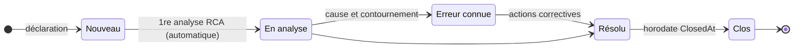

# 📐 Règles métier

> Les règles implémentées dans la plateforme. À lire avant toute modification de logique ; à mettre à jour **dans le même commit** que le code ([ADR-0002](../decisions/adr-0002-documentation-dans-le-depot.md)).

[← Documentation](../readme.md) · [Produit](produit.md) · [Règles métier](regles-metier.md) · [Architecture](architecture.md) · [Base de données](base-de-donnees.md) · [Frontend](frontend.md) · [Exploitation](exploitation.md) · [Sécurité](securite.md) · [Glossaire](glossaire.md)

Sections 1, 2, 7 et 8 : **socle**, communes à tous les processus. Sections 3 à 6 : module **Gestion des problèmes**. Sections 9 à 15 : les autres processus, en **MVP**, cadrés sur les pratiques **ITIL 4** ([ADR-0007](../decisions/adr-0007-pratiques-itil4-et-socle-commun-des-processus.md)).

## 1. Rôles et droits

Les rôles applicatifs sont dérivés de l'appartenance aux **groupes Active Directory** définis dans `backend/appsettings.json` (section `Ldap:Groups`). Un utilisateur hors de ces groupes ne peut pas se connecter.

| Capacité | User | Manager | Admin |
|---|---|---|---|
| Se connecter, consulter problèmes / analyses / actions / reporting | ✔ | ✔ | ✔ |
| Déclarer un problème | ✔ | ✔ | ✔ |
| Créer / modifier une analyse RCA | ✔ | ✔ | ✔ |
| Créer / mettre à jour une action corrective et sa matrice RACI | ✔ | ✔ | ✔ |
| Modifier un problème (titre, statut, cause racine, contournement) | ✘ | ✔ | ✔ |
| Supprimer une analyse ou une action | ✘ | ✔ | ✔ |
| Supprimer un problème | ✘ | ✘ | ✔ |
| Créer et modifier incidents, demandes, changements, CI, articles, améliorations | ✔ | ✔ | ✔ |
| Décisions de gestionnaire : autoriser/rejeter un changement, approuver/rejeter une demande, publier un article, valider/abandonner une amélioration | ✘ | ✔ | ✔ |
| Tenir le catalogue des services et les SLA | ✘ | ✔ | ✔ |
| Relier deux enregistrements (et retirer un lien), relier deux CI | ✔ | ✔ | ✔ |
| Supprimer un incident, une demande, un changement, un CI, un service, un SLA, un article, une amélioration | ✘ | ✘ | ✔ |

Si un utilisateur appartient à plusieurs groupes, le rôle le plus élevé est retenu (ordre d'évaluation : Admin > Manager > User).

L'identité retenue est le `sAMAccountName` renvoyé par l'annuaire, quelle que soit la casse saisie à la connexion ; les comparaisons d'identifiants (« Mes … » de la console, actions affectées) ignorent la casse.

## 2. Consoles par rôle

Chaque rôle dispose de sa propre console (page d'accueil « Ma console »), **orientée action** : le contenu est organisé en deux zones, et ce qui requiert une intervention de l'utilisateur apparaît toujours en premier.

**Zone « À traiter »** — classée par criticité, chaque bloc n'apparaît que s'il contient des éléments :

| Ordre | Bloc | Visible par | Criticité |
|---|---|---|---|
| 1 | Mes actions en retard (échéance dépassée) | Tous | 🔴 |
| 2 | Incidents majeurs en cours (ni Résolu ni Clos) | Manager, Admin | 🔴 |
| 3 | Problèmes à qualifier (statut Nouveau) | Manager, Admin | 🔵 |
| 4 | Décisions en attente : changements Demandé/Évalué, demandes Soumise, améliorations Proposée | Manager, Admin | 🔵 |
| 5 | Erreurs connues sans action corrective | Manager, Admin | 🟠 |
| 6 | Actions en retard toutes équipes (à relancer) | Manager, Admin | 🟠 |
| 7 | Revues échues : articles Publié et SLA En vigueur dont la date de revue est passée | Manager, Admin | 🟠 |
| 8 | Mes actions en cours (non en retard) | Tous | 🔵 |
| 9 | Mes incidents, demandes, changements et améliorations ouverts (dont je suis le responsable) | Tous | 🔵 |

Un **bandeau de synthèse** en tête de console totalise les éléments à traiter (état « Rien à traiter » sinon).

**Zone « À suivre »** — informative, en retrait visuel : mes problèmes déclarés encore ouverts (tous), analyses en cours sans cause racine (Manager, Admin).

Les **indicateurs de volumétrie** (totaux problèmes/actions/analyses, déclarants distincts, dernière activité) ne relèvent pas de l'action : ils ont été déplacés de la console vers la page **Reporting**, accessible à tous les rôles.

La composition des blocs est décidée **côté serveur** (`GET /api/console`) à partir du rôle porté par le jeton : un client ne peut pas obtenir un bloc qui ne correspond pas à son rôle.

## 3. Gestion des problèmes — cycle de vie

Les statuts sont modifiables librement par un Manager ou un Admin ; le schéma montre le
parcours nominal.

- Un problème est créé au statut **Nouveau** avec une référence `PRB-AAAA-NNNN` (séquence annuelle). Le numéro part du **plus grand numéro de l'année**, pas du nombre de problèmes : un numéro supprimé n'est pas réattribué, sauf s'il était le dernier de l'année. En cas de déclarations simultanées, la déclaration perdante relit le maximum et réessaie (jusqu'à 10 tentatives).
- La création d'une première analyse RCA fait passer automatiquement un problème **Nouveau** à **En analyse**.
- **Erreur connue** : le champ *Contournement* doit être documenté (règle de bonne pratique, non bloquante).
- Le passage à **Clos** horodate `ClosedAt`, utilisé pour le calcul du MTTR. Un problème **rouvert** (le statut quitte Clos) voit `ClosedAt` remis à vide : seul un problème actuellement clos compte dans le MTTR. Seuls Manager et Admin changent les statuts.
- La recherche de problèmes (titre, référence) ignore la casse.

## 4. Gestion des problèmes — priorité

La priorité est **calculée automatiquement** (matrice impact × urgence), non modifiable directement :

| | Urgence Faible | Urgence Moyenne | Urgence Élevée |
|---|---|---|---|
| **Impact Faible** | P4 | P4 | P3 |
| **Impact Moyen** | P4 | P3 | P2 |
| **Impact Élevé** | P3 | P2 | P1 |

## 5. Gestion des problèmes — analyses de cause racine

- Méthodologies disponibles : **5 Pourquoi**, **Ishikawa (6M)**, **Arbre des défaillances (FTA)** avec portes ET/OU.
- Plusieurs analyses (y compris de méthodes différentes) peuvent coexister sur un même problème.
- La « Cause racine identifiée » d'une analyse alimente son champ *Conclusion* ; la cause racine **validée** du problème est renseignée par un Manager dans la fiche du problème.

## 6. Gestion des problèmes — actions correctives et matrice RACI

- Chaque action porte : titre, description, échéance, statut (`À faire, En cours, Terminée, Annulée`).
- Règles RACI **bloquantes à la création** (validées côté API) :
  - au moins **un R** (Responsable — réalise l'action) ;
  - exactement **un A** (Approbateur — rend compte du résultat) ;
  - C (Consulté) et I (Informé) libres.
- Chaque rôle RACI est affecté à un **utilisateur ou groupe AD** (recherche en direct dans l'annuaire).
- Une action est **en retard** si son échéance est dépassée et son statut ni Terminée ni Annulée. L'échéance est une **date** : l'action n'est en retard qu'à partir du **lendemain** de la date d'échéance, jamais le jour même. La règle vaut pour la console, le reporting et le suivi des actions.
- Le passage à **Terminée** horodate `CompletedAt`.

## 7. Reporting

- **MTTR** : moyenne en jours de (`ClosedAt − CreatedAt`) sur les problèmes actuellement clos.
- Répartitions par statut, priorité et catégorie ; liste des actions en retard avec leurs responsables (R).
- **MTTR incidents** : moyenne en heures de (`ResolvedAt − CreatedAt`) sur les incidents actuellement résolus ou clos.
- **Taux de changements réussis** : part des changements de résultat *Réussi* parmi ceux dont le résultat est renseigné.
- **Incidents majeurs ouverts** ; **volumétrie par statut** de chaque processus.

## 8. Règles communes aux processus

S'appliquent aux processus des sections 9 à 15 (socle `Core/Records` de l'API).

- **Référence** `XXX-AAAA-NNNN` par processus (INC, REQ, CHG, CI, SVC, SLA, KB, AMI), même
  règle que les problèmes : plus grand numéro de l'année + 1, nouvelle tentative en cas de
  création simultanée.
- **Valeurs fermées** : statut, type, risque, impact… hors liste ⇒ refus (400) avec la liste
  des valeurs admises. Le titre est obligatoire.
- **Statut de création** imposé par le processus (on ne crée pas un changement « Autorisé ») ;
  exceptions : CI et services, inventaires dont le statut est choisi à la saisie.
- **Transitions** libres entre statuts, sauf : statuts réservés aux gestionnaires (403 sinon)
  et conditions propres à chaque processus (400 avec le motif).
- Les **conditions d'un statut** sont vérifiées à l'entrée dans le statut **et à chaque
  modification ultérieure** : vider la résolution d'un incident résolu ou le résultat d'un
  changement clos est refusé.
- **Longueurs** : un texte qui dépasse la taille de sa colonne est refusé (400, champ et
  limite indiqués) ; vaut aussi pour les problèmes, analyses et actions.
- Les **registres** du changement et des connaissances ne renvoient pas les champs longs
  (plans, contenu) : ils restent dans la fiche.
- **Dates de transition** posées à l'entrée du statut et **effacées à la sortie** (réouverture),
  comme `ClosedAt` des problèmes (M4).
- **Responsable** : un utilisateur ou groupe AD (assigné, propriétaire, porteur selon le
  processus). « Mes … » compare les identifiants sans tenir compte de la casse.
- **Recherche** (titre, référence) insensible à la casse.
- **Liens inter-processus** : tout enregistrement peut être relié à un autre par sa
  référence (incident → problème, changement → CI…). Le lien se lit des deux côtés ; un
  lien en double (dans un sens ou dans l'autre) est refusé (409) ; supprimer un
  enregistrement supprime ses liens.

## 9. Gestion des incidents (ITIL 4)

*Objectif ITIL 4 : minimiser l'impact négatif des incidents en rétablissant le service normal au plus vite.*

`Nouveau → En cours ⇄ En attente → Résolu → Clos`

- Priorité **P1–P4** calculée par la même matrice impact × urgence que les problèmes (§ 4).
- Case **incident majeur** : remonte dans la console des gestionnaires tant qu'il n'est ni Résolu ni Clos.
- **Résolu** ou **Clos** exige une *résolution* décrite. `ResolvedAt` est posé au passage à
  Résolu (ou directement Clos) et effacé à la réouverture ; `ClosedAt` au passage à Clos.
- **Ouvrir un problème lié** depuis l'incident : crée le problème avec les mêmes titre,
  description, impact, urgence, catégorie et service, puis relie les deux.

## 10. Gestion des demandes de service (ITIL 4)

*Objectif ITIL 4 : délivrer la qualité de service convenue en traitant les demandes prédéfinies, initiées par les utilisateurs, de façon efficace et conviviale.*

`Soumise → Approuvée | Rejetée ; Approuvée → En cours → Satisfaite → Close`

- **Approuvée** et **Rejetée** : gestionnaire uniquement ; l'approbation horodate `ApprovedAt` / `ApprovedBy`.
- **En cours**, **Satisfaite** et **Close** exigent une demande approuvée : une demande **rejetée est terminée** (ni traitée, ni close).
- Revenir à **Soumise** ou passer à **Rejetée** efface l'approbation. `FulfilledAt` au passage à Satisfaite ; `ClosedAt` à Close.
- Champs : objet demandé (obligatoire), bénéficiaire AD, échéance souhaitée, responsable du traitement.

## 11. Habilitation des changements (ITIL 4)

*Objectif ITIL 4 : maximiser le nombre de changements réussis en évaluant les risques, en autorisant les changements et en gérant le calendrier des changements.*

`Demandé → Évalué → Autorisé | Rejeté ; Autorisé → Planifié → Mis en œuvre → Clos`

- Types : **Standard** (modèle déjà évalué : créé directement **Autorisé**, autorisation
  « Modèle standard (pré-autorisé) »), **Normal**, **Urgent**. Risque : Faible, Moyen, Élevé.
- **Autorisé** et **Rejeté** : gestionnaire uniquement (autorité de changement) ; l'autorisation horodate `AuthorizedAt` / `AuthorizedBy`.
- **Planifié**, **Mis en œuvre** et **Clos** exigent un changement autorisé ; **Planifié** exige un début planifié ; **Clos** exige le résultat (*Réussi* ou *Échoué*). Un changement **rejeté est terminé** : ni planifié, ni mis en œuvre, ni clos.
- Le **type** d'un changement autorisé ne peut plus changer (un standard pré-autorisé passé en urgent garderait une autorisation jamais donnée) : créer un nouveau changement.
- Revenir à Demandé ou Évalué efface l'autorisation. La fin planifiée ne peut précéder le début.
- **Calendrier des changements** : changements non rejetés ayant un début planifié, depuis une semaine, regroupés par semaine.

## 12. Gestion de la configuration des services (ITIL 4)

*Objectif ITIL 4 : fournir une information exacte et fiable sur la configuration des services et des éléments de configuration qui les supportent, quand et où elle est nécessaire.*

`Planifié | En service | Hors service | Retiré` — statut choisi à la création (« En service » par défaut).

- Un **CI** porte un nom, un type (Application, Serveur, Base de données, Réseau, Stockage,
  Poste de travail, Logiciel, Autre), un environnement, un emplacement et un propriétaire.
- **Relations** orientées entre CI : *Dépend de*, *Héberge*, *Fait partie de*, *Se connecte à* ;
  la fiche montre les relations sortantes et entrantes. Pas de relation d'un CI vers
  lui-même, ni de doublon (même source, cible et type).

## 13. Gestion des niveaux de service (ITIL 4)

*Objectif ITIL 4 : fixer des cibles claires, orientées métier, pour les niveaux de service, et évaluer, suivre et gérer la prestation au regard de ces cibles.*

- **Catalogue des services** (`En conception | En service | Retiré`) : nom, criticité,
  heures de service, responsable. Tenu par les gestionnaires.
- **Accords de niveau de service** (`Brouillon → En vigueur → Expiré`), rattachés à un service :
  client, disponibilité cible (%), délais de résolution P1 à P4 (heures), validité, date de
  revue. Tenus par les gestionnaires ; supprimer un service supprime ses SLA.
- MVP : les cibles sont **enregistrées**, pas encore **mesurées** (rapprochement incidents ↔ SLA au plan d'action).

## 14. Gestion des connaissances (ITIL 4)

*Objectif ITIL 4 : maintenir et améliorer l'usage efficace, efficient et pratique de l'information et des connaissances dans l'organisation.*

`Brouillon → Publié → Archivé`

- Types d'article : Solution, Procédure, Erreur connue, FAQ ; résumé, contenu, mots-clés, date de revue.
- **Publié** : gestionnaire uniquement, et contenu obligatoire ; horodate `PublishedAt` / `PublishedBy`, effacés au retour en Brouillon.
- La recherche porte aussi sur les mots-clés et le contenu.

## 15. Amélioration continue (ITIL 4)

*Objectif ITIL 4 : aligner les pratiques et services de l'organisation sur l'évolution des besoins métier par l'amélioration continue des produits, services, pratiques et de tout élément de leur gestion.*

`Proposée → Validée → En cours → Réalisée | Abandonnée`

- Registre d'amélioration continue : opportunité, valeur attendue, mesure de départ et
  mesure cible, priorité, porteur, échéance, résultat constaté.
- Avancement selon le **modèle d'amélioration continue ITIL 4** (étape 1 à 7) : *Quelle est
  la vision ? — Où en sommes-nous ? — Où voulons-nous être ? — Comment y parvenir ? —
  Passer à l'action — Y sommes-nous parvenus ? — Comment maintenir la dynamique ?*
- **Validée** et **Abandonnée** : gestionnaire uniquement. **En cours** et **Réalisée** exigent
  une amélioration validée ; **Réalisée** exige le résultat constaté. **Abandonner** (comme
  revenir à Proposée) retire la validation : relancer l'amélioration demande une nouvelle validation.
