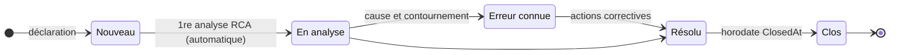

# 📐 Règles métier

> Les règles implémentées dans la plateforme. À lire avant toute modification de logique ; à mettre à jour **dans le même commit** que le code ([ADR-0002](../decisions/adr-0002-documentation-dans-le-depot.md)).

[← Documentation](../readme.md) · [Produit](produit.md) · [Règles métier](regles-metier.md) · [Architecture](architecture.md) · [Base de données](base-de-donnees.md) · [Frontend](frontend.md) · [Exploitation](exploitation.md) · [Sécurité](securite.md) · [Glossaire](glossaire.md)

Sections 1, 2 et 7 : **socle**, communes à tous les processus. Sections 3 à 6 : module **Gestion des problèmes (ITIL v3)**.

## 1. Rôles et droits

Les rôles applicatifs sont dérivés de l'appartenance aux **groupes Active Directory** définis dans `backend/appsettings.json` (section `Ldap:Groups`). Un utilisateur hors de ces groupes ne peut pas se connecter.

| Capacité | User | Manager | Admin |
|---|---|---|---|
| Se connecter, consulter problèmes / analyses / actions / reporting | ✔ | ✔ | ✔ |
| Déclarer un problème | ✔ | ✔ | ✔ |
| Créer / modifier une analyse RCA | ✔ | ✔ | ✔ |
| Créer / mettre à jour une action corrective et sa matrice RACI | ✔ | ✔ | ✔ |
| Modifier un problème (titre, statut, cause racine, contournement) | ✘ | ✔ | ✔ |
| Supprimer une analyse ou une action | ✘ | ✔ | ✔ |
| Supprimer un problème | ✘ | ✘ | ✔ |

Si un utilisateur appartient à plusieurs groupes, le rôle le plus élevé est retenu (ordre d'évaluation : Admin > Manager > User).

## 2. Consoles par rôle

Chaque rôle dispose de sa propre console (page d'accueil « Ma console »), **orientée action** : le contenu est organisé en deux zones, et ce qui requiert une intervention de l'utilisateur apparaît toujours en premier.

**Zone « À traiter »** — classée par criticité, chaque bloc n'apparaît que s'il contient des éléments :

| Ordre | Bloc | Visible par | Criticité |
|---|---|---|---|
| 1 | Mes actions en retard (échéance dépassée) | Tous | 🔴 |
| 2 | Problèmes à qualifier (statut Nouveau) | Manager, Admin | 🔵 |
| 3 | Erreurs connues sans action corrective | Manager, Admin | 🟠 |
| 4 | Actions en retard toutes équipes (à relancer) | Manager, Admin | 🟠 |
| 5 | Mes actions en cours (non en retard) | Tous | 🔵 |

Un **bandeau de synthèse** en tête de console totalise les éléments à traiter (état « Rien à traiter » sinon).

**Zone « À suivre »** — informative, en retrait visuel : mes problèmes déclarés encore ouverts (tous), analyses en cours sans cause racine (Manager, Admin).

Les **indicateurs de volumétrie** (totaux problèmes/actions/analyses, déclarants distincts, dernière activité) ne relèvent pas de l'action : ils ont été déplacés de la console vers la page **Reporting**, accessible à tous les rôles.

La composition des blocs est décidée **côté serveur** (`GET /api/console`) à partir du rôle porté par le jeton : un client ne peut pas obtenir un bloc qui ne correspond pas à son rôle.

## 3. Gestion des problèmes — cycle de vie

Les statuts sont modifiables librement par un Manager ou un Admin ; le schéma montre le
parcours nominal.

- Un problème est créé au statut **Nouveau** avec une référence `PRB-AAAA-NNNN` (séquence annuelle).
- La création d'une première analyse RCA fait passer automatiquement un problème **Nouveau** à **En analyse**.
- **Erreur connue** : le champ *Contournement* doit être documenté (règle de bonne pratique, non bloquante).
- Le passage à **Clos** horodate `ClosedAt`, utilisé pour le calcul du MTTR. Seuls Manager et Admin changent les statuts.

## 4. Gestion des problèmes — priorité

La priorité est **calculée automatiquement** (matrice impact × urgence), non modifiable directement :

| | Urgence Faible | Urgence Moyenne | Urgence Élevée |
|---|---|---|---|
| **Impact Faible** | P4 | P4 | P3 |
| **Impact Moyen** | P4 | P3 | P2 |
| **Impact Élevé** | P3 | P2 | P1 |

## 5. Gestion des problèmes — analyses de cause racine

- Méthodologies disponibles : **5 Pourquoi**, **Ishikawa (6M)**, **Arbre des défaillances (FTA)** avec portes ET/OU.
- Plusieurs analyses (y compris de méthodes différentes) peuvent coexister sur un même problème.
- La « Cause racine identifiée » d'une analyse alimente son champ *Conclusion* ; la cause racine **validée** du problème est renseignée par un Manager dans la fiche du problème.

## 6. Gestion des problèmes — actions correctives et matrice RACI

- Chaque action porte : titre, description, échéance, statut (`À faire, En cours, Terminée, Annulée`).
- Règles RACI **bloquantes à la création** (validées côté API) :
  - au moins **un R** (Responsable — réalise l'action) ;
  - exactement **un A** (Approbateur — rend compte du résultat) ;
  - C (Consulté) et I (Informé) libres.
- Chaque rôle RACI est affecté à un **utilisateur ou groupe AD** (recherche en direct dans l'annuaire).
- Une action est **en retard** si son échéance est dépassée et son statut ni Terminée ni Annulée.
- Le passage à **Terminée** horodate `CompletedAt`.

## 7. Reporting

- **MTTR** : moyenne en jours de (`ClosedAt − CreatedAt`) sur les problèmes clos.
- Répartitions par statut, priorité et catégorie ; liste des actions en retard avec leurs responsables (R).
