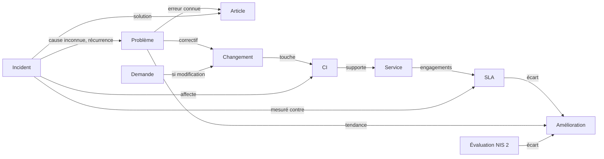

# 📐 Règles métier

> Le référentiel fonctionnel de S-Aloha : ce que la plateforme fait, et ce qu'elle doit
> faire. Ce document porte le **socle commun** ; chaque pratique ITIL a son document dans
> [`processus/`](processus/readme.md), sur le même gabarit. À lire avant toute
> modification de logique ; à mettre à jour **dans le même commit** que le code
> ([ADR-0002](../decisions/adr-0002-documentation-dans-le-depot.md)).

[← Documentation](../readme.md) · [Produit](produit.md) · [Règles métier](regles-metier.md) · [Architecture](architecture.md) · [Base de données](base-de-donnees.md) · [Frontend](frontend.md) · [Exploitation](exploitation.md) · [Sécurité](securite.md) · [Glossaire](glossaire.md)

**Pour un agent de code** : lire d'abord le § 3 (conventions), puis le document de la
pratique concernée. Une règle **🔜 à implémenter** s'implémente avec son test, et passe en
**✅** dans la même pull request ; une règle **✅** décrit le comportement actuel : ne pas
le « corriger » sans modifier d'abord la règle.

## 1. Rôles et droits

Les rôles applicatifs sont dérivés de l'appartenance aux **groupes Active Directory** définis dans `backend/appsettings.json` (section `Ldap:Groups`). Un utilisateur hors de ces groupes ne peut pas se connecter.

| Capacité | User | Manager | Admin |
|---|---|---|---|
| Se connecter, consulter tous les enregistrements et le reporting | ✔ | ✔ | ✔ |
| Créer et modifier problèmes (déclaration), analyses, actions, incidents, demandes, changements, CI, articles, améliorations | ✔ | ✔ | ✔ |
| Qualifier un problème (statut, cause racine, contournement) | ✘ | ✔ | ✔ |
| Décisions de gestionnaire : autoriser/rejeter un changement, approuver/rejeter une demande, publier un article, valider/abandonner une amélioration | ✘ | ✔ | ✔ |
| Tenir le catalogue des services et les SLA | ✘ | ✔ | ✔ |
| Relier deux enregistrements (et retirer un lien), relier deux CI | ✔ | ✔ | ✔ |
| Supprimer une analyse ou une action corrective | ✘ | ✔ | ✔ |
| Supprimer tout autre enregistrement | ✘ | ✘ | ✔ |

Le détail par pratique (et les droits à venir) est au § 2 de chaque document de
[`processus/`](processus/readme.md).

Si un utilisateur appartient à plusieurs groupes, le rôle le plus élevé est retenu (ordre d'évaluation : Admin > Manager > User).

Ces rôles valent aujourd'hui pour toute la plateforme. Leur limitation à des **périmètres**
(direction, site, entité) est spécifiée dans [périmètres](perimetres.md) (PER-01 à PER-12, à
implémenter).

L'identité retenue est le `sAMAccountName` renvoyé par l'annuaire, quelle que soit la casse saisie à la connexion ; les comparaisons d'identifiants (« Mes … » de la console, actions affectées) ignorent la casse.

**Rôles applicatifs et rôles ITIL.** ITIL définit des rôles par pratique (gestionnaire des
incidents, autorité de changement, propriétaire de service…). S-Aloha les porte par les
trois rôles applicatifs : **Manager** = gestionnaire de pratique et autorité de décision,
**User** = intervenant (support, exploitation, études), **Admin** = administrateur de la
plateforme. Chaque document de pratique précise la correspondance.

## 2. Consoles par rôle

Chaque rôle dispose de sa propre console (page d'accueil « Ma console »), **orientée action** : le contenu est organisé en groupes, dans l'ordre où il faut les traiter ; un bloc n'apparaît que s'il contient des éléments.

| Groupe | Bloc | Visible par |
|---|---|---|
| **Urgent** | Mes actions en retard (échéance dépassée) | Tous |
| | Incidents majeurs en cours (ni Résolu ni Clos) | Manager, Admin |
| **Décisions** | Décisions en attente : changements Demandé/Évalué, demandes Soumise, améliorations Proposée | Manager, Admin |
| | Problèmes à qualifier (statut Nouveau) | Manager, Admin |
| **Relances** | Actions en retard toutes équipes (à relancer) | Manager, Admin |
| | Erreurs connues sans action corrective | Manager, Admin |
| | Revues échues : articles Publié et SLA En vigueur dont la date de revue est passée | Manager, Admin |
| **Mon travail** | Mes actions en cours (non en retard) | Tous |
| | Mes incidents, demandes, changements et améliorations ouverts (dont je suis le responsable) | Tous |
| **À suivre** | Mes problèmes déclarés encore ouverts | Tous |
| | Analyses en cours sans cause racine | Manager, Admin |

En tête de console, des **tuiles de synthèse** comptent les éléments de chaque groupe à
traiter (Urgent, Décisions, Relances, Mon travail ; les deux du milieu pour Manager et
Admin) et mènent au groupe ; une tuile à zéro s'efface. Sans rien à traiter : « Tout est à jour ».

La console d'un **Admin** est celle d'un Manager, avec le même contenu : une console
d'administration propre reste à définir (A1, § 9).

Les **indicateurs de volumétrie** (totaux problèmes/actions/analyses, déclarants distincts, dernière activité) ne relèvent pas de l'action : ils sont sur la page **Reporting**, accessible à tous les rôles.

La composition des blocs est décidée **côté serveur** (`GET /api/console`) à partir du rôle porté par le jeton : un client ne peut pas obtenir un bloc qui ne correspond pas à son rôle.

Les blocs **à venir** propres à chaque pratique (SLA en risque, demandes en retard,
changements sans revue post-implémentation…) sont décrits au § 8 de chaque document de
pratique ; ils rejoignent le groupe indiqué.

## 3. Conventions de ce référentiel

### Statut des règles

| Marque | Sens | Ce que fait un agent de code |
|---|---|---|
| ✅ | **Implémentée** : comportement actuel de la plateforme | La respecter ; la modifier seulement si la règle elle-même change |
| 🔜 | **À implémenter** : comportement cible | L'implémenter avec un test d'API (et d'interface si visible), puis passer la marque à ✅ dans la même PR |

### Identifiants

Chaque règle porte un identifiant **stable** : `<PRÉFIXE>-<NN>` (`INC-07`, `CHG-12`). Un
identifiant n'est jamais réattribué : une règle abandonnée reste listée avec la mention
*retirée*. Les tests, commits et pull requests citent l'identifiant
(« Implémente INC-12 »).

| Préfixe | Document |
|---|---|
| `SOC` | Socle commun (ce document, § 5 à 9) |
| `PRB` | [Gestion des problèmes](processus/gestion-des-problemes.md) |
| `INC` | [Gestion des incidents](processus/gestion-des-incidents.md) |
| `REQ` | [Gestion des demandes de service](processus/gestion-des-demandes.md) |
| `CHG` | [Habilitation des changements](processus/habilitation-des-changements.md) |
| `CFG` | [Gestion de la configuration](processus/gestion-de-la-configuration.md) |
| `SLM` | [Gestion des niveaux de service](processus/gestion-des-niveaux-de-service.md) |
| `KB` | [Gestion des connaissances](processus/gestion-des-connaissances.md) |
| `CSI` | [Amélioration continue](processus/amelioration-continue.md) |
| `NIS` | [Conformité NIS 2](processus/conformite-nis2.md) |
| `RAG` | [Recherche](recherche.md) (capacité transverse) |

### Lots

Les règles 🔜 sont rangées par **lot**, qui donne l'ordre d'implémentation :

| Lot | Contenu | Pourquoi d'abord |
|---|---|---|
| **1** | Robustesse et cohérence : validations, transitions contraintes, écarts connus | Ce que la plateforme affiche doit être juste avant d'en faire plus |
| **2** | Pratique ITIL complète : délais et SLA mesurés, escalade, revues, catalogue | Ce qui fait passer chaque pratique du MVP à l'usage réel |
| **3** | Confort et industrialisation : automatismes, import, enquêtes, tableaux avancés | Utile, non bloquant |

Le [plan d'action](../plan-action.md) reste la liste des chantiers ; il renvoie aux
identifiants de règles.

### Gabarit d'un document de pratique

Tous les documents de [`processus/`](processus/readme.md) suivent le même plan : 1. Objectif
et périmètre · 2. Rôles et droits · 3. Données · 4. Cycle de vie · 5. Règles de gestion ·
6. Délais, calculs et alertes · 7. Liens avec les autres pratiques · 8. Console et
indicateurs · 9. API · 10. Scénarios d'acceptation.

## 4. Les pratiques

Référentiel : les **pratiques ITIL 4** ([ADR-0007](../decisions/adr-0007-pratiques-itil4-et-socle-commun-des-processus.md)).

| Pratique | Document | Objet | Maturité |
|---|---|---|---|
| Gestion des incidents | [gestion-des-incidents](processus/gestion-des-incidents.md) | Rétablir le service au plus vite | MVP |
| Gestion des demandes de service | [gestion-des-demandes](processus/gestion-des-demandes.md) | Traiter les demandes prédéfinies des utilisateurs | MVP |
| Gestion des problèmes | [gestion-des-problemes](processus/gestion-des-problemes.md) | Supprimer les causes des incidents | Complète |
| Habilitation des changements | [habilitation-des-changements](processus/habilitation-des-changements.md) | Faire réussir les changements | MVP avancé |
| Gestion de la configuration | [gestion-de-la-configuration](processus/gestion-de-la-configuration.md) | Connaître les CI et leurs dépendances | MVP avancé |
| Gestion des niveaux de service | [gestion-des-niveaux-de-service](processus/gestion-des-niveaux-de-service.md) | Fixer et mesurer les engagements | MVP |
| Gestion des connaissances | [gestion-des-connaissances](processus/gestion-des-connaissances.md) | Capitaliser et réutiliser | MVP |
| Amélioration continue | [amelioration-continue](processus/amelioration-continue.md) | Améliorer en continu | MVP |
| Conformité NIS 2 (sécurité de l'information) | [conformite-nis2](processus/conformite-nis2.md) | Évaluer la conformité au Référentiel Cyber France | MVP |

## 5. Règles communes aux processus

S'appliquent à toutes les pratiques (socle `Core/Records` de l'API pour les sept pratiques
MVP ; le module Problèmes suit les mêmes règles par son propre code).

| ID | Règle | Statut | Lot |
|---|---|---|---|
| SOC-01 | **Référence** `XXX-AAAA-NNNN` par processus (PRB, INC, REQ, CHG, CI, SVC, SLA, KB, AMI) : plus grand numéro de l'année + 1 ; un numéro supprimé n'est pas réattribué, sauf s'il était le dernier de l'année ; en cas de création simultanée, nouvelle tentative (jusqu'à 10) | ✅ | |
| SOC-02 | **Valeurs fermées** : statut, type, risque, impact… hors liste ⇒ 400 avec la liste des valeurs admises. Le titre est obligatoire | ✅ | 1 |
| SOC-03 | **Statut de création** imposé par le processus (on ne crée pas un changement « Autorisé ») ; exceptions : CI et services, inventaires dont le statut est choisi à la saisie | ✅ | |
| SOC-04 | **Transitions** : statuts réservés aux gestionnaires ⇒ 403 pour un User ; conditions propres à chaque processus ⇒ 400 avec le motif. Une pratique sans tableau § 4 garde des transitions libres | ✅ | |
| SOC-05 | **Transitions contraintes** : seules les transitions du tableau § 4 de chaque pratique sont permises ; toute autre ⇒ 400 « Transition de *A* vers *B* non permise », avec les statuts accessibles depuis *A* (ou « statut final »), y compris pour un gestionnaire. Les retours décidés par l'API (article retouché, changement modifié, première analyse d'un problème) ne passent pas par ce contrôle. L'interface ne propose que le statut courant et ses successeurs (`GET …/transitions`). Un Admin peut forcer une transition avec un motif obligatoire, tracé au journal d'audit (SOC-20). Côté API : `PUT …?force=true&reason=…` ; un non-Admin qui force ⇒ 403, un motif vide ⇒ 400 ; les conditions du statut visé restent exigées | ✅ | 1 |
| SOC-06 | Les **conditions d'un statut** sont vérifiées à l'entrée dans le statut **et à chaque modification ultérieure** (vider la résolution d'un incident résolu ⇒ 400) | ✅ | |
| SOC-07 | **Longueurs** : un texte qui dépasse la taille de sa colonne ⇒ 400, champ et limite indiqués | ✅ | |
| SOC-08 | **Dates de transition** (`ResolvedAt`, `ClosedAt`, `AuthorizedAt`…) posées à l'entrée du statut et **effacées à la sortie** (réouverture) | ✅ | |
| SOC-09 | **Responsable** : un utilisateur ou groupe AD (assigné, propriétaire, porteur selon le processus) ; « Mes … » compare les identifiants sans tenir compte de la casse | ✅ | |
| SOC-10 | **Responsable groupe** : un enregistrement dont le responsable est un **groupe AD** apparaît dans « Mon travail » de chaque membre du groupe (groupes de l'utilisateur portés par le jeton à la connexion) — résout M3 | 🔜 | 1 |
| SOC-11 | **Recherche** (titre, référence) insensible à la casse ; filtres `status`, `q`, `owner` sur chaque registre | ✅ | |
| SOC-12 | **Liens inter-processus** : tout enregistrement peut être relié à un autre par sa référence ; le lien se lit des deux côtés ; un doublon (dans un sens ou dans l'autre) ⇒ 409 ; supprimer un enregistrement supprime ses liens | ✅ | |
| SOC-13 | Les **registres** du changement et des connaissances ne renvoient pas les champs longs (plans, contenu) : ils restent dans la fiche | ✅ | |
| SOC-14 | **Suppression** réservée à l'Admin (sauf analyses et actions : Manager), avec **confirmation** dans l'interface qui rappelle la référence et le nombre de liens supprimés — résout M8 | 🔜 (API ✅, interface 🔜) | 2 |
| SOC-15 | **Enregistrement terminé** (statut final de la pratique) : modifiable seulement par un Manager ; un User qui doit le reprendre le rouvre (transition permise) | 🔜 | 2 |

## 6. Priorité

Partagée par les incidents et les problèmes : la priorité est **calculée** (matrice impact
× urgence, `Core/Itil/Priority.cs`), jamais saisie.

| | Urgence Faible | Urgence Moyenne | Urgence Élevée |
|---|---|---|---|
| **Impact Faible** | P4 | P4 | P3 |
| **Impact Moyen** | P4 | P3 | P2 |
| **Impact Élevé** | P3 | P2 | P1 |

| ID | Règle | Statut | Lot |
|---|---|---|---|
| SOC-16 | Priorité recalculée à chaque modification de l'impact ou de l'urgence | ✅ | |
| SOC-17 | Toute modification de priorité est tracée (ancienne et nouvelle valeur, auteur) au journal d'audit (SOC-20) | ✅ | 2 |

## 7. Reporting

Indicateurs globaux de la page Reporting (`GET /api/reports/summary`). Les indicateurs
propres à chaque pratique, actuels et à venir, sont au § 8 de son document.

- **MTTR problèmes** : moyenne en jours de (`ClosedAt − CreatedAt`) sur les problèmes actuellement clos. ✅
- **MTTR incidents** : moyenne en heures de (`ResolvedAt − CreatedAt`) sur les incidents actuellement résolus ou clos. ✅
- **Taux de changements réussis** : part des changements *Réussi* parmi ceux dont le résultat est renseigné. ✅
- Répartitions des problèmes par statut, priorité, catégorie ; actions en retard et leurs responsables (R) ; incidents majeurs ouverts ; volumétrie par statut de chaque processus. ✅

| ID | Règle | Statut | Lot |
|---|---|---|---|
| SOC-18 | **Période** : chaque indicateur se calcule sur une période choisie (30 jours par défaut, mois, trimestre, personnalisée) | 🔜 | 2 |
| SOC-19 | **Export CSV** de chaque tableau du reporting | 🔜 | 3 |

## 8. Notifications

Aucune notification n'existe aujourd'hui. Cible : notifications **dans l'application**
(cloche, compteur), puis par courriel (SMTP configurable).

| ID | Règle | Statut | Lot |
|---|---|---|---|
| SOC-21 | Chaque événement listé au § 6 des documents de pratique notifie ses destinataires (responsable, groupe, demandeur, gestionnaires) dans l'application | 🔜 | 2 |
| SOC-22 | Envoi par **courriel** des mêmes notifications, configurable par utilisateur (aucun, immédiat, résumé quotidien) | 🔜 | 3 |
| SOC-23 | Une notification porte la référence, le titre, l'événement et un lien vers la fiche ; jamais de donnée au-delà de ce que le destinataire peut consulter | 🔜 | 2 |

## 9. Traçabilité, commentaires, administration

| ID | Règle | Statut | Lot |
|---|---|---|---|
| SOC-20 | **Journal d'audit** : toute création, modification (champ, ancienne et nouvelle valeur), transition, suppression et lien est tracé (auteur, date) ; consultable sur la fiche (onglet « Historique ») ; conservé 3 ans — résout R5. Les actions et analyses d'un problème sont tracées sur le problème, une relation entre CI sur le CI source ; les effets automatiques (horodatages, auteurs d'une décision) ne sont pas des modifications | ✅ (affectations RACI d'une action : 🔜) | 1 |
| SOC-24 | **Commentaires** : fil de commentaires sur chaque enregistrement ; un commentaire est soit **public** (visible du demandeur / bénéficiaire), soit **note de travail** (équipe IT) | 🔜 | 2 |
| SOC-25 | **Pièces jointes** sur chaque enregistrement (10 Mo par fichier, types bureautiques et images), stockées hors base | 🔜 | 3 |
| SOC-26 | **Administration** (Admin seul, section de menu dédiée) : utilisateurs et rôles constatés, mapping groupes AD → rôles (lecture), santé (base, annuaire, version), journal d'audit global, nettoyage des doublons — résout A1 | 🔜 | 2 |
| SOC-27 | **Référentiels** (section Paramétrage, Manager et Admin) : catégories d'incident et de problème tirées d'une liste tenue par les gestionnaires, et service affecté tiré du catalogue (SLM-10), au lieu du texte libre | 🔜 | 2 |
